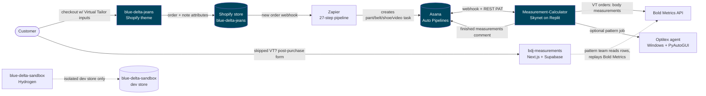
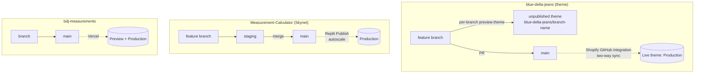

# 00 — Orientation: How to Read This Bundle

> **Confidential — shared for proposal evaluation.** This documentation bundle is provided to prospective agencies so you can scope work and write proposals **before** any engagement begins. It is self-contained; please treat it as confidential and do not redistribute.
>
> **Audience:** an external developer (agency or contractor) evaluating the Blue Delta Jeans (BDJ) stack cold, in order to scope work.
> **Goal:** give you the shape of each codebase you would be working in — the system inventory, how the pieces fit, the branch/deploy model, and the testing/CI reality — so you can scope accurately.
> **Last verified:** 2026-06-24.

This page is the **map**. It does not duplicate the deep docs — it points to them. Read this first, then dive into the per-system docs it links. Everything referenced here lives **inside this bundle**; there are no links out to private repos, Notion, or internal tools.

**What you are *not* getting in this pre-hire bundle (by design):** repository access, credential values, secret-store locations, and account logins. Those are provided once an engagement is in place. This document describes the systems so you can scope them, not so you can run them today.

### How this bundle is organized

| You want… | Read |
|---|---|
| This map + the shape of each codebase | This file (`00-orientation.md`) |
| The end-to-end system architecture | [`01-system-architecture.md`](01-system-architecture.md) |
| The Asana "production database" model + GIDs | [`02-asana-production-database.md`](02-asana-production-database.md) |
| Virtual Tailor (in-checkout fit capture) | [`03-virtual-tailor.md`](03-virtual-tailor.md) |
| Website vs POS product/SKU architecture | [`04-website-vs-pos-products.md`](04-website-vs-pos-products.md) |
| Jeanius (the spec/measurement product) | [`05-jeanius.md`](05-jeanius.md) |
| Integrations (vendors, data flows, env-var names) | [`06-integrations.md`](06-integrations.md) |
| Glossary of BDJ-specific terms | [`07-glossary.md`](07-glossary.md) |
| Skynet (Measurement-Calculator) deep docs | [`reference/skynet/README.md`](reference/skynet/README.md) |
| Shopify theme deep docs | [`reference/shopify-theme/THEME_DOCUMENTATION.md`](reference/shopify-theme/THEME_DOCUMENTATION.md) |
| Shopify → Zapier → Asana order pipeline | [`reference/zapier/Architecture Overview.md`](reference/zapier/Architecture%20Overview.md) |
| Stand-alone post-purchase capture form | [`reference/virtual-tailor-standalone/README.md`](reference/virtual-tailor-standalone/README.md) |
| Company / product / vendor domain context | [`reference/domain/domain-context.md`](reference/domain/domain-context.md) |
| Where the source material came from | [`appendix/notion-source-context.md`](appendix/notion-source-context.md) |

---

## 1. The codebases at a glance

There are four codebases plus a knowledge base of domain context. They span **three different GitHub orgs** — that is real, and a frequent source of "I can't see the repo" confusion once access is granted. Repo names below are plain text; each is a **private repo, provided once engaged**.

| Repo | What it is | Stack | Deploys to |
|---|---|---|---|
| **blue-delta-jeans** | The **live Shopify theme** ("Web Rescue \| Fall 2024"). The storefront, including the Virtual Tailor front-end. | Liquid + Tailwind/Vite + vanilla-JS shadow-DOM components | Shopify store `blue-delta-jeans` (prod via `main`) |
| **Measurement-Calculator** ("**Skynet**") | Internal garment-measurement backend. Watches Asana, calls Bold Metrics, runs the spec engine, posts finished measurements back. | Express + React SPA, Drizzle/Postgres, Asana integration, Optitex queue | Replit autoscale (prod via `main`) |
| **bdj-measurements** | Stand-alone post-purchase Virtual Tailor capture form (for customers who skipped the in-checkout VT). | Next.js 16 + Supabase | Vercel |
| **blue-delta-sandbox** | Throwaway **Hydrogen** headless storefront for learning/prototyping a possible future rebuild. **Not staging, not prod.** | Hydrogen (Remix) on Node 22 | Local only (isolated dev store) |
| **Domain knowledge base** | Products, policies, vendors, and the source material behind the Zapier + Asana docs. Not code. | — | — |

> **GitHub org gotcha:** the theme lives under one org (the agency that originally built it), Skynet and the sandbox under the BDJ org, and bdj-measurements under a personal account. Whoever you engage with would be invited to each separately. The takeaway for scoping: these are **four independent repos with independent deploy targets**, not a monorepo.

### How the pieces fit together

**One-paragraph mental model:** A customer orders on the Shopify **theme** (`blue-delta-jeans`), entering fit inputs in the Virtual Tailor (which, since the `bold-metrics-api-removal` change, **no longer calls Bold Metrics from the storefront** — it only attaches the raw inputs to the order). Shopify fires a webhook into a **27-step Zapier pipeline** that parses the order and creates one **Asana** task per production line item. **Skynet** (Measurement-Calculator) watches Asana via webhook: for Virtual Tailor orders it calls **Bold Metrics** server-side to compute body measurements, then runs its spec engine to produce *finished garment* measurements and posts them back to the Asana task. **bdj-measurements** is a separate stop-gap form for customers who skipped the in-checkout VT. **blue-delta-sandbox** is an isolated Hydrogen experiment that touches none of the above.

For the full architecture, see [`01-system-architecture.md`](01-system-architecture.md).

---

## 2. The shape of each codebase (what you'd be working in)

This section is the per-system scoping orientation. For each repo: the stack, how local development is set up, and the gotchas that affect effort estimates. Credential values and access provisioning are deliberately out of scope for this pre-hire bundle — env-var **names** are listed where they aid understanding.

### blue-delta-jeans (Shopify theme)
- **Stack:** Liquid templates, Tailwind compiled via Vite, and a set of **vanilla-JS shadow-DOM web components** (the Virtual Tailor lives here). No app server, no secret env vars in the repo — third-party keys (GemPages, Klaviyo, Bold, SMSBump, Yotpo, Sentry) are configured in the Shopify admin / app dashboards, not in code.
- **Local dev:** the theme authenticates through the **Shopify CLI** against a store collaborator account; a `local:start` script creates a per-branch unpublished preview theme and runs `shopify theme dev` live-synced to it. Prereqs: Node LTS, the Shopify CLI, and `jq`.
- **Scoping gotcha — CSS does not auto-build:** the dev script runs the Liquid server but **not** the Tailwind/Vite watcher, so edits to Tailwind classes won't reflect until `watch:css` / `build:css` is run in a second terminal. This is the most common "my styles aren't applying" trap.
- **Deep docs:** [`reference/shopify-theme/THEME_DOCUMENTATION.md`](reference/shopify-theme/THEME_DOCUMENTATION.md), the shadow-DOM component pattern in [`reference/shopify-theme/SHADOW_DOM_COMPONENTS.md`](reference/shopify-theme/SHADOW_DOM_COMPONENTS.md), and the Virtual Tailor data flow in [`reference/shopify-theme/VIRTUAL_TAILOR_BOLDMETRICS.md`](reference/shopify-theme/VIRTUAL_TAILOR_BOLDMETRICS.md).

### Measurement-Calculator (Skynet)
- **Stack:** Express API + a React SPA, Drizzle ORM over Postgres (Neon in prod), an Asana integration, server-side Bold Metrics calls, the spec engine (finished-garment measurement math), and an Optitex pattern-job queue. Node 20.
- **Local dev:** install, point `DATABASE_URL` at a Postgres you control, `db:push` the Drizzle schema, then `npm run dev` (API + SPA on port 5000). Asana calls require a **write-scope** Personal Access Token (it posts comments and writes custom fields).
- **Scoping gotchas:**
  1. `DATABASE_URL` is **mandatory** — both the DB module and the Drizzle config throw at load if it's unset.
  2. The Asana → Skynet **webhook needs a public HTTPS tunnel** to exercise locally (the target URL is built from the Replit domain). Without a tunnel you can still use the manual Calculator/Batch/Bold Metrics/Full Workflow pages, just not the hands-free webhook flow.
  3. The dev Vite logger calls `process.exit(1)` on **any** frontend compile error, so a broken React file kills the whole dev server.
- **Deep docs:** [`reference/skynet/README.md`](reference/skynet/README.md) and the numbered docs `01`–`09` (API, Asana, spec engine, DB, frontend, agent, known issues).

### bdj-measurements (Next.js + Supabase)
- **Stack:** Next.js 16 App Router + Supabase (Postgres, RLS, Auth). A male and a female Virtual Tailor capture path; the pattern team reads submitted rows. Optional Upstash rate limiter and Resend email (Phase 2).
- **Local dev:** copy `.env.example` to `.env.local` (Supabase URL + anon + service-role keys), install, `npm run dev` on port 3000. The DB has a **real, ordered migration trail** under `supabase/migrations/` (the only repo with one) applied via Studio or the Supabase CLI. Verify RLS: anon `SELECT` must be **denied**.
- **Server-only secret to be aware of:** `SUPABASE_SERVICE_ROLE_KEY` bypasses RLS and must never be exposed to the browser (never prefixed `NEXT_PUBLIC_`).
- **Deep docs:** [`reference/virtual-tailor-standalone/README.md`](reference/virtual-tailor-standalone/README.md).

### blue-delta-sandbox (Hydrogen)
- **Stack:** Hydrogen (Remix) on Node 22 (pinned via `.nvmrc`), reading from an **isolated dev store** through a Headless-channel public Storefront token.
- **Local dev:** `nvm use`, copy `.env.example` to `.env` (store domain must be the sandbox dev store), install, `npm run dev` on port 3000 (plus `/graphiql` and `/subrequest-profiler`). Note `shopify hydrogen link` does not work on dev stores — the Headless channel token is used instead.
- **Scope note:** this repo is a throwaway prototype. It is **not** deployed and every Shopify action targets the sandbox store only — it touches none of the production systems above.

---

## 3. Branch & deploy model per repo (high level)

The deploy story differs per repo, which matters for release planning and risk.

- **blue-delta-jeans — `main` = production.** Never develop on `main` (the local-start script hard-stops if you try). Each feature branch gets its own unpublished preview theme. There's a **two-way Shopify ↔ GitHub sync**: merchant/admin edits in Shopify land as `Update from Shopify…` commits on `main`, and merges to `main` flow back to the live theme. The practical consequence for scoping: `main` is a **shared surface** — rebase feature branches on `main` before merging to avoid clobbering admin-side changes.
- **Measurement-Calculator (Skynet) — `main` = production on Replit.** Replit autoscale deploys `main`; the `Published your App` commits are the deploy markers. All dev happens on `staging` or feature branches. **Schema changes are `drizzle-kit push` straight to the DB — there are no migration files and no versioned history**, so schema changes are a manual, un-versioned step on deploy. Factor this into any data-model work.
- **bdj-measurements — Vercel.** `main` deploys to Vercel (Production + Preview); env vars are set per-environment in the Vercel project. This is the one repo with **real, ordered SQL migrations** (`supabase/migrations/`).
- **blue-delta-sandbox — local only.** Throwaway; not deployed anywhere, and every store action targets the sandbox dev store.

---

## 4. Testing & CI reality (read before you trust "it builds")

This is the single most important section for scoping risk. Outside one repo's lint, **nothing is enforced by CI anywhere** — the safety nets you'd assume exist mostly don't.

| Repo | Tests | CI | What this means for scoping |
|---|---|---|---|
| **Skynet** | One plain-script test (a spec-engine assertion file, no framework). | **None.** | ⚠️ `npm run check` (tsc) is **not** wired into build or deploy — `npm run build` will happily ship broken types straight to production, and the test file is excluded from type-checking. Type-checking and the one test are **manual** steps before every merge. There is no automated safety net. (Known issue #22 — see [`reference/skynet/09-known-issues-and-tech-debt.md`](reference/skynet/09-known-issues-and-tech-debt.md).) |
| **bdj-measurements** | `npm run lint` (eslint). No unit tests; a manual verification checklist in the README. | None configured. | Verification is walking the male + female VT paths end-to-end and confirming the Supabase row + RLS denial by hand. |
| **blue-delta-jeans** | None (Liquid theme). | Shopify ↔ GitHub sync only. | Test in the per-branch preview theme. No automated gate — **review is the gate.** |
| **blue-delta-sandbox** | `npm run typecheck`. | None. | It's a sandbox; just keep `tsc` green. |

**Bottom line:** budget for manual verification on every change, especially on Skynet, where the build will deploy type errors to production. Any proposal that assumes a CI gate will catch regressions should account for the fact that one does not exist.

---

## 5. Landmines worth knowing up front (they affect estimates)

These are the non-obvious constraints that most affect how long things take. The deep docs cover each in detail.

- **Skynet has no auth on its API** (deliberate, deferred). Anyone who can reach the URL can read/search Asana, post comments via the server's token, and toggle automation. Adding features here without widening this surface is a design constraint. (Skynet known issues #9–#14.)
- **Asana custom fields are matched by display name, not GID** — renaming a field in Asana (e.g. one with a trailing period in its label) silently breaks Skynet's parsing. See [`02-asana-production-database.md`](02-asana-production-database.md).
- **Skynet's comment footer is load-bearing** — the dedupe logic keys on the auto-calculated comment text, so changing the comment format risks double-posting.
- **The Zapier order pipeline is fragile and lives in Zapier, not git** — read [`reference/zapier/Architecture Overview.md`](reference/zapier/Architecture%20Overview.md) end-to-end and the [`reference/zapier/Bug Tracker & Fix Plan.md`](reference/zapier/Bug%20Tracker%20%26%20Fix%20Plan.md) before scoping anything that touches it. It depends on AfterSell timing, SC Product Options, and a pinned Shopify API version.
- **The storefront no longer calls Bold Metrics** (post `bold-metrics-api-removal`); measurements are computed by Skynet from the attached inputs. Don't plan to re-add a storefront Bold Metrics call. See [`03-virtual-tailor.md`](03-virtual-tailor.md).
- **Some Skynet docs are partially stale by their own admission** (module counts, pattern counts). The numbered `reference/skynet/` audit (file:line cited) is the source of truth where it disagrees with in-repo notes.

---

## 6. Confidentiality & handling note

This bundle is shared **pre-contract for proposal evaluation only**. Customer PII has already been scrubbed from these docs; any names you see (e.g. "Erin Test") are synthetic examples. The architecture, data flows, Asana/SKU/Jeanius schemas and GIDs, and known tech-debt are included precisely because they are what you need to scope — they are not secrets. Hard-coded credentials and secret-store locations have been removed; one known item of tech-debt is that a legacy storefront snippet still carries a hard-coded vendor key slated for rotation (called out in the relevant deep docs).

Please keep this bundle confidential and limited to those evaluating the work.

---

### Where to go deeper

| Topic | Doc |
|---|---|
| End-to-end system architecture | [`01-system-architecture.md`](01-system-architecture.md) |
| Asana production-database model & GIDs | [`02-asana-production-database.md`](02-asana-production-database.md) |
| Virtual Tailor (in-checkout) | [`03-virtual-tailor.md`](03-virtual-tailor.md) |
| Website vs POS product/SKU architecture | [`04-website-vs-pos-products.md`](04-website-vs-pos-products.md) |
| Jeanius (spec/measurement product) | [`05-jeanius.md`](05-jeanius.md) |
| Integrations & env-var names | [`06-integrations.md`](06-integrations.md) |
| Glossary | [`07-glossary.md`](07-glossary.md) |
| Skynet internals (API, Asana, spec engine, DB, frontend, agent, tech debt) | [`reference/skynet/README.md`](reference/skynet/README.md) (docs `01`–`09`) |
| Shopify → Zapier → Asana order pipeline | [`reference/zapier/Architecture Overview.md`](reference/zapier/Architecture%20Overview.md) (+ step pages, Bug Tracker) |
| Asana field mapping & GIDs | [`reference/zapier/Asana Field Mapping (Steps 21–27).md`](reference/zapier/Asana%20Field%20Mapping%20%28Steps%2021%E2%80%9327%29.md) |
| Online vs POS product/SKU architecture | [`reference/zapier/Online vs POS Product Architecture.md`](reference/zapier/Online%20vs%20POS%20Product%20Architecture.md) |
| Virtual Tailor front-end & data flow | [`reference/shopify-theme/VIRTUAL_TAILOR_BOLDMETRICS.md`](reference/shopify-theme/VIRTUAL_TAILOR_BOLDMETRICS.md) |
| Tailwind/Shadow-DOM component pattern (theme) | [`reference/shopify-theme/SHADOW_DOM_COMPONENTS.md`](reference/shopify-theme/SHADOW_DOM_COMPONENTS.md) |
| bdj-measurements form/dashboard/auth | [`reference/virtual-tailor-standalone/README.md`](reference/virtual-tailor-standalone/README.md) |
| Company / product / vendor domain context | [`reference/domain/domain-context.md`](reference/domain/domain-context.md) |
| Source material provenance | [`appendix/notion-source-context.md`](appendix/notion-source-context.md) |
