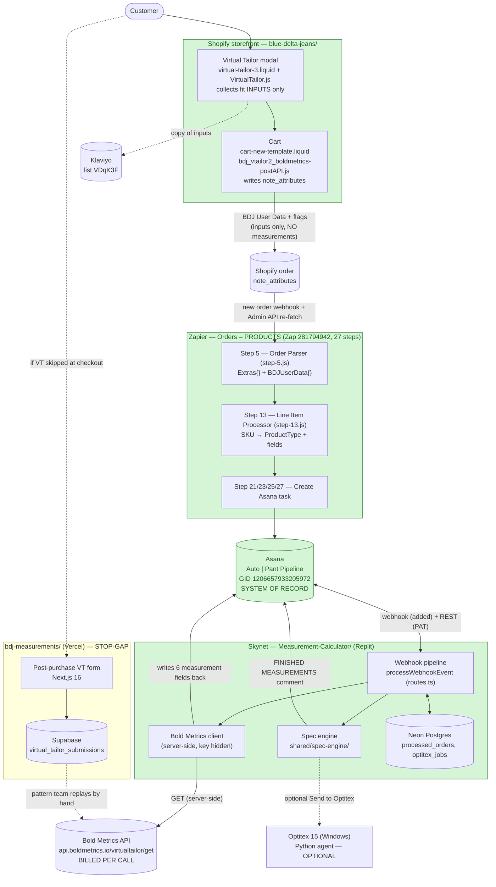
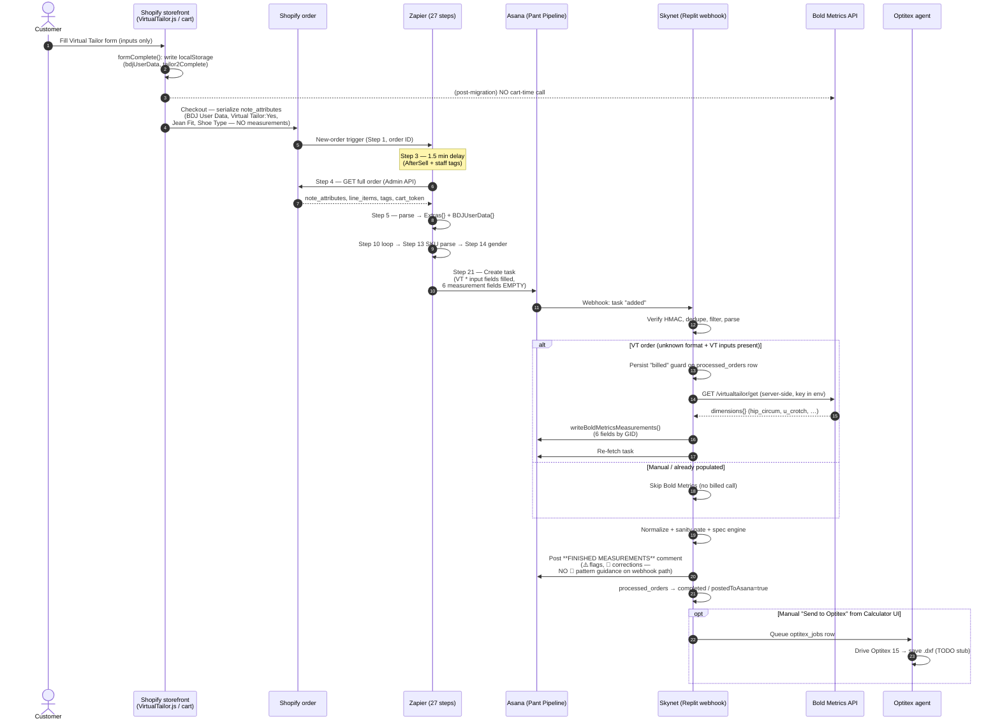

# 01 — System Architecture

> **The most important doc in this repo.** It is the end-to-end map of how a Blue Delta Jeans
> order flows from a customer's Virtual Tailor inputs on the storefront, through the Zapier order
> pipeline, into an Asana production task, and finally through the "Skynet" measurement backend that
> computes body measurements (Bold Metrics), writes them back, runs the spec engine, and posts
> finished garment specs for the pattern team.
>
> If you read only one document before touching any of these systems, read this one. Everything
> here is sourced from the ground-truth docs listed in [Sources](#sources) — every file path, field
> name, and GID below is real.
>
> **Last reviewed:** 2026-06-24 · **Status of the headline migration (Bold Metrics off the cart):**
> **COMPLETE.** Storefront removal **LIVE** (main VT path merged via PR #83, 2026-06-19); per the owner
> the GemPages "quick-tailor" page also no longer fires Bold Metrics on the live site; Skynet
> server-side compute **LIVE** (June 2026); the Zapier `VT *` input mapping that feeds it is **LIVE**
> (Zap v51). The only remaining items are owner-side cleanup (rotate the vendor `user_key`, deactivate
> the unused quick-tailor page, purge stale committed snippet exports — see
> [What is live](#what-is-live)).

---

## Table of contents

1. [The systems at a glance](#1-the-systems-at-a-glance)
2. [System-context diagram](#2-system-context-diagram)
3. [The full order lifecycle (step-by-step)](#3-the-full-order-lifecycle-step-by-step)
4. [Order + measurement sequence diagram](#4-order--measurement-sequence-diagram)
5. [The Bold Metrics migration: BEFORE vs AFTER](#5-the-bold-metrics-migration-before-vs-after)
6. [What is live](#6-what-is-live)
7. [The bdj-measurements stop-gap path](#7-the-bdj-measurements-stop-gap-path)
8. [Who owns / writes what (responsibility table)](#8-who-owns--writes-what)
9. [Cross-system invariants (do not break these)](#9-cross-system-invariants)
10. [Environment variables & secrets (names + locations only)](#10-environment-variables--secrets)
11. [Glossary](#11-glossary)
12. [Sources](#sources)

---

## 1. The systems at a glance

The order/measurement pipeline spans **six** moving parts, each owned by a different repo or vendor.

| # | System | What it is | Repo / location | Hosted on |
|---|--------|-----------|-----------------|-----------|
| 1 | **Shopify storefront ("the theme")** | The e-commerce site + the multi-step Virtual Tailor (VT) fit form. Collects fit **inputs** and attaches them to the order. | `blue-delta-jeans/` (Shopify theme "Web Rescue \| Fall 2024") | Shopify (`blue-delta-jeans.myshopify.com`) |
| 2 | **Zapier "Orders – PRODUCTS"** | A 27-step ETL zap. Re-fetches each new order, parses it, loops line items, routes by product type, and creates Asana production tasks. | Zapier docs (private repo — provided once engaged) · Zap ID `281794942` | Zapier |
| 3 | **Asana** | The **system of record** for production. One task per produced item. Holds VT inputs, measurements, and the finished-measurement comment. | (no repo — config lives in Asana) | Asana |
| 4 | **Skynet (Measurement Calculator)** | The backend that turns **body** measurements into **finished garment** specs. Now also fires Bold Metrics server-side for VT orders and writes the 6 measurements back. | Measurement-Calculator (private repo — provided once engaged) | Replit autoscale (`bdjskynet.replit.app`) + Neon Postgres |
| 5 | **Bold Metrics** | Third-party "Virtual Tailor" body-measurement estimator. Turns VT form answers into body dimensions. **Billed per API call.** | (vendor) — `api.boldmetrics.io` | Bold Metrics |
| 6 | **bdj-measurements** | A standalone Next.js stop-gap form for customers who skip the in-checkout VT. Stores submissions in Supabase for the pattern team to replay through Bold Metrics by hand. | `bdj-measurements/` | Vercel + Supabase |

Supporting cast (not on the critical measurement path, but referenced below): **Klaviyo** (marketing
list, receives a copy of VT inputs), **AfterSell** (post-purchase upsell app that writes note
attributes), **SC Product Options** (passes thread/monogram as line-item properties on online
orders), **Optitex 15** (pattern CAD, driven by a Python agent — optional last step).

---

## 2. System-context diagram



> **Color key:** green = live & owned end-to-end. The Zapier `VT *` mapping is now live (Zap v51), so
> the whole automated path is green. The Klaviyo copy and the Optitex hop are intentionally drawn
> dashed because they are side-channels, not part of the core measurement contract.

---

## 3. The full order lifecycle (step-by-step)

This is the canonical "what happens when a customer buys jeans" walkthrough. Stages map to the
sequence diagram in §4.

### Stage A — Storefront: collect VT inputs

1. **Modal rendered site-wide.** `layout/theme.liquid:363` does ``.
   The snippet `snippets/virtual-tailor-3.liquid` loads the engine `assets/VirtualTailor.js` and
   styles, plus the Klaviyo script (`company_id=SkKEvJ`).
2. **Customer fills the form.** `VirtualTailor.js` is a `VirtualTailor` class. It is a multi-step,
   **gender-branched** form (`<section data-step="1">` … `data-step="12">`). Every change writes
   `localStorage.bdjFormData`. On completion, `formComplete()`:
   - sets `localStorage.tailor2Complete = "Yes"`,
   - writes a human-readable inputs block to `localStorage.bdjUserData` via `formatUserData()`,
   - POSTs a copy to **Klaviyo** (list `VDqK3F`) — independent of everything downstream.
   - **It does NOT call Bold Metrics and does NOT build a Bold Metrics URL** (post-migration).
3. **Inputs collected** (the `formData` object): `gender` (Male/Female), `age`, `weight` (lbs),
   `height` (feet/inches → total inches), `shoe_size`, plus gender-specific — men: `waist_size`,
   `inseam`; women: `bra_band` + `bra_cup` (joined into a bra size). Plus `jean_fit`, contact
   fields, and `notes`.

### Stage B — Cart: serialize inputs into `note_attributes`

4. **Cart hand-off.** `templates/cart.liquid:5` renders `sections/cart-new-template.liquid`. That
   section holds hidden `<textarea name="attributes[X]">` fields inside the cart `<form method="post">`.
   Shopify serializes `name="attributes[X]"` into the order's note attribute `X` at checkout.
5. **The poster populates them.** `assets/bdj_vtailor2_boldmetrics-postAPI.js` (still named for its
   old job) copies `localStorage` values into those hidden fields **with no API call**. Post-migration
   it writes only **inputs + flags**, never measurements.
6. **Resulting `note_attributes` on the order** (post-migration contract):

   | Attribute | Source | Kept? |
   |---|---|---|
   | `Virtual Tailor` (= `"Yes"`) | `tailor2Complete` flag | ✅ |
   | **`BDJ User Data`** (newline `key: value` block of all inputs) | `localStorage.bdjUserData` | ✅ **load-bearing** |
   | `Jean Fit`, `Shoe Type` | VT inputs | ✅ |
   | `Pattern on File`, `White Glove`, `Pocket Initials` | PDP flags | ✅ |
   | `Hip Circum`, `Jean Inseam`, `Knee Circum`, `Thigh Circum`, `U Crotch`, `Waist Average` | ~~Bold Metrics output~~ | 🔴 **removed** |

### Stage C — Zapier: order → Asana task(s)

The zap is a 3-phase ETL (Extract 1–6, Transform 7–14, Load 15–27). Full step table in
[Architecture Overview.md](reference/zapier/Architecture%20Overview.md).

7. **Step 1 — trigger** fires on every new Shopify order. Only `1__id` (order ID) is used; the
   trigger payload is otherwise incomplete (no nested `properties` / `note_attributes`).
8. **Step 2 — filter** guards that the order ID exists.
9. **Step 3 — delay 1.5 min.** Intentional. Lets **AfterSell** finish writing note attributes and
   lets event staff add tags (e.g. `RUSH ROYAL`) before the order is fetched.
10. **Step 4 — re-fetch the full order** from the Shopify Admin REST API:
    `GET …/admin/api/2024-10/orders/{{1__id}}.json`. This is where the complete order arrives,
    including `note_attributes`, `line_items[].properties`, `tags`, `cart_token`, `source_name`.
11. **Step 5 — Order Parser (`step-5.js`).** The first JS step. It:
    - detects `RUSH` from tags (`RUSH ROYAL` > `RUSH COBALT`),
    - sets `OrderType = cart_token ? "Online" : "Direct"` (the cart-token presence is the
      online-vs-POS signal),
    - filters line items to production SKUs (`W-`, `M-`, `CB`, `SHOE-`, `VID-GIFT-`) → `LI[]`,
    - flattens `note_attributes` → `Extras{}`,
    - parses the **`BDJ User Data`** block (split on `\n`, then on `": "`) → `BDJUserData{}`
      (`Gender, Age, Height, Weight, Shoe Size, Bra Size | Waist, Inseam, Jean Fit, Common Shoe, Style`).
    - **Historical bugs (now fixed, deployed):** BUG-01 `quantity > 1` not expanded (one task instead
      of N); BUG-05 `CustomerNew` always `"Yes"`; BUG-06 `\r` residue. All three V4 fixes plus later
      work are deployed — the zap is now at **version 51**. See
      [Step 5 — Order Parser.md](reference/zapier/Step%205%20%E2%80%94%20Order%20Parser.md).
12. **Step 6 — filter** stops the run unless `LIcount > 0`.
13. **Steps 7–9** extract a clean date and increment the Zapier Tables daily counters.
14. **Step 10 — Loop.** The architectural pivot: **Steps 11–27 run once per line item.**
15. **Step 13 — Line Item Processor (`step-13.js`).** Parses the SKU into segments
    (`sku.split("-")`), routes by prefix into product-specific branches, computes the due date, and
    builds the `Properties{}` object (ProductType, Gender, Fabric, Style, Thread, Monogram, DueDate, …).
    **The segment count is part of the online/POS detection** (e.g. online belts are 3-segment, POS
    belts 4/5-segment).
16. **Step 14 — Gender lookup.** Maps the gender code to an Asana enum option GID:
    `M → 1112754700909041`, `F → 1112754700909042` (displays as "W"), Youth → `1209345887831124`.
17. **Steps 15–27 — route + create.** Step 15 splits into Pants & Belts / Shoes / Video Cards.
    The terminal Asana create-task steps are **21 (Pant)**, **23 (Belt)**, **25 (Shoe)**, **27 (Video)**.
    Pants land in **Auto | Pant Pipeline** (GID `1206657933205972`), mapping up to 49 custom fields.

### Stage D — Asana: the task exists (system of record)

18. A production task now exists, e.g. `#114265 Erin Test 1/1`. For a post-migration VT order, the
    **6 Bold Metrics measurement fields are EMPTY** and the **`VT *` input fields are populated** (the
    Zapier mapping is live as of Zap v51 — §6). Demographics (`Gender`, `Age`, `Weight`) are
    always populated.

### Stage E — Skynet: compute measurements, write back, post specs

This is the "hands-free" production path (`processWebhookEvent`, `Measurement-Calculator/server/routes.ts`,
~lines 935–1183). See [Skynet overview](reference/skynet/01-overview.md).

19. **Webhook fires** on Asana task `added`. The raw body's HMAC-SHA256 signature is verified
    against the stored webhook secret; Skynet returns `200` immediately and processes async via
    `setImmediate`.
20. **Filters & dedupe.** Task-type only; `action === 'added'` only; dedupe against the
    `processed_orders` row and a `hasFinishedMeasurements` story scan; skip excluded projects
    (names containing `in production` / `alt info requests` / `alt 2.0` / `alteration`); skip if
    `created_at < 2024-11-01` or `< webhookRegisteredAt`.
21. **Parse.** `parseAsanaMeasurements(task)` reads custom fields **by exact display name** and
    returns a format: `MANUAL` (tape — `Waist Around`/`Seat Around` present), `BOLD_METRICS`
    (`Waist Avg.`/`Hip Circum` present), or `unknown`.
22. **Bold Metrics step (NEW, June 2026).** If the parse is `unknown` **and** VT inputs are present
    (the VT order signature), Skynet:
    - builds the Bold Metrics GET request from the Asana `VT *` input fields (server-side, key in
      env var — never in the browser),
    - **awaits** the response,
    - persists the billed result on the `processed_orders` row **before** the Asana write (so a retry
      never pays for a second call — idempotency guard),
    - writes the **6 measurements back** into the Asana custom fields via
      `writeBoldMetricsMeasurements()` (`Waist Avg.`, `Hip Circum`, `Thigh Circum`, `Knee Circum`,
      `U Crotch`, `Jean Inseam`),
    - re-fetches the task and continues. Because `Waist Avg.`/`Hip Circum` are now populated, any
      reprocess parses as `BOLD_METRICS`.
23. **Normalize + sanity gate.** Normalize gender/style/fit (`Skinny` forces `Trim`); skip unless
    `waist > 10 && seat > 10 && thigh > 5`.
24. **Spec engine** (`shared/spec-engine/`, runs both client- and server-side) computes finished
    garment measurements + ease, runs thigh/seat range checks, auto-corrections, outlier detection
    vs ~5,300 historical patterns, and a **pattern-readiness verdict**
    (`ready_for_pattern` / `needs_review` / `blocked`).
25. **Post results.** `postFinishedMeasurements()` posts one Asana comment titled
    `**FINISHED MEASUREMENTS**` with ⚠️ alert lines and 🔧 correction lines. The footer
    `*Auto-calculated by Garment Measurement Calculator*` is what the dedupe keys on.
    `processed_orders` is upserted to `completed / postedToAsana=true`.
    **Important nuance:** the 🧭 **PATTERN GUIDANCE** block (the `patternReadiness` verdict) is
    rendered by `postFinishedMeasurements()` only when the caller passes `measurements.patternReadiness`
    (`server/asana.ts:631`). The **webhook path does NOT pass it** — the `finishedMeasurements` object
    built at `server/routes.ts:1420–1446` omits `patternReadiness` — so **auto-processed (webhook)
    orders get NO pattern-guidance block.** Only the CLIENT posting paths (the Calculator's
    "Calculate" / "Full Workflow" buttons, which POST to `/api/asana/task/:taskId/measurements` with a
    body that includes `patternReadiness`) produce the 🧭 block. (The spec engine still *computes* the
    readiness verdict on the server — it just isn't included in the auto-posted comment.)
26. **Optional Optitex.** Only the Calculator UI's "Send to Optitex" button queues an `optitex_jobs`
    row. A Python agent on a Windows box polls, drives Optitex 15, and saves a `.dxf`. **As shipped,
    the actual Optitex UI automation is a commented-out TODO** — the agent reports success without
    producing a file (see [docs/08](reference/skynet/08-optitex-agent.md)). The webhook
    path does **not** create Optitex jobs.

---

## 4. Order + measurement sequence diagram



---

## 5. The Bold Metrics migration: BEFORE vs AFTER

**One-sentence summary:** the storefront cart used to call Bold Metrics on every cart load and write
the 6 computed measurements into the order note; now the cart is **inputs-only**, and **Skynet**
computes the measurements **once, post-order**.

### Why (the drivers)

1. **Cost.** Bold Metrics bills per call. The cart fired it on every cart modification — pre-purchase,
   for people who never buy, and repeatedly on quantity changes. Real need ≈ 1,000 calls/month; we
   were billed for 3,000–4,000. → The backend call must be **idempotent and guarded**.
2. **Data loss.** At the cart there was a race between the Bold Metrics call and checkout navigation.
   The old code captured only the Bold Metrics *response* and dropped the raw inputs — when navigation
   won, everything was lost; even on success the raw inputs weren't persisted. Submitting **inputs
   first, computing after** gives a permanent fallback (the raw inputs live in Asana).
3. **Decoupling.** This is the first step before the Jeanius rebuild, Tom James automation, and the
   future custom database. It removes Bold Metrics as a blocker and lets SEO traffic grow without
   inflating API cost.

### BEFORE (Bold Metrics fired at the cart)

```
VirtualTailor.js  →  builds boldPostUrl (endpoint + hardcoded user_key) in localStorage
Cart  →  bdj_vtailor2_boldmetrics-postAPI.js: $.ajax(boldPostUrl) → Bold Metrics
      →  on success, computes 6 measurements + writes them into hidden attributes[…] textareas
Order placed  →  note_attributes include the 6 MEASUREMENTS
Zapier Step 5  →  Extras{} carries the 6 measurements; BDJUserData{} carries (some) inputs
Asana task  →  6 measurement fields PRE-FILLED at creation
Skynet  →  reads the 6 fields, runs spec engine, posts FINISHED MEASUREMENTS
```

### AFTER (inputs-only cart; Skynet computes post-order)

```
VirtualTailor.js  →  writes inputs to localStorage; NO Bold Metrics URL, NO key
Cart  →  poster writes ONLY inputs/flags into attributes[…] (no API call)
Order placed  →  note_attributes carry INPUTS (BDJ User Data, Virtual Tailor:Yes, Jean Fit, Shoe Type)
Zapier Step 5  →  BDJUserData{} carries the inputs; Zapier maps them into the Asana VT * fields (live, v51)
Asana task  →  6 measurement fields EMPTY; VT * input fields POPULATED
Skynet webhook  →  detects VT order → calls Bold Metrics server-side → AWAITS →
                   writes 6 fields back → spec engine → FINISHED MEASUREMENTS
```

### What changed, concretely

| Aspect | BEFORE | AFTER |
|---|---|---|
| Who calls Bold Metrics | The browser, at the cart, on every cart load | Skynet, server-side, once per real order |
| Where the key lives | Historically hard-coded in the storefront VT engine asset (+ several dead engine copies) | `BOLDMETRICS_USER_KEY` env var on Replit; never in the browser |
| What the order note carries | 6 measurements + some inputs | Inputs only (`BDJ User Data` block + flags) |
| Bold Metrics call frequency | 3,000–4,000/month (pre-purchase noise) | ≈ 1,000/month (post-purchase, guarded, idempotent) |
| Raw-input durability | Dropped unless the ajax succeeded in time | Always persisted in the order → Asana |
| Who writes the 6 measurement fields | Zapier Step 21 (from `Extras{}`) | **Skynet** (`writeBoldMetricsMeasurements`) — the ownership flip |

### Two cross-team corrections surfaced by the storefront code (important for parity)

These came out of the storefront forensic pass and override earlier Skynet-side guesses:

1. **`Waist Average` is NOT `waist_circum_preferred`.** The old cart computed it as a **3-way mean,
   rounded to 2 decimals**:
   `waist_average = round((waist_circum_natural + waist_circum_preferred + waist_circum_stomach) / 3, 2)`
   (`bdj_vtailor2_boldmetrics-postAPI.js:99`). Skynet must replicate this exact mean for the
   `Waist Avg.` write-back so historical and new orders match. *(Skynet's migration doc §9 / open
   question #1 had assumed `waist_circum_preferred` — this corrects it.)*
2. **`Thigh Circum` = `thigh_circum_proximal`** (upper thigh, ~23"), confirmed. Do **not** map
   `thigh_circum_distal` (~16", just above the knee).

The other four are direct: `Hip Circum ← hip_circum`, `Jean Inseam ← jean_inseam`,
`Knee Circum ← knee_circum`, `U Crotch ← u_crotch`.

---

## 6. What is live

The Bold Metrics → Skynet migration is **complete**. The table below records current state; a short
list of owner-side cleanup items (not agency work) follows.

| Piece | Owner | Status | Notes |
|---|---|---|---|
| Storefront: stop the **main VT cart path** from calling Bold Metrics; write inputs only | Caleb + Cantilever (storefront) | ✅ **LIVE** | PR #83 merged to the live theme 2026-06-19. The cart now writes **VT inputs only**; the `BDJ User Data` path preserved. The hardcoded `user_key` was removed from the live site. |
| Storefront: data-loss fix (inputs persist even when no API call) | Caleb + Cantilever | ✅ **LIVE** | Side effect of re-wiring the poster's `"Yes"` branch to call `retrieveLocalData()` directly instead of through the BM ajax success. |
| GemPages "quick-tailor" flow — Bold Metrics removal on the live site | Caleb (storefront) | ✅ **LIVE (live no longer fires)** + ⚠️ **stale committed exports** | Per the owner, the GemPages quick-tailor page **no longer fires Bold Metrics on the live site** and the hard-coded key was removed there. **Honest repo nuance:** a legacy GemPages quick-tailor snippet committed to the theme repo still lags the live page — GemPages sections are app-managed, so the committed export is **stale** and a hard-coded Bold Metrics key remains in it, slated for rotation. LIVE = removed; the committed snippet export is **stale**. Do **not** claim the repo is fully key-free, and do **not** claim the live site still fires. Anyone rotating/auditing should also purge the committed copies. |
| Skynet: fire Bold Metrics server-side in the webhook, await, write 6 fields back | Skynet repo | ✅ **LIVE** | June 2026. Idempotent/guarded; billed result persisted before the Asana write; failures mark the order `failed` (recover via the Bold Metrics tab). |
| Skynet: `setAsanaCustomFields` / `writeBoldMetricsMeasurements` (first custom-field WRITE) | Skynet repo | ✅ **LIVE** | `PUT /tasks/:id` with a `custom_fields` GID map. Requires the PAT to have **write** scope. |
| Skynet: Bold Metrics tab + Full Workflow dashboard (manual recovery) | Skynet repo | ✅ **LIVE** | Replaces the public Quick Tailor page; `POST /api/asana/task/:id/boldmetrics` (409 unless `overwrite=true`). |
| **Zapier: map the 5 `VT *` input fields onto each new Asana task** | Caleb (Zapier) | ✅ **LIVE (Zap v51)** | The Zapier mapping that fills the 5 `VT *` fields per order is **deployed and live** — each new order now populates them. (Skynet still tolerates empty `VT *` fields defensively, but the normal path is now populated.) |
| Owner cleanup: rotate the Bold Metrics key on the vendor side | Caleb (owner, not agency) | 🟡 **OPEN — not yet rotated** | The key was removed from the live site, but a hard-coded Bold Metrics key still survives in a legacy GemPages quick-tailor snippet committed to the theme repo (stale, app-managed export). Rotate it vendor-side, then purge the committed copies so no copy remains valid. |
| Owner cleanup: deactivate the now-unused quick-tailor page | Caleb (owner, not agency) | 🟡 **OPEN** | The live quick-tailor page no longer fires Bold Metrics; deactivate it. Its function is rebuilt as the Skynet Bold Metrics tab. |
| Owner cleanup: purge the stale committed key copies | Caleb (owner, not agency) | 🟡 **OPEN** | Remove the hard-coded Bold Metrics key from the legacy GemPages quick-tailor snippet exports committed to the theme repo (they lag the app-managed live page). |
| Zapier: V4 `step-5.js` bug fixes (BUG-01/05/06) | Caleb (Zapier) | ✅ **LIVE (Zap v51)** | The V4 fixes plus later work are deployed — the zap is now at version 51. |
| Skynet: Optitex agent actually drives Optitex (not a stub) | Skynet / pattern team | 🟡 **PENDING** | Real UI automation is a commented-out TODO. |
| bdj-measurements Phase 2 (team/admin dashboards, auth, notifications) | bdj-measurements repo | 🟡 **PLANNED** | Phase 1 (public form → Supabase, read in Studio) is built; Phase 2 routes/migrations designed. |

---

## 7. The bdj-measurements stop-gap path

`bdj-measurements/` is a **standalone, Shopify-independent** Next.js 16 app (Vercel + Supabase). It
exists because some customers skip the in-checkout Virtual Tailor; they fill this **post-purchase**
form instead, and the pattern team picks the submissions up out of Supabase.

Key facts:

- It captures the **same VT question set** as the storefront form (lifted from
  `snippets/virtual-tailor-3.liquid` / `assets/VirtualTailor.js` into `lib/steps.ts`), but it
  **does not call Bold Metrics** and **does not send to Klaviyo**.
- `lib/bold-metrics.ts` mirrors the storefront's `generateBoldMetricsUrl()` **minus the `user_key`**.
  The shaped request object is stored verbatim in the `bold_metrics_payload` (jsonb) column.
- The browser never sees the service-role key — all writes go through `app/actions.ts` (server
  action), validated with zod (`lib/schema.ts`) before insert. Spam controls: honeypot field
  (`company_website`), min-time-on-form (~3s), and optional Upstash IP rate limit (5/min).
- **Pattern-team workflow (Phase 1):** sign in to Supabase Studio → open
  `virtual_tailor_submissions` → filter `processed = false` → copy the row's `bold_metrics_payload`,
  append the team's `user_key`, POST to `https://api.boldmetrics.io/virtualtailor/get` by hand → set
  `processed = true`.

**How it relates to the main pipeline:** it is a **parallel, manual** capture lane, not part of the
automated Shopify → Zapier → Asana → Skynet flow. It feeds Bold Metrics directly (by hand), bypassing
Asana and Skynet. It is explicitly a **stop-gap until the real internal database exists** (~6+ months
out). Do not confuse it with the "standalone customer-facing VT app" future initiative, nor wire it
into Skynet — they are separate efforts.

---

## 8. Who owns / writes what

### Repos & owners

| System | Repo | Primary owner |
|---|---|---|
| Storefront theme + VT form | `blue-delta-jeans/` | Caleb + Cantilever |
| Zapier order pipeline | `zapier-documentation/` (Zap `281794942`) | Caleb |
| Asana production config | (Asana) | Caleb / pattern team (Hunter = technical lead) |
| Skynet measurement backend | `Measurement-Calculator/` | Skynet repo owner |
| bdj-measurements stop-gap | `bdj-measurements/` | Caleb |
| Bold Metrics (vendor) | — | Bold Metrics |

### The data each system writes

| Data | Written by | Read by |
|---|---|---|
| VT form inputs → `localStorage` (`bdjUserData`, `bdjFormData`, `tailor2Complete`) | `VirtualTailor.js` | the cart poster |
| Copy of VT inputs → Klaviyo (list `VDqK3F`) | `VirtualTailor.js` | Marketing |
| Order `note_attributes` (inputs + flags) | cart poster `bdj_vtailor2_boldmetrics-postAPI.js` via Shopify form serialize | Zapier Step 5 |
| `Extras{}` + `BDJUserData{}` (parsed order) | Zapier `step-5.js` | downstream zap steps |
| `Properties{}` (parsed line item / SKU) | Zapier `step-13.js` | Asana create-task steps |
| Asana task + most custom fields (fabric, style, demographics, **VT \* inputs**) | Zapier Steps 21/23/25/27 | Skynet |
| **The 6 measurement fields** (`Waist Avg.`, `Hip Circum`, `Thigh Circum`, `Knee Circum`, `U Crotch`, `Jean Inseam`) | **Skynet `writeBoldMetricsMeasurements()`** (post-flip) | Skynet spec engine, pattern team |
| `**FINISHED MEASUREMENTS**` comment | Skynet `postFinishedMeasurements()` | Pattern team |
| `processed_orders`, `optitex_jobs`, `webhook_settings` rows | Skynet (Neon Postgres) | Skynet |
| `virtual_tailor_submissions` rows | bdj-measurements server action | Pattern team (Supabase Studio) |

### ⭐ The ownership flip (the most important change)

The 6 measurement fields below **used to be written by Zapier Step 21** (sourced from the cart's
Bold Metrics output in `Extras{}`). They are **now written by Skynet** after it calls Bold Metrics
server-side. Zapier no longer carries measurements — it carries the `VT *` **inputs**, and Skynet
owns the outputs.

| Asana field (display name) | GID | Engine field | Bold Metrics `dimensions` key |
|---|---|---|---|
| `Waist Avg.` *(trailing period required)* | `1206671503499692` | waist | 3-way mean (see §5 correction) |
| `Hip Circum` | `1206671503499682` | seat | `hip_circum` |
| `Thigh Circum` | `1206671503499688` | thigh | `thigh_circum_proximal` |
| `Knee Circum` | `1206671503499686` | knee | `knee_circum` |
| `U Crotch` | `1206671503499690` | fullRise | `u_crotch` |
| `Jean Inseam` | `1206671503499684` | inseam | `jean_inseam` |

> Don't confuse these **output** fields with the **input** fields Skynet reads to build the request:
> `VT Waist` (`1215612213755178`, input) is *not* `Waist Avg.` (output); `VT Inseam`
> (`1215612213755180`, input) is *not* `Jean Inseam` (output).

The 5 `VT *` input fields (read by Skynet, populated by the Zapier mapping — live as of Zap v51).
All are **number** type except `VT Bra Size`, which is **text**:
`VT Height` `1215612213755174` · `VT Shoe Size` `1215612213755176` · `VT Waist` `1215612213755178`
· `VT Inseam` `1215612213755180` · `VT Bra Size` `1215851864495064` (text). Plus pre-existing inputs
`Gender` (enum `1112754700909040`), `Age` `1206671503499694`, `Weight` `1206671503499698`.

---

## 9. Cross-system invariants

These are the load-bearing contracts. Break one and the pipeline silently produces wrong tasks or
drops measurements — usually with no error.

1. **Asana custom fields are matched by EXACT display name, never by GID** (for reads /
   parsing — `parseAsanaMeasurements`, `parseVTInputs`). Renaming a field in Asana silently breaks
   parsing. The classic landmine: **`Waist Avg.` has a trailing period** — `Waist Avg` (no period)
   will not match. *Writes* use GIDs (§8 table), but reads are name-keyed.

2. **`BDJ User Data` is the load-bearing note attribute.** It is the single newline `key: value`
   block that carries every VT input (`Gender, Age, Height, Weight, Shoe Size, Bra Size | Waist,
   Inseam, Jean Fit, Common Shoe, Style`). The whole migration's premise is "keep writing
   `BDJ User Data`." The poster must populate `#bdj_user_data` **unconditionally** — the old code
   only wrote it inside the Bold Metrics ajax success callback, which is exactly the data-loss bug
   the migration fixes. All five `VT *` Asana fields are derived from this one block.

3. **Order type is detected by `cart_token` presence; SKU/SC-Product-Options channel by segment
   count.** `OrderType = cart_token ? "Online" : "Direct"`. Online orders carry thread/monogram as
   line-item properties (SC Product Options); POS orders encode them in the SKU, and **Step 13
   distinguishes them by the number of `-`-delimited SKU segments** (e.g. online 3-segment vs POS
   4/5-segment belts). If SC Product Options is replaced, both the property format and the segment
   parsing break.

4. **The Bold Metrics call must be idempotent and guarded.** Never fire if the measurement fields
   are already populated or the order is already processed. The existing `hasFinishedMeasurements`
   dedupe **fails open** on any Asana API error, so it cannot be the only guard — check the
   measurement fields directly, and persist the billed result on the `processed_orders` row
   **before** the Asana write.

5. **The spec engine is shared and runs in both the browser and the server** (browser Home/Batch,
   server webhook). A change to `shared/spec-engine/` affects all paths by design.

6. **Dedupe depends on the comment footer.** `hasFinishedMeasurements` keys on the literal footer
   `*Auto-calculated by Garment Measurement Calculator*` (plus keyword heuristics). Changing the
   `FINISHED MEASUREMENTS` comment format risks double-posting.

7. **Skynet middleware order is load-bearing.** `/api/asana/webhook` must receive `express.raw`
   **before** the global `express.json` (`server/index.ts`) or HMAC verification breaks.

8. **Quarter-rounding applies only to Bold Metrics values.** `roundQuarter(v) = Math.round(v*4)/4`.
   Manual/tape measurements pass through raw. For Bold Metrics orders Skynet derives
   `outseam = roundQuarter(inseam − 0.5)` and `calf = roundQuarter(knee − 1)` (there is no Calf field
   in the VT set, and Bold Metrics returns no calf circumference).

9. **`main` deploys to production via Replit autoscale** (`npm run build` → `npm run start`).
   `npm run check` is **not** part of the build — type errors do **not** block deploys.

10. **Don't rely on Zapier's `paused` export field.** `zap-export.json` shows `"paused": true` on
    Steps 2–6, but live runs confirm they execute. Verify against live run history, not the export.

---

## 10. Environment variables & secrets

> Names + locations only. No secret values, keys, or PII appear in this repo.

### Skynet (`Measurement-Calculator/`, Replit secrets)

| Var | Purpose |
|---|---|
| `DATABASE_URL` | Neon Postgres connection (throws if unset) |
| `ASANA_ACCESS_TOKEN` | Asana PAT (Bearer). Needs **write** scope for the 6-field write-back |
| `BOLDMETRICS_CLIENT_ID` | `= bluedelta` |
| `BOLDMETRICS_USER_KEY` | The company-wide Bold Metrics secret (server-only) |
| `BOLDMETRICS_BASE_URL` | Optional; default `https://api.boldmetrics.io/virtualtailor/get` |
| `OPTITEX_AGENT_TOKEN` | Bearer token the Windows Optitex agent uses to poll |
| `REPLIT_DOMAINS` | Used to derive the webhook target URL (`REPLIT_DOMAINS[0]`) |
| `PORT` | `5000` |

### Storefront (`blue-delta-jeans/`)

The Bold Metrics key was historically **hard-coded** in the storefront VT engine asset. The
migration removed the key from the live site (main VT path + GemPages quick-tailor page). A
hard-coded Bold Metrics key still survives in a legacy GemPages quick-tailor snippet committed to the
theme repo (a stale, app-managed export that lags the live page), and is **not yet rotated** — rotate
it vendor-side and purge the committed copies so no copy remains valid. No env-var mechanism on the
theme — the goal is simply that no Bold Metrics key remains in shipped assets.

### bdj-measurements (`bdj-measurements/`, Vercel project)

| Var | Notes |
|---|---|
| `NEXT_PUBLIC_SUPABASE_URL` / `NEXT_PUBLIC_SUPABASE_ANON_KEY` | Public |
| `SUPABASE_URL` | Server mirror |
| `SUPABASE_SERVICE_ROLE_KEY` | **Server-only**; never `NEXT_PUBLIC_*` |
| `UPSTASH_REDIS_REST_URL` / `UPSTASH_REDIS_REST_TOKEN` | Optional (IP rate limit) |
| `RESEND_API_KEY` / `NEXT_PUBLIC_SITE_URL` | Phase 2 notifications |

> ⚠️ Tech-debt flagged in the Skynet migration doc: `.env` was historically **not** gitignored in the
> Skynet repo and `.env.example` told you to copy it to `.env`. Confirm no secret was committed before
> any push, and ensure `.env` is gitignored.

---

## 11. Glossary

| Term | Meaning |
|---|---|
| **VT / Virtual Tailor** | The storefront fit form (`virtual-tailor-3.liquid` + `VirtualTailor.js`) that collects fit inputs. |
| **Skynet** | Internal name for the Measurement Calculator backend (`Measurement-Calculator/`). |
| **Bold Metrics** | Third-party API that turns VT inputs into body measurements. Billed per call. |
| **Body vs finished measurements** | Body = what the customer measures; finished garment = what the jeans should measure (body + ease). Skynet's job is body → finished. |
| **`note_attributes`** | Shopify order-level key/value data. The transport for VT inputs. |
| **`Extras{}` / `BDJUserData{}`** | Zapier Step 5 outputs: flattened note attributes / parsed VT inputs. |
| **Online vs Direct/POS** | Determined by `cart_token` presence; drives due dates and where customization data lives. |
| **The flip** | The ownership change where the 6 measurement fields moved from Zapier-written to Skynet-written. |

---

## Sources

This document is a synthesis of the following ground-truth files. Consult them for line-level detail.

- **Storefront:**
  [Virtual Tailor / Bold Metrics theme doc](reference/shopify-theme/VIRTUAL_TAILOR_BOLDMETRICS.md) ·
  [Shopify theme README](reference/shopify-theme/README-theme.md)
- **Zapier:**
  [Architecture Overview.md](reference/zapier/Architecture%20Overview.md) ·
  [Step 5 — Order Parser.md](reference/zapier/Step%205%20%E2%80%94%20Order%20Parser.md) ·
  [Step 13 — Line Item Processor](reference/zapier/Step%2013%20%E2%80%94%20Line%20Item%20Processor.md) ·
  [Asana Field Mapping (Steps 21–27)](reference/zapier/Asana%20Field%20Mapping%20(Steps%2021%E2%80%9327).md) ·
  [Online vs POS Product Architecture](reference/zapier/Online%20vs%20POS%20Product%20Architecture.md) ·
  [SKU Reference Guide](reference/zapier/SKU%20Reference%20Guide.md)
- **Skynet:**
  [01-overview.md](reference/skynet/01-overview.md) ·
  [04-asana-integration.md](reference/skynet/04-asana-integration.md) ·
  [05-spec-engine.md](reference/skynet/05-spec-engine.md) ·
  [08-optitex-agent.md](reference/skynet/08-optitex-agent.md) ·
  [09-known-issues-and-tech-debt.md](reference/skynet/09-known-issues-and-tech-debt.md)
- **Stop-gap:** [bdj-measurements README](reference/virtual-tailor-standalone/README.md)
- **Business context (domain):**
  [Domain context — Tailoring & Fit / Manufacturing](reference/domain/domain-context.md)
- **Notion (deeper, if accessible):** the Zapier pipeline pages and the Skynet technical docs are
  mirrored in the company Notion workspace — see [Notion source context](appendix/notion-source-context.md).

---

*Bold Metrics migration ground-truth: migration COMPLETE. Storefront main VT path removed via PR #83
(merged 2026-06-19, live); the GemPages quick-tailor page no longer fires on the live site (committed
snippet exports lag and remain stale). Zapier is live at **Zap v51** with the 5 `VT *` input fields
mapped per order; Skynet server-side compute live June 2026. Asana GIDs and the Bold Metrics
request/response contract are sourced from the live Asana API (June 2026) and the Skynet migration
context doc.*
