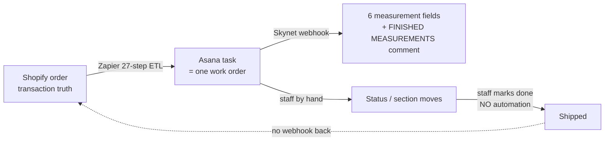
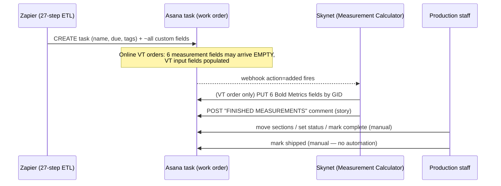
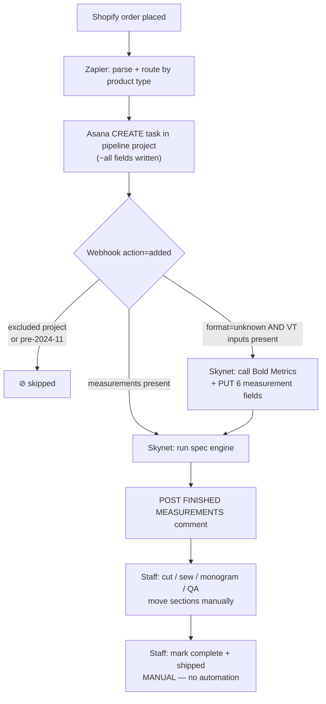

# 02 — Asana as the Production-Pipeline Database

> **TL;DR** — Blue Delta does not have a real order database. **Asana is it.** Every
> production-qualifying line item a customer buys becomes one Asana **task** (a work order) in one
> of four "Auto | … Pipeline" projects. Zapier creates the task and writes ~most of the fields;
> Skynet (the Garment Measurement Calculator) writes the six Bold Metrics measurement fields and a
> `FINISHED MEASUREMENTS` comment; the production staff move the task through their workflow by
> hand. There is no automated "shipped" event — fulfillment is a manual status change. This document
> explains how that works, what the field "schema" is, who writes what, and why it is the single
> biggest piece of tech debt the company is planning to retire.

**Status legend used throughout:** ✅ Live in production · 🟡 Live but fragile / partial · ⏳ Pending / planned

**Related docs**
- Full per-step field GID tables → [Asana Field Mapping (Steps 21–27).md](reference/zapier/Asana%20Field%20Mapping%20(Steps%2021%E2%80%9327).md)
- The 27-step Zapier order pipeline that *creates* the tasks → [Architecture Overview.md](reference/zapier/Architecture%20Overview.md)
- Skynet's Asana client (parsing + writes) → [04-asana-integration.md](reference/skynet/04-asana-integration.md) and `server/asana.ts`
- Online vs POS data sources (why one Asana field has multiple Zapier source tokens) → [Online vs POS Product Architecture.md](reference/zapier/Online%20vs%20POS%20Product%20Architecture.md)
- Skynet known issues → [09-known-issues-and-tech-debt.md](reference/skynet/09-known-issues-and-tech-debt.md)

---

## 1. Why Asana is the de-facto order database

Blue Delta's order data lives in three places, none of which is a purpose-built production DB:

| System | Role | What it is NOT |
|---|---|---|
| **Shopify** | Source of truth for the *transaction* (payment, customer record, line items) | Not the production tracker — Shopify doesn't know "this pant is cut / sewn / shipped" |
| **Zapier** | The ETL that turns a Shopify order into production work orders | Stateless — it fires and forgets; it stores nothing queryable beyond a daily counter table |
| **Asana** | The **production pipeline tracker** — the working system of record for *making and shipping* the garment | Not a database — it's a project-management tool being used as one |

So in practice, **once an order is placed, Asana is where the work lives.** Production staff open
Asana, not Shopify, to see what to cut, sew, monogram, and ship. The Skynet docs state it plainly:
"Asana is the system of record" (`Measurement-Calculator/docs/README.md`).

Three properties make it specifically a *production* database and not a customer database:

1. **It tracks orders, not customers.** A task is a single garment work order
   (`#100001 Jordan Sample 1/1`), not a person. There is no customer object, no order history, no
   "all pants this customer has ever bought." If the same customer orders twice, that's two
   unrelated tasks. Customer identity lives in Shopify; Asana only carries the name/order-number
   stamped into the task title plus a few denormalized fields (`New Customer`, body profile).
2. **It is denormalized to the point of one row per garment.** A 5-pant order becomes 5 tasks
   (`… 1/5` through `… 5/5`), each carrying its own full copy of the spec. There is no shared
   "order" parent — the order number in the title is the only join key.
3. **It is manual at shipping.** Nothing automatically marks a task complete or shipped. A human
   drags the task to a "shipped"/done section or marks it complete. There is **no fulfillment
   webhook back to Shopify** and no automated reconciliation. This is the most important thing to
   understand about treating Asana as the DB: the *create* side is automated, the *lifecycle and
   close-out* side is people clicking.



---

## 2. The four pipeline projects

Zapier routes each line item by product type (Paths begin at Step 15) into one of four Asana projects. Each
project is a separate "table" with its own column set (custom fields). All four live in the same
Asana workspace.

| # | Project (display name) | Project GID | Products routed here | Zapier "Create Task" step | Total custom fields |
|---|---|---|---|---|---|
| 1 | **Auto \| Pant Pipeline** | `1206657933205972` | Men's Pants, Women's Pants, Shorts, Kentucky Derby Pants | Step 21 | 49 (6 shared + 43 pant-specific) |
| 2 | **Auto \| Belt Pipeline** | `1206657932919233` | All belts (online 3-segment + POS 4/5-segment) | Step 23 | 17 (6 shared + 11 belt) |
| 3 | **Auto \| Shoe Pipeline** | `1206648505149980` | All shoes (Classic + Custom; POS/event only) | Step 25 | 15 (6 shared + 9 shoe) |
| 4 | **Auto \| Video Card Pipeline** | `1206657933205969` | Video Gift Cards only | Step 27 | 7 (6 shared + 1 video) |

> **All four pipeline GIDs are now captured (live via the Asana API, June 2026).** They live in the
> Asana workspace `2357765184667`, team **PRODUCTION ORDER PIPELINE** (`5333978630773`). The Pant
> project GID `1206657933205972` is the one Skynet hard-codes (its measurement-field GIDs all belong
> to this project — see §5). Earlier versions of this doc listed Belt/Shoe as "not captured" and
> Video Card as a workspace id (`2357765184667`) — those were placeholders and are **now corrected**
> with the real per-project GIDs above. Source: live Asana API capture (June 2026) +
> [Asana Field Mapping (Steps 21–27).md](reference/zapier/Asana%20Field%20Mapping%20(Steps%2021%E2%80%9327).md).

### 2.1 Adjacent / related pipelines (B2B + Corporate)

Two further pipeline projects exist in the same team and are relevant to the **Jeanius** custom-DB
effort and B2B flows, though they are not the four product-routed "Auto" pipelines above:

| Project (display name) | Project GID | Relevance |
|---|---|---|
| **AUTO \| TJ Order Pipeline** | `1210690652026343` | Tom James B2B orders — relevant to Jeanius |
| **Corporate Sales + CET Pipeline** | `1215501202787817` | Corporate / CET flow — relevant to Jeanius corporate flow |

### 2.2 Projects Skynet EXCLUDES from automation

Skynet skips tasks whose project **name** (lowercased, substring match — see §7) marks them as
non-production-create work. The live project GIDs for those excluded projects:

| Excluded project (by name) | Project GID |
|---|---|
| **ORDER PIPELINE** | `5333978630781` |
| **ALTERATION** | `52059426160001` |
| **Alt 2.0** | `1209872583838617` |
| **alt info requests** | *(name-matched; no standalone project GID captured)* |

**What each project represents**

- **Pant Pipeline** is the heavy one. Pants are the core product, fully measured, and the only
  product Skynet computes finished garment specs for. The full body-measurement set, Virtual Tailor
  fields, and Bold Metrics output fields all live here.
- **Belt Pipeline** carries leather/width/hardware/stitching/monogram plus *only* a waist
  measurement for sizing — belts don't need thigh/knee/rise. No full body-measurement set.
- **Shoe Pipeline** carries shoe type, gender, size, and the customization options (Laces, Swoosh,
  Back Tab/Eyelets, Toe Cap/Back Heel, Toe Box/Mid Panel). All values come from line-item
  properties manually keyed in from **paper order forms** at events. Shoes are POS/event-only and
  the only pipeline with **no `Product Type` field** (everything here is a shoe by definition).
- **Video Card Pipeline** is the trivial one — a video gift card needs no measurements,
  customization, or gender, so it carries only basic order tracking (7 fields). It's the only
  pipeline with **no `New Customer` and no `Gender`** field.

---

## 3. A task *is* a work order

The Asana **task** is the atomic unit. One task = one garment to make and ship. Everything the
shop needs is on that single task object:

| Asana primitive | What it holds in this system |
|---|---|
| **Task name** | The human key: `#{OrderNumber} {First} {Last} {iter}/{total}{rush}` → e.g. `#100001 Jordan Sample 1/1 | RUSH ROYAL` |
| **Project membership** | Which pipeline (= which "table") this work order lives in; also drives Skynet's excluded-project skip logic (§7) |
| **Due date (`due_on`)** | Calculated by Zapier as order date + product-specific offset (pants online 14d / POS 30d, belts 30d, shoes 45d, video 5d) |
| **Tags** | `Event (tags)` — event names, staff names, `RUSH ROYAL`/`RUSH COBALT` |
| **Custom fields** | The "columns" — up to 49 for pants; the full spec + measurements (§4) |
| **Stories (comments)** | The audit log. Skynet posts the `FINISHED MEASUREMENTS` comment here (§6) |
| **Section / completion** | The lifecycle — moved by staff (§6 lifecycle) |

The task title is the only thing that joins a work order back to its Shopify order: searching Asana
for `100001` or `#100001` is how staff (and Skynet's typeahead) find a task. There is no foreign
key, no order-ID custom field — just the number in the name. Skynet's
`searchTasksByName` (`asana.ts:666`) explicitly searches both `<q>` and `#<q>` for this reason.

---

## 4. The custom-field "schema"

Asana custom fields are the column definitions. The Pant Pipeline's ~49 fields are the closest
thing the business has to a schema for a production order. **All fields are `text` except `Gender`
(which is `enum`).** Every field was created by the previous developer ("JK", GID
`1200862872026994`), is `public_with_guests`, and `default_access_level: admin`.

> **The full 49-field GID table is NOT reproduced here on purpose.** The authoritative, live-verified
> list of every field name → GID → source token lives in
> [Asana Field Mapping (Steps 21–27).md](reference/zapier/Asana%20Field%20Mapping%20(Steps%2021%E2%80%9327).md)
> (see the "Asana Custom Field GID Reference" section there). Use that when making direct Asana API
> calls or building the replacement DB. Below is the field set summarized **by group** so you can
> reason about the shape without scrolling 49 rows. The **key GIDs** (6 Bold Metrics outputs, 5 VT
> inputs, garment spec, and the per-pipeline Belt/Shoe/Video field sets) are captured in §4.3 below
> from the live Asana API (June 2026).

> **⚠️ SHARED vs PER-PROJECT GID nuance — document and respect this.** Many custom fields are
> **workspace-shared** and reuse **one** `custom_field` GID across all pipelines, e.g.
> `Gender`=`1112754700909040` (enum), `Order Type`=`1206649285610127`, `Event (tags)`=`1203340633343053`,
> `Quantity`=`1206648951199301`, `Note`=`1206648966139310`, `New Customer`=`1206649008312472`,
> `Product Type`=`1203386148481388`, `Print PDF`=`1207446201916950`, `Monogram`=`1206660694454917`,
> `Waist Around`=`1206889563216920`. **BUT** some same-named fields are **per-project duplicates with
> DIFFERENT GIDs** — e.g. `Waist Avg.` (Pant=`1206671503499692`, Belt=`1206660342181401`) and
> `White Glove` (Pant=`1208695148089782`, Belt=`1210137215275442`). This is exactly **why Skynet
> matches Asana fields by EXACT DISPLAY NAME, not GID** (§7): a GID is not a stable cross-project key,
> but the display name is — and therefore **renaming a field silently breaks Skynet**.

### 4.1 Pant Pipeline field groups

| Group | Fields (display names) | Who fills it | Notes |
|---|---|---|---|
| **Shared (all 4 pipelines)** | Task Name, Due On, `Event (tags)`, `Order Type`, `Quantity`, `Note` | Zapier | Configured identically in Steps 21/23/25/27 |
| **Order info** | `New Customer`, `Gender` (enum), `Order Type`, `Product Type`, `Quantity`, `Event (tags)` | Zapier | `Gender` is the only enum; values are GIDs: M=`…909041`, W=`…909042`, Youth=`…831124` |
| **Production flags** | `POF` (Pattern On File), `White Glove`, `Note`, `Print PDF` | Zapier (`Print PDF` set by another mechanism — not in the Zapier transcription) | |
| **Garment spec** | `Fabric`, `Style`, `Thread`, `Monogram`, `Monogram Thread`, `Fit`, `Shoe Type`, `Pockets`, `Break`, `Waist Ride` | Zapier | Several use **multi-token fallback** to merge online (SC Product Options) vs POS (SKU) sources — see [Field Mapping → Multi-Token Fallback Chains](reference/zapier/Asana%20Field%20Mapping%20(Steps%2021%E2%80%9327).md) |
| **Bold Metrics measurement OUTPUTS (the 6)** | `Waist Avg.`, `Hip Circum`, `Thigh Circum`, `Knee Circum`, `U Crotch`, `Jean Inseam` | ⚠️ **Skynet** (post-creation, §5). Historically Zapier filled these from order note attributes, but Bold Metrics was removed from the storefront cart so those note attrs now arrive **empty** on new online orders — Skynet is the live writer | These six are what Skynet's `BOLD_METRICS_FIELD_GIDS` targets |
| **VT inputs (newer)** | `VT Height`, `VT Shoe Size`, `VT Waist`, `VT Inseam`, `VT Bra Size` (+ shared `Gender`/`Age`/`Weight`) | Zapier (separate mapping owned by Caleb, from `5. BDJUserData *`) | ✅ GIDs (number type, except `VT Bra Size`=text): VT Height `1215612213755174`, VT Shoe Size `1215612213755176`, VT Waist `1215612213755178`, VT Inseam `1215612213755180`, **VT Bra Size `1215851864495064`** (corrected — the old `1215851864495064` was wrong wherever it appeared). The Zapier mapping that populates these **is live** (zap v51): each order now populates all 5 VT* input fields. Skynet reads them (`parseVTInputs`, `asana.ts:400`) to *call Bold Metrics itself* when the 6 output fields are empty. Gendered: men send VT Waist+VT Inseam, women send VT Bra Size (no women's inseam) |
| **BDJ user data** | `Age`, `Body` (GID unconfirmed), `Weight` | Zapier (from "BDJ User Data" note attribute) | Customer body profile from the VT form |
| **Manual / in-person measurement set** | `Waist Around`, `Seat Down`, `Seat Around`, `Thigh Upper Down/Around`, `Thigh Middle Down/Around`, `Thigh Lower Down/Around`, `Outseam`, `Knee Up`, `Knee Around`, `Calf Up`, `Calf Around`, `Front Rise`, `Full Rise`, `Leg Opening` | Zapier (from POS/in-person tape measurements) | Empty for online VT orders; populated when a tailor measures in person |
| **Meta** | `Measured By`, `Photo 1`, `Photo 2` | Zapier | |

### 4.2 Belt / Shoe / Video subsets

| Pipeline | Field set (beyond the 6 shared) |
|---|---|
| **Belt (11)** | `New Customer`, `Gender`, `POF`, `White Glove`, `Belt - Leather`, `Belt - Width`, `Belt - Hardware`, `Belt - Stitching`, `Monogram`, plus `Waist Avg.` + `Waist Around` for sizing only (no thigh/knee/rise). |
| **Shoe (9)** | `New Customer`, `Gender`, `Shoe`, `Size`, `Laces`, `Swoosh`, `Back Tab/Eyelets`, `Toe Cap/Back Heel`, `Toe Box/Mid Panel`. **No `Product Type`** (all shoes). Gender derives from SKU[2] (M/W) via the same Step 14 lookup. |
| **Video (1)** | `Product Type` only (the one pipeline that maps `ProductType` directly). **No `New Customer`, no `Gender`.** |

### 4.3 Authoritative per-project custom-field GIDs (live Asana API, June 2026)

These were captured live from the Asana API in June 2026 and fill prior gaps / correct prior
errors. **Remember the shared-vs-per-project nuance above:** GIDs marked *(shared)* reuse one
workspace-wide `custom_field` GID; same-named fields without the marker can differ per project.

#### Pant Pipeline (`1206657933205972`) — key fields

**6 Bold Metrics OUTPUT fields (written by Skynet *by GID*):**

| Field (exact display name) | GID |
|---|---|
| `Hip Circum` | `1206671503499682` |
| `Jean Inseam` | `1206671503499684` |
| `Knee Circum` | `1206671503499686` |
| `Thigh Circum` | `1206671503499688` |
| `U Crotch` | `1206671503499690` |
| `Waist Avg.` (trailing period!) | `1206671503499692` |

**5 VT INPUT fields (number type, except `VT Bra Size`=text):**

| Field (exact display name) | GID |
|---|---|
| `VT Height` | `1215612213755174` |
| `VT Shoe Size` | `1215612213755176` |
| `VT Waist` | `1215612213755178` |
| `VT Inseam` | `1215612213755180` |
| `VT Bra Size` (text) | `1215851864495064` ← corrected (old `1215851864495064` was wrong) |

**Garment spec:**

| Field | GID |
|---|---|
| `Fabric` | `1203263757944175` |
| `Style` | `1206671503498614` |
| `Thread` | `1206671503498616` |
| `Monogram` *(shared)* | `1206660694454917` |
| `Monogram Thread` | `1206706696879461` |
| `Fit` | `1206671503498618` |
| `Shoe Type` | `1207059370633718` |
| `Pockets` | `1206671503498620` |
| `Break` | `1206671503498622` |
| `Waist Ride` | `1206671503499680` |

**Order / production:**

| Field | GID |
|---|---|
| `POF` | `1206660699367056` |
| `White Glove` (Pant-specific) | `1208695148089782` |
| `Age` | `1206671503499694` |
| `Body` | `1206671503499696` |
| `Weight` | `1206671503499698` |

> The full manual / in-person measurement set GIDs (Waist Around, Seat Down/Around, Thigh
> Upper/Middle/Lower Down/Around, Outseam, Knee Up/Around, Calf Up/Around, Front Rise, Full Rise, Leg
> Opening, Measured By, Photo 1/2) were also captured live; see the Field Mapping doc for the full
> table. Note `Waist Around`=`1206889563216920` is **shared** across pipelines.

#### Belt Pipeline (`1206657932919233`)

| Field | GID | Note |
|---|---|---|
| `New Customer` | `1206649008312472` | shared |
| `Gender` (enum) | `1112754700909040` | shared |
| `POF` | `1206660699367056` | shared with Pant |
| `Order Type` | `1206649285610127` | shared |
| `White Glove` | `1210137215275442` | **Belt-specific — differs from Pant** |
| `Event (tags)` | `1203340633343053` | shared |
| `Quantity` | `1206648951199301` | shared |
| `Waist Avg.` | `1206660342181401` | **Belt-specific — differs from Pant** |
| `Waist Around` | `1206889563216920` | shared |
| `Belt - Leather` | `1206660686733050` | |
| `Belt - Width` | `1206660695392880` | |
| `Belt - Hardware` | `1206660696647112` | |
| `Belt - Stitching` | `1210023972860730` | |
| `Monogram` | `1206660694454917` | shared |
| `Note` | `1206648966139310` | shared |
| `Print PDF` | `1207446201916950` | shared |

#### Shoe Pipeline (`1206648505149980`)

| Field | GID | Note |
|---|---|---|
| `New Customer` | `1206649008312472` | shared |
| `Gender` (enum) | `1112754700909040` | shared |
| `Product Type` | `1203386148481388` | shared (present on Shoe in API; note §2 narrative treats shoes as all-shoe) |
| `Order Type` | `1206649285610127` | shared |
| `Event (tags)` | `1203340633343053` | shared |
| `Quantity` | `1206648951199301` | shared |
| `Shoe` | `1206649434581930` | |
| `Size` | `1206657371264334` | |
| `Laces` | `1206649011400238` | |
| `Swoosh` | `1206649336008535` | |
| `Back Tab \| Eyelets` | `1206649338146406` | |
| `Toe Cap \| Back Heel` | `1206649001881160` | |
| `Toe Box \| Mid Panel` | `1206649000374109` | |
| `Note` | `1206648966139310` | shared |

#### Video Card Pipeline (`1206657933205969`)

| Field | GID | Note |
|---|---|---|
| `Product Type` | `1203386148481388` | shared |
| `Order Type` | `1206649285610127` | shared |
| `Event (tags)` | `1203340633343053` | shared |
| `Quantity` | `1206648951199301` | shared |
| `Note` | `1206648966139310` | shared |

---

## 5. Who writes what

Three actors write to an Asana task. Getting this boundary right is essential — it's the source of
most "why is this field blank / doubled" confusion.



### Zapier — the creator
- **Creates** the task in the right pipeline project (Steps 21/23/25/27).
- **Writes most custom fields** at creation: order info, production flags, garment spec, VT input
  fields, BDJ user data, and the manual measurement set for POS orders.
- It does **not** effectively write the 6 Bold Metrics measurement fields anymore. The Step 21
  tokens (`5. Extras Hip Circum`, `Jean Inseam`, etc.) still exist, but Bold Metrics was removed from
  the storefront cart, so the source note attributes arrive **empty** on new online orders and those
  tokens resolve to blank. **Skynet fills the 6 fields post-creation** (§5). This is the "ownership
  flip" — the old mapping is correct only for historical pre-migration tasks.
- Zapier is fire-and-forget: after `Create Task` it stores nothing about the task and never updates
  it again.

### Skynet — the measurement writer (post-creation)
Skynet is the **only** automated writer *after* task creation. It listens to the Asana webhook
(`action: 'added'`) and does two writes:

1. **The 6 Bold Metrics measurement fields** — *only* when the task arrives as a Virtual Tailor
   order with empty measurements but populated VT inputs. Skynet reads the inputs
   (`parseVTInputs`), calls Bold Metrics itself, then writes the results back **by GID** via
   `writeBoldMetricsMeasurements` / `setAsanaCustomFields` (`PUT /tasks/:id`). The GIDs are
   hard-coded in `server/asana.ts:443`:

   ```ts
   export const BOLD_METRICS_FIELD_GIDS = {
     waist:    '1206671503499692', // "Waist Avg." (trailing period!)
     seat:     '1206671503499682', // "Hip Circum"
     thigh:    '1206671503499688', // "Thigh Circum"
     knee:     '1206671503499686', // "Knee Circum"
     fullRise: '1206671503499690', // "U Crotch"
     inseam:   '1206671503499684', // "Jean Inseam"
   } as const;
   ```

   These are **writes, so they need GIDs** — unlike every *read* in Skynet, which matches by display
   name. After writing, Skynet re-fetches and re-parses so the values flow through the same
   quarter-rounding / derived-calf path as a native Bold Metrics order (`routes.ts:1318-1332`).
   This was Skynet's *first* field-write capability; before the Bold Metrics migration it only ever
   posted comments.

2. **The `FINISHED MEASUREMENTS` comment** — a single Asana story (comment) with the computed
   finished garment specs, measurement alerts, and (when present) pattern-guidance. This is the
   production-facing output Skynet exists to produce. See §6.

Skynet does **not** touch any of the spec/order fields Zapier set; it only adds measurements and a
comment.

### Production staff — the lifecycle drivers
Everything about *progress* is manual. Staff:
- Move the task between sections / set status as it goes through cut → sew → monogram → QA.
- Read the `FINISHED MEASUREMENTS` comment to cut the pattern.
- Mark the task complete and "shipped" — **by hand, with no automation and no callback to Shopify.**

---

## 6. Lifecycle of a task



1. **Create** — Zapier creates the task with fields populated. Asana fires the webhook handshake on
   first registration (`X-Hook-Secret`), then sends events.
2. **Webhook gate** — Skynet's processor (see [04-asana-integration.md](reference/skynet/04-asana-integration.md)
   and Skynet doc 03) verifies the HMAC, confirms the fetched task GID matches the event, then
   **skips** the task if it's in an excluded project (§7) or was created before 2024-11-01 (the app's
   launch). Only `action: 'added'` does anything.
3. **Measurement resolution** — if the task parses as `unknown` but has VT inputs, Skynet calls
   Bold Metrics and writes the 6 fields (§5). If a previous billed Bold Metrics result is stored on
   the order row, Skynet reuses it instead of paying for a second call (`routes.ts:1259-1276`).
4. **Compute + post** — Skynet runs the spec engine and posts the `FINISHED MEASUREMENTS` comment,
   guarded by `hasFinishedMeasurements` to avoid double-posting.
5. **Production** — humans take over. Sections, status, completion, shipping — all manual.

### The `FINISHED MEASUREMENTS` comment

One story per task, e.g.:

```
**FINISHED MEASUREMENTS**
Waist: 37-37.5"
Seat: 44"
Thigh: 25"
Knee: 18"
Calf: 17"
Leg Opening: 14.5"
Front Rise: 11.5"
Back Rise: 16"
Inseam: 31.5"

**⚠️ MEASUREMENT ALERTS**            ← only when a flag exists
⚠️ Thigh: This measurement is too large for this style
🔧 Correction: <reason>

**🧭 PATTERN GUIDANCE**              ← when pattern-readiness is supplied
…
—
*Auto-calculated by Garment Measurement Calculator*
```

The footer string `Auto-calculated by Garment Measurement Calculator` (and the words
`finished measurements`) are exactly what the dedupe check keys on, so the comment format is
load-bearing — see §7.

---

## 7. DO NOT BREAK

These are the brittle invariants that keep the Asana-as-DB integration working. Changing any of them
silently breaks Skynet — usually with no error, just missing or duplicated data.

| Invariant | Where | What breaks if you change it |
|---|---|---|
| **Custom-field reads match by exact display name** | `getCustomFieldValue` (`asana.ts:216`); `parseAsanaMeasurements` (`asana.ts:273`); `parseVTInputs` (`asana.ts:400`) | Renaming *any* read field in Asana (e.g. `Waist Around`, `Style`, `Fit`, `VT Height`) makes Skynet silently stop seeing it. Reads never use GIDs — **because GIDs are not a stable cross-project key**: same-named fields like `Waist Avg.` and `White Glove` have *different* GIDs in Pant vs Belt, while others (`Gender`, `Order Type`, `Note`, …) share one GID workspace-wide (see §4 nuance box and §4.3). Display name is the only reliable match, so renaming is the foot-gun. |
| **The trailing period in `Waist Avg.`** | `asana.ts:284`, `:311`, `BOLD_METRICS_FIELD_GIDS.waist` comment `:444` | `Waist Avg.` with the period is the literal field name. Drop the period and Bold Metrics parsing fails. |
| **The 6 Bold Metrics write GIDs** | `BOLD_METRICS_FIELD_GIDS` (`asana.ts:443`) | These are the only place Skynet *writes by GID*. They are specific to the **Pant Pipeline** project. If the fields are recreated in Asana (new GIDs), writes go nowhere. |
| **Excluded project names** | `routes.ts:1189` | The webhook skips any task whose project name (lowercased) *contains*: `in production`, `alt info requests`, `alt 2.0`, `alteration`. Skynet matches these by **name**, not GID (live GIDs of the excluded projects are listed in §2.2 for reference: ORDER PIPELINE `5333978630781`, ALTERATION `52059426160001`, Alt 2.0 `1209872583838617`). Renaming production sections to include these strings would make Skynet ignore real orders; conversely, removing the strings would make it process alteration/in-production tasks it should leave alone. |
| **Only `action: 'added'` is processed** | webhook processor (Skynet doc 04 / routes) | The webhook also subscribes to `changed` (`asana.ts:107`), but those events are intentionally discarded. Do not assume editing a field re-triggers automation — it doesn't. Re-running requires the task to be re-`added`. |
| **`FINISHED MEASUREMENTS` comment wording** | `postFinishedMeasurements` (`asana.ts:601`) / `hasFinishedMeasurements` (`asana.ts:548`) | Dedupe scans stories for `auto-calculated by garment measurement calculator` or `finished measurements`. Change the footer/header text and you risk **double-posting** measurements. |
| **Single-workspace assumption** | `getWorkspaceGid` (`asana.ts:657`) | The first workspace from `/workspaces` is cached forever. Search/typeahead silently use only that workspace. |
| **Created-before-2024-11 skip** | `routes.ts:1210` | Tasks created before the app launch are skipped. Backfilling/importing old tasks won't auto-process. |

> **Secrets note:** Skynet reads the Asana PAT from the `ASANA_ACCESS_TOKEN` environment variable
> per request (`asana.ts:9`) and computes the webhook target from `REPLIT_DOMAINS`
> (`routes.ts:665`). Those are env-var *names* only — the values live in the Replit deployment
> environment, never in source or in this doc.

---

## 8. Known limitations

Using a PM tool as a production database has real costs. The confirmed ones:

- **No customer view / no order rollup.** You cannot ask "show me everything for customer X" or
  "all items in order #100001" except by text-searching the order number in task titles. There is no
  order parent object.
- **Name-based matching is fragile.** Any Asana field rename breaks parsing with no error (§7). The
  trailing period in `Waist Avg.` is a literal foot-gun.
- **Manual close-out, no reconciliation.** No automated shipped/fulfilled state and no callback to
  Shopify. Shopify and Asana can drift; nobody is the authority on "did this actually ship."
- **Denormalized spec on every task.** The same data is copied per garment and per pipeline; an
  online field and a POS field can both map to one Asana field via fallback chains (debuggable only
  via the fallback table in the Field Mapping doc).
- **Quirks that are live in the data:** `New Customer` is always "Yes" (BUG-05, the Shopify field it
  reads doesn't exist in the REST response); `POF` is mapped from the same token twice; `Pockets` has
  a duplicate third fallback token; `changed` webhook events are subscribed but discarded (noisy);
  `hasFinishedMeasurements` **fails open** — on any Asana API error it returns `false`, which can lead
  to a duplicate comment.
- **Single point of failure.** If the Asana PAT loses access, or a field/project is renamed, the
  whole production-measurement loop stops silently.

---

## 9. The planned move to a real database

The long-term plan, stated in multiple ground-truth docs, is to **replace the Asana pipeline with a
real database** — referred to internally around the "Jeanius" / custom-DB effort.

> "The long-term plan is to build a real database to replace the Asana pipeline, at which point the
> Online/POS product split can potentially be simplified."
> — [Online vs POS Product Architecture.md](reference/zapier/Online%20vs%20POS%20Product%20Architecture.md)
> (echoed in the [domain context](reference/domain/domain-context.md))

What a real DB unlocks:
- A proper **order → line-item** relationship (one order, N garments) instead of N orphaned tasks
  joined only by a string in the title.
- A **customer record** with order history.
- **GID-free, schema-defined fields** with types and constraints, ending the exact-name-match
  fragility.
- **Automated lifecycle / fulfillment state** with reconciliation back to Shopify.
- Simplification of the online-vs-POS data split that exists today only to feed Asana's flat field
  model.

The Asana Field Mapping doc was deliberately written to support this migration: its
"Asana Custom Field GID Reference" section captures every confirmed GID so a future DB can be
seeded/mapped from the live Asana data — "use these when … building the replacement database."

Until that DB ships, **Asana remains the production database**, and the invariants in §7 must hold.
