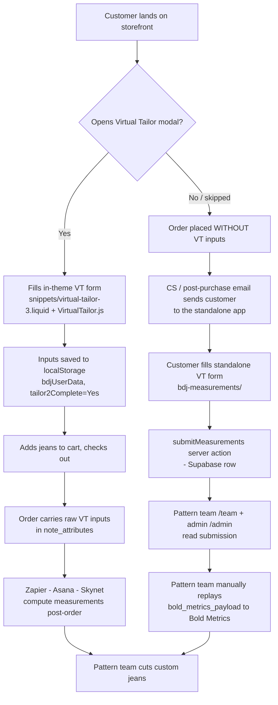

# 03 — Virtual Tailor

> **Hub doc.** What the Virtual Tailor is, the two implementations that collect fit inputs, and the
> exact Bold Metrics payload contract both must honor. This is the entry point; deep source-level
> detail lives in the sibling reference docs in this bundle (linked inline).
>
> **Audience:** anyone touching the storefront fit form, the standalone capture app, the Zapier →
> Asana → Skynet order pipeline, or the Bold Metrics integration.
>
> **Last verified:** 2026-06-24 against the working trees of `blue-delta-jeans`
> (branch `bold-metrics-api-removal`), `bdj-measurements`, and `Measurement-Calculator` (Skynet).

---

## 1. What the Virtual Tailor IS

The **Virtual Tailor (VT)** is a guided, gendered, multi-step **fit-input form**. It does *not*
measure the body. It asks a short questionnaire — sex, age, weight, height, shoe size, and a few
gender-specific sizes (waist + inseam for men; bra size for women) plus fit preference — and those
answers are the **inputs** to **Bold Metrics**, the Mark Cuban-backed AI body-data vendor that
predicts 50+ body measurements from the questionnaire. The pattern team in Tupelo uses the six
pants-relevant measurements Bold Metrics returns to **cut a custom-fit pair of jeans** without ever
putting a tape measure on the customer. (Bold Metrics is what dropped Blue Delta's return rate to
~7%.)

- For the company/vendor view, see the [domain context](reference/domain/domain-context.md) (Suppliers
  & Vendors → Bold Metrics; Ordering & Fitting → Tailoring & Fit Process).
- The form is **gendered**: the question *sequence itself* branches on sex. Men are asked waist and
  inseam and a "common shoe" type; women are asked bra band + cup and are **not** asked waist or
  inseam (a deliberate choice — see [§6](#6-bold-metrics-payload-contract)). This split is enforced
  identically in both implementations and is the most common source of parity bugs.

### Two implementations, one question set

| | **In-theme VT** (primary) | **Standalone app** (stop-gap) |
|---|---|---|
| Where | `blue-delta-jeans` Shopify theme | `bdj-measurements` (Next.js 16 on Vercel) |
| When | During shopping / at checkout | Post-purchase, for customers who skipped the in-theme form |
| Surface | Site-wide modal | Dedicated web page (`/`) + dashboards (`/team`, `/admin`) |
| Output | Order `note_attributes` (raw inputs) | Supabase row (raw inputs + ready-to-replay payload) |
| Bold Metrics call | **Removed** (inputs only; Skynet computes later) | **Never** in-app; pattern team replays manually |
| Source of truth for the question set | `snippets/virtual-tailor-3.liquid` + `assets/VirtualTailor.js` | `lib/steps.ts` + `lib/schema.ts` + `lib/bold-metrics.ts` (mirrors of the theme) |

Both feed the **same** Bold Metrics contract. The standalone app's logic was deliberately *lifted
from* the theme so behavior parity is "one diff away" — see the **[parity rule](#7-parity-rule-keep-the-two-in-sync)**.

---

## 2. Customer journey — when each implementation fires



- **In-theme VT is the primary path.** It fires during the normal shopping/checkout flow. If the
  customer completes it, the order arrives with everything Skynet needs and the standalone app is
  never involved.
- **Standalone app is the stop-gap for skippers.** When a customer buys without completing the
  in-theme VT (or a rep needs to capture inputs after the fact — e.g. an event order), they get sent
  to the standalone capture page. It is explicitly a stop-gap "until a real internal database
  exists" (`bdj-measurements/README.md`).
- The two paths **converge** at the pattern team, which ends up with the same Bold Metrics inputs
  either way — they just arrive through different plumbing.

---

## 3. In-theme implementation (primary)

Repo: `blue-delta-jeans`. Branch with the current behavior: `bold-metrics-api-removal`.
Full forensic file map: `blue-delta-jeans/VIRTUAL_TAILOR_BOLDMETRICS.md`.

### 3.1 Data flow

```
Modal rendered site-wide
  layout/theme.liquid  →  
        │
        ▼
snippets/virtual-tailor-3.liquid   (pure form UI: 12 steps, option arrays, Klaviyo loader)
        │  loads (defer)
        ▼
assets/VirtualTailor.js            (VirtualTailor class — validation, navigation, persistence)
        │  on every change → localStorage.bdjFormData
        │  on complete formComplete():
        │     • localStorage.tailor2Complete = "Yes"
        │     • localStorage.bdjUserData     = formatUserData() human-readable block
        │     • submitToKlaviyo()            (list VDqK3F — independent of Bold Metrics)
        ▼
Cart page
  templates/cart.liquid → sections/cart-new-template.liquid
        │  hidden <textarea name="attributes[...]"> note-attribute fields
        │  enqueues assets/bdj_vtailor2_boldmetrics-postAPI.js  (only if cart.item_count > 0)
        ▼
assets/bdj_vtailor2_boldmetrics-postAPI.js   (the "poster")
        │  reads localStorage (bdjUserData / tailor2Complete / patternOnFile / whiteGlove / ...)
        │  copies them into the hidden attributes[...] textareas
        ▼
Order placed → Shopify serializes attributes[...] → order note_attributes
        ▼
Zapier (Zap 281794942 "Orders – PRODUCTS") → Asana production task → Skynet computes measurements
```

### 3.2 localStorage → cart note-attribute → order

`VirtualTailor.js` never touches the cart and never calls an API; it only writes `localStorage`. The
**poster** (`bdj_vtailor2_boldmetrics-postAPI.js`) is the bridge that copies `localStorage` into the
hidden `<textarea name="attributes[X]">` fields in `sections/cart-new-template.liquid`. Shopify
serializes any `name="attributes[X]"` field on the cart form into the order's `note_attributes` at
checkout.

**`note_attributes` contract (current, post-removal):**

| Order note attribute | Hidden field id | Source (localStorage / flag) | Status |
|---|---|---|---|
| `Virtual Tailor` (`"Yes"`) | `#tailor2_complete` | `tailor2Complete` | ✅ keep |
| `BDJ User Data` (newline block of all inputs) | `#bdj_user_data` | `bdjUserData` | ✅ **keep — this is the whole point** |
| `Jean Fit` | `#jean_fit` | VT input | ✅ keep |
| `Shoe Type` | `#shoe_type` | VT input | ✅ keep |
| `Pattern on File` | `#pattern_on_file` | PDP flag (`pdp2024_sizing.js`) | ✅ keep |
| `White Glove` | `#white_glove` | PDP flag | ✅ keep |
| `Pocket Initials` | `#pocket_initials` | PDP initials UI | ✅ keep |
| ~~`Hip Circum`, `Jean Inseam`, `Knee Circum`, `Thigh Circum`, `U Crotch`, `Waist Average`~~ | (deleted) | **Bold Metrics output** | 🔴 **removed 2026-06** |

The `BDJ User Data` block (built by `VirtualTailor.formatUserData()`) already contains every input
Bold Metrics needs: `Gender`, `Age`, `Height` (total inches), `Weight`, `Shoe Size`, plus men's
`Waist`/`Inseam` or women's `Bra Size`. **Shopify needs no new fields** — the only downstream task is
the Zapier mapping of those keys into the `VT *` Asana fields ([§6.4](#64-the-vt--input-fields-in-asana)).

### 3.3 Bold Metrics was REMOVED from the cart (inputs only now)

Historically the cart **fired Bold Metrics on every cart load/edit** (`$.ajax(boldPostUrl)` inside
the poster), computed the six measurements, and wrote them into `note_attributes`. As of the
`bold-metrics-api-removal` change:

- `assets/VirtualTailor.js` no longer builds the Bold Metrics URL — `generateBoldMetricsUrl()` and
  its hard-coded `user_key` secret are gone.
- `assets/bdj_vtailor2_boldmetrics-postAPI.js` no longer makes the `$.ajax` call; the `"Yes"` branch
  now populates the kept fields directly (which also fixed a data-loss bug where a failed BM call
  used to drop the raw inputs from the order).
- `sections/cart-new-template.liquid` no longer has the six measurement `<textarea>` fields.

The storefront now collects **inputs only**; the measurements are computed **post-order in Skynet**
from the `BDJ User Data` block. See `VIRTUAL_TAILOR_BOLDMETRICS.md` for the line-by-line removal map.

This removal is **complete and live**. PR #83 (`bold-metrics-api-removal`) was merged to the live
theme on **2026-06-19**, `grep api.boldmetrics.io` returns 0 across `assets/`, and Skynet now computes
the 6 measurements server-side, post-order. The Bold Metrics → Skynet migration project is done.

> 🟡 **GemPages "quick-tailor" surface (live = removed; committed exports stale):** the **separate
> GemPages "quick-tailor" product flow** *also* no longer fires Bold Metrics on the live site, and the
> hard-coded `user_key` was removed from the live page (owner-confirmed). **Honest repo nuance:** GemPages
> sections are app-managed, so a few committed snippet *exports* (and a co-brand quick-tailor asset) still
> point at the Bold Metrics endpoint and still embed a legacy hard-coded `user_key` — they **lag** the
> live page. So: **LIVE = removed; the committed exports are stale.** Do not claim the live site still
> fires, or that the repo is fully key-free. **Remaining owner task (owner-handled):** rotate the
> `user_key` vendor-side (not yet done) and purge these committed copies.

> **Tech debt / cleanup pending:** the predecessor left ~10 dead VT engines/posters in `assets/`,
> several of which still embed copies of a legacy hard-coded Bold Metrics `user_key`. The key should be
> rotated vendor-side regardless; deleting the dead files purges those copies. (See the in-theme deep dive
> in [reference/shopify-theme/VIRTUAL_TAILOR_BOLDMETRICS.md](reference/shopify-theme/VIRTUAL_TAILOR_BOLDMETRICS.md)
> — these dead engines/posters are TRAPS that mirror the active code but are unreferenced.)

---

## 4. Standalone app (post-purchase stop-gap)

Repo: `bdj-measurements`. **Next.js 16** (App Router) + TypeScript, **Supabase** (Postgres + RLS)
for storage, **zod** for validation, optional **Upstash Redis** for rate limiting, hosted on
**Vercel**. README: `bdj-measurements/README.md`.

It captures the *same question set* as the in-theme form but **does not** call Bold Metrics and
**does not** send to Klaviyo. It just stores the submission so the pattern team can act on it.

### 4.1 Capture flow & the single DB write path

```
components/MeasurementWizard.tsx   (all wizard state: step index, form data, submit status)
   │  draft persisted to localStorage.bdjFormData (reload-safe)
   ▼
app/actions.ts → submitMeasurements(raw)   ← "use server"  · THE ONLY path into the DB
   1. zod parse against lib/schema.ts        (server-authoritative)
   2. anti-spam gate (honeypot / min-time / IP rate limit)
   3. formatPayloadForBoldMetrics(data)      (lib/bold-metrics.ts → bold_metrics_payload jsonb)
   4. supa.from("virtual_tailor_submissions").insert(...)   via service-role key (server only)
   5. best-effort Resend notification to opted-in pattern-team users (never blocks the submit)
   ▼
Supabase: public.virtual_tailor_submissions   (one row per submission)
```

- **`submitMeasurements` is the only DB write path.** The browser never sees the service-role key;
  it can only call the server action. The anon key has **no** direct table access (RLS denies it).
- The row stores both **flat columns** (so the team can filter/sort) and a ready-to-replay
  **`bold_metrics_payload` jsonb** that matches `generateBoldMetricsUrl()` output minus the
  `user_key`. Table columns: `gender('m'|'w')`, `age`, `height_inches`, `weight_lbs`,
  `shoe_size_us`, `waist_circum_preferred` (m only), `bra_size` (w only), `jean_inseam`, `jean_fit`,
  `common_shoe`, `notes`, plus contact (`email`, `phone`, `first_name`, `last_name`, `order_number`)
  and workflow (`processed`, `processed_at`, `processed_by`) fields.
  (Migration: `supabase/migrations/0001_virtual_tailor_submissions.sql`.)

### 4.2 Anti-spam (in `submitMeasurements`)

| Defense | How | Notes |
|---|---|---|
| **Honeypot** (`company_website` / `honeypot`) | zod requires `max(0)`; server rejects any non-empty value | bots fill it, humans never see it |
| **Min time on form** (~3s) | server rejects if `Date.now() - formStartTime < 3000` | catches instant bot submits |
| **IP rate limit** (5 / min) | Upstash sliding window via `lib/rate-limit.ts`; IP is sha256-hashed before storage | **no-op without `UPSTASH_REDIS_REST_URL`** — limiter silently disabled |

Next escalation if abuse appears: Cloudflare Turnstile in front of the submit button.

### 4.3 Pattern-team `/team` and admin `/admin` dashboards (Phase 2)

| Route | Audience | Purpose |
|---|---|---|
| `/team` (`app/team/page.tsx`) | Pattern team (allow-listed) | Mobile-first card list of unprocessed submissions; tap to open full measurements; **"Copy Bold Metrics URL params"** + **"Mark Processed"** (`markProcessedAction` → `mark_processed` RPC) |
| `/admin` (`app/admin/page.tsx`) | `dev@bluedeltajeans.com` only (`admin` role) | Desktop table, status chips (New/Processed/Test), CSV export, **"Mark as Test"** toggle (`adminMarkTestAction` → `admin_mark_test` RPC) |
| `/admin/users` (`app/admin/users/page.tsx`) | admin | Manage allow-list + per-user notification prefs (`admin_upsert_user`, `admin_remove_user` RPCs) |

**Auth:** Google OAuth primary, magic-link email fallback, both through `/auth/callback`. The
allow-list is enforced at **two** layers — a middleware check (bounces unknown emails to
`/login?error=unauthorized`) **and** RLS + `SECURITY DEFINER` RPCs at the DB layer so a bypassed
middleware still can't leak data. **Notifications:** on submit, every user with
`notify_on_new_submission = true` gets a Resend email (server-only `RESEND_API_KEY`; absent ⇒
silently skipped). Migration: `supabase/migrations/0002_phase2_users_and_test_flag.sql`
(+ `0003`–`0006` for RLS-recursion and realtime fixes).

### 4.4 Manual Bold Metrics replay (pattern-team workflow)

The standalone app **never** calls Bold Metrics. The pattern team replays it by hand:

1. Open `/team` (or, Phase-1 fallback, the Supabase Studio table), filter `processed = false`.
2. Each row's `bold_metrics_payload` jsonb is already shaped for the API. Copy it (the dashboard's
   "Copy Bold Metrics URL params" button does this), **append their own `user_key`**, and
   `GET https://api.boldmetrics.io/virtualtailor/get`.
3. Read the six pants dimensions ([§6.2](#62-the-six-outputs)), cut the jeans.
4. Set `processed = true`, `processed_at = now()`, `processed_by = '<their email>'`.

### 4.5 What's live vs pending

- **Live / on disk:** the public capture form, `submitMeasurements`, schema/steps/bold-metrics libs,
  the `/team`, `/admin`, `/admin/users`, `/login`, `/auth/callback` routes, and migrations
  `0001`–`0006`.
- **Spec'd in the README but not yet on disk in this tree:** a root `middleware.ts` (the README
  describes it as the first allow-list layer). Treat the DB-layer RLS + RPCs as the *enforced*
  guarantee; the middleware is the UX layer that should land alongside it. Confirm before relying on
  middleware for security.
- **Stop-gap by design:** this whole app exists only until the internal database / Jeanius rebuild
  lands. Don't build long-lived integrations against its Supabase schema.

---

## 5. End-to-end diagram (both paths)

```mermaid
flowchart LR
    subgraph theme["In-theme VT (blue-delta-jeans)"]
      direction TB
      T1["virtual-tailor-3.liquid<br/>(form UI, 12 steps)"]
      T2["VirtualTailor.js<br/>(validation + persistence)"]
      T3[("localStorage<br/>bdjUserData / tailor2Complete")]
      T4["bdj_vtailor2_boldmetrics-postAPI.js<br/>(poster — no API call)"]
      T5["cart-new-template.liquid<br/>attributes[...] textareas"]
      T6["Order note_attributes<br/>(raw inputs only)"]
      T1 --> T2 --> T3 --> T4 --> T5 --> T6
    end

    subgraph standalone["Standalone app (bdj-measurements)"]
      direction TB
      S1["MeasurementWizard.tsx"]
      S2["submitMeasurements()<br/>(only DB write path)"]
      S3["zod schema.ts + anti-spam"]
      S4[("Supabase<br/>virtual_tailor_submissions<br/>+ bold_metrics_payload jsonb")]
      S5["/team + /admin dashboards"]
      S1 --> S2 --> S3 --> S4 --> S5
    end

    T6 --> Z["Zapier Zap 281794942<br/>Step 5 Order Parser"]
    Z --> A["Asana production task<br/>(VT * input fields)"]
    A --> SK["Skynet (Measurement-Calculator)<br/>callBoldMetrics() — idempotent, guarded"]
    S5 --> MR["Pattern team manual replay<br/>(append user_key, POST)"]

    SK --> BM[["Bold Metrics API<br/>/virtualtailor/get"]]
    MR --> BM
    BM --> OUT["6 pants measurements<br/>→ Asana output fields"]
    OUT --> CUT["Pattern team cuts custom jeans"]
```



---

## 6. Bold Metrics payload contract

Both implementations build the **same** request. The canonical client is Skynet's
`Measurement-Calculator/server/boldmetrics.ts` (`callBoldMetrics`); the standalone app's
`lib/bold-metrics.ts` builds the identical object minus the `user_key`; the (now removed) in-theme
`generateBoldMetricsUrl()` was the original.

- **Endpoint:** `GET https://api.boldmetrics.io/virtualtailor/get`
- **Docs:** `https://docs.boldmetrics.io/#body-measurements`

### 6.1 Request inputs

| Param | Type | Sent when | Source field |
|---|---|---|---|
| `client_id` | `"bluedelta"` | always | constant |
| `user_key` | string secret | always | env var, **never** in source (see [§8](#8-secrets--env-vars)) |
| `gender` | `"m"` / `"w"` | always | `Male` → `m`, `Female` → `w` |
| `age` | number | always | `age` |
| `height` | number (**total inches**) | always | `height_integer` (feet/inches → inches) |
| `weight` | number (lbs) | always | `weight` |
| `sleeve_type` | **`"ARS"`** | always | constant per the original cart integration |
| `shoe_size_us` | string (numeric, e.g. `"12.5"`) | when present | `shoe_size` |
| `waist_circum_preferred` | number | **men only** | `waist_size` (API rejects men's requests without it) |
| `jean_inseam` | number | **men only** | `inseam` |
| `bra_size` | string e.g. `"34C"` | **women only** | `bra_band` + `bra_cup_size` |

**Gender split (critical):** men send `waist_circum_preferred` + `jean_inseam` and **no**
`bra_size`; women send `bra_size` and **no** waist/inseam. Women's inseam is deliberately *not* sent
— a known Bold Metrics issue with women's inseam, and the women's form sequence doesn't even ask for
it. `sleeve_type=ARS` is a constant on every request regardless of gender.

**`user_key` handling:**
- **Skynet** reads `process.env.BOLDMETRICS_USER_KEY` (throws if missing) and logs the request with
  the key redacted.
- **Standalone app** intentionally **omits** the key from `bold_metrics_payload` — the pattern team
  re-attaches their own key at replay time.
- **In-theme (old)** had it hard-coded in `generateBoldMetricsUrl()` — that path is now removed, so
  the key no longer lives in the active VT engine. A legacy hard-coded copy still exists in a few
  committed GemPages quick-tailor snippet exports (a separate flow) and in leftover dead engine files
  (rotate vendor-side; see §3.3).

### 6.2 The six outputs

Bold Metrics returns ~50 dimensions as **strings in inches**; this pipeline consumes six (pants).

| Engine field | `dimensions` key | Asana output field (display name) | Asana GID |
|---|---|---|---|
| `waist` | **3-way mean** of `waist_circum_preferred`, `waist_circum_natural`, `waist_circum_stomach` | `Waist Avg.` *(trailing period)* | `1206671503499692` |
| `seat` | `hip_circum` | `Hip Circum` | `1206671503499682` |
| `thigh` | **`thigh_circum_proximal`** (upper thigh — **not** `_distal`) | `Thigh Circum` | `1206671503499688` |
| `knee` | `knee_circum` | `Knee Circum` | `1206671503499686` |
| `fullRise` | `u_crotch` | `U Crotch` | `1206671503499690` |
| `inseam` | `jean_inseam` | `Jean Inseam` | `1206671503499684` |

### 6.3 The "Waist Avg." 3-way mean (do not get this wrong)

`Waist Avg.` is **NOT** `waist_circum_preferred`. The original cart code computed it as the mean of
the three returned waist circumferences:

```js
waist_average = (waist_circum_natural + waist_circum_preferred + waist_circum_stomach) / 3
```

Skynet's `boldmetrics.ts` replicates this (`WAIST_DIMENSION_KEYS` averaged, ignoring non-positive
values). The cart additionally rounded to 2 decimals. **Any new computation of `Waist Avg.` must use
this exact 3-way mean** or historical and new orders won't match. (This corrected an earlier
assumption in the Skynet doc that it was `waist_circum_preferred`.) Likewise `Thigh Circum` is the
**proximal** (upper) thigh, ~23"; `thigh_circum_distal` (~16", just above the knee) is a different
field — do not map it.

### 6.4 The `VT *` input fields in Asana

The five gender-specific **inputs** Skynet reads to *build* the request (distinct from the outputs it
writes back). Renaming any of these in Asana silently breaks Zapier parsing.

| Bold Metrics input | Source VT field | Asana input field | Asana GID | Status |
|---|---|---|---|---|
| `height` (in) | height | `VT Height` | `1215612213755174` | field created · Zapier mapping pending |
| `shoe_size_us` | shoe_size | `VT Shoe Size` | `1215612213755176` | field created · Zapier mapping pending |
| `waist_circum_preferred` (m) | waist_size | `VT Waist` | `1215612213755178` | field created · Zapier mapping pending |
| `jean_inseam` (m) | inseam | `VT Inseam` | `1215612213755180` | field created · Zapier mapping pending |
| `bra_size` (w) | bra_band + bra_cup | `VT Bra Size` | `1215851864495064` | field created · Zapier mapping pending |

> **Don't confuse inputs with outputs.** `VT Waist` (input) is *not* `Waist Avg.` (output);
> `VT Inseam` (input) is *not* `Jean Inseam` (output). The `VT *` fields are read; the unprefixed
> measurement fields are written.

---

## 7. Parity rule — keep the two in sync

The standalone app's logic was **lifted from** the theme so the two stay byte-equivalent in behavior.
Any change to the question set, bounds, gender sequence, or payload shape **must be made in both
places, in the same PR**, or the standalone form will silently diverge from what the storefront
collects.

| Concern | In-theme (source of truth) | Standalone (mirror) |
|---|---|---|
| Option arrays (heights, shoe, waist, bra, inseam) | `snippets/virtual-tailor-3.liquid` (`shoe_sizes`, `waist_sizes`, …) | `lib/steps.ts` (`SHOE_OPTIONS`, `WAIST_OPTIONS`, …) |
| Gender-specific step sequence | `assets/VirtualTailor.js` | `lib/steps.ts` (`MALE_SEQUENCE` / `FEMALE_SEQUENCE`, `getStepSequence`) |
| Bounds (age/weight/waist/inseam/shoe), height math, `getBraSize` join | `assets/VirtualTailor.js` (`:1758-1787`, height/bra helpers) | `lib/steps.ts` + `lib/schema.ts` (zod, server-authoritative) |
| Bold Metrics payload shape | `generateBoldMetricsUrl()` *(removed; preserved in git history)* | `lib/bold-metrics.ts` (`formatPayloadForBoldMetrics`) |

`lib/*.ts` files carry explicit line-referenced comments back to the theme source (e.g.
`// VirtualTailor.js:2648 — bra band + cup → "34B"`). When you touch one side, grep the other for
the matching anchor. **Skynet's `boldmetrics.ts` is the authority for the request *params* and the
six *outputs* (incl. the Waist 3-way mean)** — keep all three (`lib/bold-metrics.ts`,
`generateBoldMetricsUrl` history, `server/boldmetrics.ts`) consistent on field names and the gender
split.

---

## 8. Secrets & env vars

No keys or PII in this repo — names and locations only.

| Secret / config | Where | Notes |
|---|---|---|
| Bold Metrics `user_key` | Skynet: `BOLDMETRICS_USER_KEY` (server env) | redacted in logs; pattern team holds their own copy for manual replay |
| Bold Metrics `client_id` / base URL | Skynet: `BOLDMETRICS_CLIENT_ID` (default `bluedelta`) / `BOLDMETRICS_BASE_URL` | optional overrides |
| Supabase URL / anon key | `bdj-measurements`: `NEXT_PUBLIC_SUPABASE_URL`, `NEXT_PUBLIC_SUPABASE_ANON_KEY` | public; anon key has no table access via RLS |
| Supabase service-role key | `bdj-measurements`: `SUPABASE_URL`, `SUPABASE_SERVICE_ROLE_KEY` | **server-only**; never `NEXT_PUBLIC_*`; used only by `submitMeasurements` |
| Upstash Redis | `bdj-measurements`: `UPSTASH_REDIS_REST_URL`, `UPSTASH_REDIS_REST_TOKEN` | optional; absent ⇒ rate limiter is a no-op |
| Resend | `bdj-measurements`: `RESEND_API_KEY`, `NEXT_PUBLIC_SITE_URL` | server-only key; absent ⇒ notifications skip |
| Klaviyo | `blue-delta-jeans`: company `SkKEvJ`, list `VDqK3F` (in `virtual-tailor-3.liquid` / `VirtualTailor.js`) | independent of Bold Metrics |

> ⚠️ The old in-theme `user_key` was hard-coded and copied into ~10 files. It was **removed from the
> active VT engine path**, but a legacy copy still lives in a few committed GemPages quick-tailor
> snippet exports (a separate flow) and in leftover dead engine files. Rotate it vendor-side and delete
> the dead engine files (§3.3) to purge the copies.

---

## 9. See also

- **In-theme deep dive:** [reference/shopify-theme/VIRTUAL_TAILOR_BOLDMETRICS.md](reference/shopify-theme/VIRTUAL_TAILOR_BOLDMETRICS.md)
  (line-by-line removal map, active-vs-dead file table, localStorage contract) and
  [reference/shopify-theme/README-theme.md](reference/shopify-theme/README-theme.md) → Virtual Tailor.
- **Standalone app:** [reference/virtual-tailor-standalone/README.md](reference/virtual-tailor-standalone/README.md)
  (stack, Supabase setup, Phase 2 dashboards, verification checklist) and its `lib/steps.ts` /
  `lib/schema.ts` / `lib/bold-metrics.ts` / `app/actions.ts` (in the bdj-measurements repo —
  private repo, provided once engaged).
- **Bold Metrics client (canonical):** `server/boldmetrics.ts` in the Measurement-Calculator (Skynet)
  repo (private repo — provided once engaged) and the cross-system migration brief; see the
  [Skynet reference docs](reference/skynet/01-overview.md).
- **Order pipeline:** [reference/zapier/Architecture Overview.md](reference/zapier/Architecture%20Overview.md),
  [reference/zapier/Step 13 — Line Item Processor.md](reference/zapier/Step%2013%20%E2%80%94%20Line%20Item%20Processor.md),
  and the [reference/zapier/Asana Field Mapping (Steps 21–27).md](reference/zapier/Asana%20Field%20Mapping%20%28Steps%2021%E2%80%9327%29.md) page.
- **Company knowledge:** [domain context](reference/domain/domain-context.md) (Suppliers & Vendors →
  Bold Metrics; Ordering & Fitting → Tailoring & Fit Process).
- **Commercial terms / account:** Bold Metrics page — see [Notion source context](appendix/notion-source-context.md).
