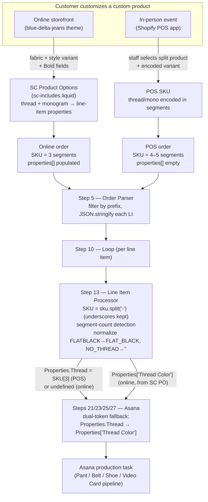

# 04 — Website vs. POS: The Dual-Product-Set Architecture

> **Audience:** anyone who edits the Shopify theme, the Zapier order pipeline, the
> Asana field mappings, or who adds/renames a SKU in Shopify. This is the single
> most important architectural decision in the Blue Delta Jeans order stack.
> If you are about to touch a SKU, **read the [Agency SKU/variant change
> playbook](#agency-skuvariant-change-playbook) at the bottom first.**

**TL;DR** — Blue Delta sells deeply customizable products. The full customization
matrix for a single product blows past Shopify's hard **100-variant-per-product
limit**. We solve that two different ways depending on the sales channel, and the
two solutions produce **two structurally different SKU formats** for the same
physical product. Everything downstream — the storefront theme, the Zapier
pipeline (Steps 5 and 13), and the Asana field mappings — has to cope with both
formats. This document explains why, how, and what you must not break.

---

## Table of Contents

- [1. The core problem: 100 variants vs. combinatorial explosion](#1-the-core-problem-100-variants-vs-combinatorial-explosion)
- [2. The two solutions (online vs. POS)](#2-the-two-solutions-online-vs-pos)
- [3. SKU structure by channel and product](#3-sku-structure-by-channel-and-product)
- [4. The underscore-vs-hyphen rule](#4-the-underscore-vs-hyphen-rule-the-load-bearing-detail)
- [5. The segment-count detection rule](#5-the-segment-count-detection-rule)
- [6. How it ripples through the stack](#6-how-it-ripples-through-the-stack)
- [7. The "Bold ≠ Bold" naming trap](#7-the-bold--bold-naming-trap)
- [8. The two deliberate SKU inconsistencies](#8-the-two-deliberate-sku-inconsistencies)
- [9. Channel flow diagram](#9-channel-flow-diagram)
- [10. Agency SKU/variant change playbook](#agency-skuvariant-change-playbook)
- [11. The future plan](#11-the-future-plan)
- [Appendix: source documents](#appendix-source-documents)

---

## 1. The core problem: 100 variants vs. combinatorial explosion

Shopify caps every product at **100 variants maximum**. That is a hard platform
limit on the current theme — there is no setting, app, or workaround that raises
it for a single product (see [§11](#11-the-future-plan) for the newer-theme path
to 2,048). Blue Delta's products are *custom*, so their option matrices multiply
fast:

### Men's pant — the matrix is 608

| Option | Values | Count |
| --- | --- | --- |
| Style | Straight, Boot, Skinny, Fashion Boot | 4 |
| Fabric Color | Dark Indigo, Smooth Indigo, Natural Indigo, Postman, Steel Gray, Cast Gray, Charcoal, Super Black | 8 |
| Thread Color | 19 stitching colors | 19 |
| **Full matrix** | 4 × 8 × 19 | **608** |

608 variants is impossible in one Shopify product. Even fabric × style alone is
4 × 8 = **32** — that fits, but the moment thread color becomes a variant option
we are 6× over the limit.

### Belt — the matrix is 1,638

| Option | Values | Count |
| --- | --- | --- |
| Leather | Black, Dark Brown, Mid Brown, Light Brown, Navy, Red, Football | 7 |
| Width | 1", 1.25", 1.5" | 3 |
| Hardware | Brass, Nickel, Flat Black | 3 |
| Thread Color | 13 stitching colors | 13 |
| Monogram | yes / no | 2 |
| **Full matrix** | 7 × 3 × 3 × 13 × 2 | **1,638** |

A single "Custom Leather Belt" product carrying the full matrix would need 1,638
variants — more than 16× the limit. Leather × width × hardware alone is 7 × 3 × 3
= **63**, which fits, but adding thread and monogram is hopeless.

> The combinatorial blow-up is *the* reason this architecture exists. Hold the
> two numbers — **608** (men's pant) and **1,638** (belt) — in your head; every
> design decision below traces back to staying under 100.

---

## 2. The two solutions (online vs. POS)

We keep two completely separate sets of Shopify products. Each set solves the
100-variant problem differently because the two channels have different
capabilities.

### Solution A — Online store: move options into line-item properties

On the storefront we use the **SC Product Options** app (the Shopify app on the
live store; see the [Bold naming trap](#7-the-bold--bold-naming-trap) before you
assume anything about its name) to pull the high-cardinality options — **thread
color and monogram** — *out of the variant matrix* and capture them as
**line-item properties** at checkout.

- The online product only needs **fabric color × style = 32 variants** for pants
  (well under 100), or **leather × width × hardware = 63 variants** for the belt.
- Thread color, monogram lettering, monogram thread color, and women's-pant
  options (waist height, pocket style) arrive as a `properties` array on the
  Shopify line item.

```json
// properties array on online pant line item #100002 (Alex Rivera)
"properties": [
  {"name": "Thread Color", "value": "Green"},
  {"name": "Add Watch Pocket Monogram", "value": "✓"},
  {"name": "Lettering", "value": "RBJ"},
  {"name": "Color", "value": "Match Thread"},
  {"name": "_boldVariantNames", "value": "Add Watch Pocket Monogram"},
  {"name": "_boldVariantIds", "value": "50222549664035"},
  {"name": "_boldProductIds", "value": "9641429893411"}
  // ...more _bold* internal metadata, ignored by the pipeline
]
```

Customer-facing properties consumed by the pipeline:

| Property | Meaning | Example | Asana destination |
| --- | --- | --- | --- |
| `Thread Color` | Stitching color | `Green` | Pant Pipeline → Thread |
| `Add Watch Pocket Monogram` | $25 add-on checkbox flag | `✓` / `""` | flag only (not mapped) |
| `Lettering` | Monogram initials (≤4 chars) | `RBJ` | Pant Pipeline → Monogram |
| `Color` | Monogram thread color | `Match Thread` | Pant Pipeline → Monogram Thread |
| `Waist Height` (women's) | Rise preference | `High`/`Mid`/`Low` | Pant Pipeline → Waist Ride |
| `Front Pockets` (women's) | Pocket style | `Functional`/`Fake` | Pant Pipeline → Pockets |

Properties prefixed `_bold` are internal app metadata. The pipeline does not
filter them out — they ride along in the `Properties` object harmlessly and are
never mapped to Asana fields.

### Solution B — Shopify POS: split products + encode options in the SKU

**SC Product Options does not run in the Shopify POS app.** POS can only *select
an existing variant* — it cannot prompt for a custom field. So a POS order carries
**no SC Product Options properties** (the `properties` array is empty or contains
only basic POS metadata). Every customization must therefore live in the variant
itself, i.e. in the **SKU**.

To fit thread color back into the variant matrix without breaking 100, we
**split the single online product into many smaller POS products**, each scoped to
a fixed value of the first option(s):

- **Pants:** one POS product *per fabric color*. Each POS pant product then only
  needs **style × thread = 4 × 19 = 76 variants** ✓. The fabric is implied by
  *which product* the POS staff selected, not by a variant option.
- **Belts:** one POS product *per leather × width* = 7 × 3 = **21 products**. Each
  belt product needs **hardware × monogram × thread-options = 3 × 2 × 13 = 78
  variants** ✓ per product (the 13 thread options are 12 stitching colors plus the
  literal `NO_THREAD`). Leather and width are implied by the product; hardware,
  monogram, and thread are variant options encoded into the SKU.

### The trade-off

| | Online (Solution A) | POS (Solution B) |
| --- | --- | --- |
| Customization source | line-item properties (SC Product Options) | the SKU itself |
| Products per category | few (1 belt, 2 pants) | many (21 belts, dozens of pants) |
| SKU segment count | fewer (3) | more (4–5) |
| Monogram **text** captured? | yes (`Lettering`) | **no** — only a yes/no flag |
| Pipeline parsing | read `Properties[...]` | `sku.split("-")` |

> The monogram-text gap is a real POS limitation: a POS belt SKU can flag that a
> monogram was *requested* (`MONO` segment) but cannot carry the customer's
> initials. Production staff must pull the lettering from the order note or
> customer record. See [§6](#6-how-it-ripples-through-the-stack).

---

## 3. SKU structure by channel and product

Across the catalog there are **5,555 total SKUs** in 8 categories (verified
against `master-sku-list.json`, April 2026 V4 audit). The *full* SKU catalog is
documented in **`zapier-documentation/SKU Reference Guide.md`** — this section
gives the structural rules and representative examples rather than reproducing all
5,555 entries.

### Category summary

| Category | Count | Format | Segments | Pipeline | Thread source |
| --- | --- | --- | --- | --- | --- |
| Online Pants (`M-`/`W-`) | 264 | `{G}-{Fabric_Name}-{Style}` | **3** | Pant | line-item property |
| POS Pants (`M-`/`W-`) | 2,920 | `{G}-{Fabric}-{Style}-{Thread}` | **4** | Pant | SKU segment |
| Shorts (`M-`) | 570 | `{G}-{Fabric_Name}-SHORT_{Len}-{Thread}` | **4** | Pant | SKU segment (always) |
| Kentucky Derby (`M-`/`W-`) | 48 | `{G}-{DerbyFabric}-{Style}-{Thread}` | **4** | Pant | SKU segment (always) |
| Online Belts (`CB`) | 63 | `{Leather}-{Width}-{Hardware}` | **3** | Belt | line-item property |
| POS Belts (`CB`) | 1,638 | `{Leather}-{W}-{HW}-[MONO-]{Thread}` | **4–5** | Belt | SKU segment |
| Shoes (`SHOE-`) | 76 | `SHOE-{Type}-{Gender}-{Size}` | **4** | Shoe | n/a |
| Video Gift Cards (`VID-GIFT-`) | 8 | `VID-GIFT-{Brand}-{Amount}` | **4** | Video Card | n/a |
| **Total** | **5,555** | | | | |

### Pants — 3 segments (online) vs. 4 segments (POS)

The defining difference: **online pants carry the fabric *name* (with an
underscore) and have no thread segment; POS pants carry just the fabric *code* and
append the thread color.**

| Channel | Example SKU | Segments | Decoded |
| --- | --- | --- | --- |
| Online | `M-RW29_DARKINDIGO-STRAIGHT` | 3 | Men's, Raw Denim Dark Indigo, Straight — thread from property |
| Online | `W-RW29_DARKINDIGO-FLARE` | 3 | Women's, Raw Denim Dark Indigo, Flare — thread from property |
| POS | `M-RW29-STRAIGHT-BLACK` | 4 | Men's, Dark Indigo, Straight, **Black thread (SKU[3])** |
| POS | `W-JH01-BOOT-GREEN` | 4 | Women's, Banana Olive Chino, Boot, **Green thread (SKU[3])** |

Note `RW29_DARKINDIGO` (online) vs. `RW29` (POS): the online fabric segment
embeds the human-readable color name after an underscore; the POS fabric segment
is the bare code. This is the at-a-glance way a human distinguishes the two — but
the pipeline does **not** rely on it (it relies on segment count).

### Shorts & Derby — always 4 segments, thread always in SKU (both channels)

Shorts and Kentucky Derby pants were built *after* the POS architecture was
established, so they **always** carry thread in the SKU regardless of channel —
even when sold online. They have no 3-segment "online" form.

| Product | Example SKU | Segments | Notes |
| --- | --- | --- | --- |
| Shorts | `M-PF03_LIGHTTAN-SHORT_5-TONAL` | 4 | `SHORT_5` = 5" inseam; thread = `TONAL` |
| Derby | `M-PFDERBY_HOTPINK-STRAIGHT-TONAL` | 4 | event-specific; thread = `TONAL` |

### Belts — 3 / 4 / 5 segments

| Pattern | Example SKU | Segments | Meaning |
| --- | --- | --- | --- |
| Online | `CB6-1.5-BRASS` | 3 | thread + monogram from properties |
| POS, thread, no mono | `CB6-1-BRASS-BLACK` | 4 | thread = `SKU[3]`, monogram = NONE |
| POS, no thread, no mono | `CB6-1-BRASS-NO_THREAD` | 4 | thread = `""`, monogram = NONE |
| POS, mono + thread | `CB6-1-BRASS-MONO-BLACK` | 5 | `MONO` flag = SKU[3], thread = `SKU[4]` |
| POS, mono, no thread | `CB6-1-BRASS-MONO-NO_THREAD` | 5 | monogram = YES, thread = `""` |

`NO_THREAD` is a literal segment meaning "no stitching" — the pipeline maps it to
an empty string so the Asana Belt-Stitching field shows blank, not the literal
text.

### Shoes — always `SHOE-CLASSIC-M-10` (4 segments)

POS/event only — there are **no shoe products on the website** (the Nike
partnership is not yet approved for online sales). The SKU encodes everything;
shoe customization (laces, swoosh, toe cap, etc.) is keyed in manually by staff
from paper order forms as line-item properties.

| Segment | Position | Values |
| --- | --- | --- |
| `SHOE` | SKU[0] | fixed prefix |
| Type | SKU[1] | `CLASSIC`, `CUSTOM` |
| Gender | SKU[2] | `M`, `W` |
| Size | SKU[3] | `5` … `14` in half-sizes (19 sizes) |

Example: `SHOE-CLASSIC-M-10` → Classic, Men's, size 10. (This 4-segment format
*replaced* the old 2-segment `SHOE-CLASSIC` format where gender/size were parsed
from `variant_title` — see [§6](#6-how-it-ripples-through-the-stack), NEW-01.)

### Video gift cards — `VID-GIFT-{Brand}-{Amount}`

8 SKUs, always 4 segments. `split("-")` → `["VID","GIFT","BDJ","500"]`, so the
useful data starts at `SKU[2]` (`BDJ` = The Blue Delta Story, `PERSONAL` = upload
your own) and `SKU[3]` (denomination: 200/300/450/500).

---

## 4. The underscore-vs-hyphen rule (the load-bearing detail)

Every product-type detection in the pipeline begins with a single line in Step 13:

```js
let SKU = LI.sku.split("-");
```

**The pipeline splits on hyphen (`-`) only. Underscores (`_`) are NEVER split.**
This is deliberate and absolutely load-bearing — it is what lets multi-word fabric
codes and inseam lengths stay together as a single segment:

| SKU | `split("-")` result | Segments |
| --- | --- | --- |
| `W-RW26_NATURALINDIGO-FLARE` | `["W", "RW26_NATURALINDIGO", "FLARE"]` | 3 |
| `M-RW29-STRAIGHT-BLACK` | `["M", "RW29", "STRAIGHT", "BLACK"]` | 4 |
| `M-PF03_LIGHTTAN-SHORT_5-TONAL` | `["M", "PF03_LIGHTTAN", "SHORT_5", "TONAL"]` | 4 |
| `M-PFDERBY_HOTPINK-STRAIGHT-TONAL` | `["M", "PFDERBY_HOTPINK", "STRAIGHT", "TONAL"]` | 4 |
| `CB6-1.5-BRASS` | `["CB6", "1.5", "BRASS"]` | 3 |
| `CB6-1-BRASS-MONO-BLACK` | `["CB6", "1", "BRASS", "MONO", "BLACK"]` | 5 |
| `SHOE-CLASSIC-M-10` | `["SHOE", "CLASSIC", "M", "10"]` | 4 |
| `VID-GIFT-BDJ-500` | `["VID", "GIFT", "BDJ", "500"]` | 4 |

> **The rule for anyone editing SKUs:** *hyphens delimit segments; underscores
> are within-segment glue.* If you put a hyphen inside what should be one logical
> field (e.g. `RW29-DARKINDIGO` instead of `RW29_DARKINDIGO`), you change the
> segment count and the pipeline will mis-parse the product — most likely
> classifying an online pant as a POS pant and reading the wrong thread. Convert
> the principle into a habit: **fabric names, `SHORT_5`, `RW29_DERBY_OAKS`, and
> `NO_THREAD` all use underscores precisely so `split("-")` keeps them intact.**

---

## 5. The segment-count detection rule

The V4 pipeline determines channel and parsing strategy purely from **how many
segments the SKU has after `split("-")`** — *not* from the upstream `Source`
field. Segment count is deterministic and self-contained, whereas the old
`Source === "pos"` check depended on an external field being passed correctly
(the cause of the fragile-detection bug NEW-04).

### Pants

| Segments | Channel | Example | How the code knows |
| --- | --- | --- | --- |
| 3 | Online | `M-RW29_DARKINDIGO-STRAIGHT` | `SKU[3]` is `undefined` → thread comes from property |
| 4 | POS / Shorts / Derby | `M-RW29-STRAIGHT-BLACK` | `SKU[3]` exists → thread = `SKU[3]` |

The pant branch doesn't even need an explicit online/POS check: it always sets
`Properties.Thread = SKU[3]`, which is `undefined` for 3-segment online SKUs and a
color string for 4-segment SKUs. The Asana mapping's [dual-token
fallback](#62-asana-the-dual-token-fallback) sorts out the rest.

### Belts

| Segments | Channel | Example | Detection |
| --- | --- | --- | --- |
| 3 | Online | `CB6-1.5-BRASS` | `beltSegments === 3` → thread & monogram from properties |
| 4 | POS, no mono | `CB6-1-BRASS-BLACK` | `beltSegments === 4` → thread = SKU[3], monogram = NONE |
| 5 | POS, with mono | `CB6-1-BRASS-MONO-BLACK` | `beltSegments === 5` → thread = SKU[4], monogram = YES |

The V4 belt code (in `step-13-v4.js`):

```js
if (beltSegments === 3) {
  // Online: thread + monogram come from line-item properties
  Properties.Monogram =
    Properties.Monogram ?? Properties.monogram ??
    Properties.Mono ?? Properties.mono ?? "NONE";
} else if (beltSegments === 4) {
  // POS, no monogram: CB6-1-BRASS-{Thread|NO_THREAD}
  const threadSeg = SKU[3];
  Properties["Thread Color"] = threadSeg === "NO_THREAD" ? "" : threadSeg;
  Properties.Monogram = "NONE";
} else if (beltSegments === 5) {
  // POS, with monogram: CB6-1-BRASS-MONO-{Thread|NO_THREAD}
  const threadSeg = SKU[4];
  Properties["Thread Color"] = threadSeg === "NO_THREAD" ? "" : threadSeg;
  Properties.Monogram = "YES";
}
```

> This single rewrite fixed three bugs at once: **BUG-02** (POS belt monogram
> silently lost — the old code only checked properties, missing the `MONO`
> segment; affected 819 POS belt SKUs), **BUG-03** (`NO_THREAD` leaking into the
> Asana stitching field), and **NEW-04** (fragile `Source` check). See
> `zapier-documentation/Step 13 — Line Item Processor.md` for the full
> before/after.

---

## 6. How it ripples through the stack

The dual-product-set decision is not contained in Shopify — it propagates through
every layer. Here is the chain.

### 6.1 Shopify theme

- **`blue-delta-jeans/snippets/sc-includes.liquid`** loads the SC Product Options
  app on the storefront. It is a generated asset and **must not be modified**
  (its own header says so):

  ```liquid
  <script>window.BOLD.common.cacheParams.options = 1782239784;</script>
  {{ 'bold-options.css' | asset_url | stylesheet_tag }}
  <script defer src="https://options.shopapps.site/js/options.js"></script>
  ```

  This is the script that renders thread-color/monogram inputs and attaches them
  as line-item properties at checkout — i.e. the entire online half of the
  architecture.

- **`blue-delta-jeans/snippets/product-form.liquid`** is the add-to-cart form.
  Two relevant hooks:
  - `<div class="bold_options" data-product-id="{{ product.id }}"></div>` — the
    mount point SC Product Options injects its custom fields into.
  - The variant `<select>`/hidden-input that posts `name="id"` (the chosen
    variant). For POS this is the whole story (all customization is the variant);
    for online the variant only carries fabric × style and the rest comes from the
    Bold-injected fields. There is also a legacy hidden `initials` input
    (`data-product-id`-scoped, `display:none`) that predates the current monogram
    flow.

  > Tech-debt note: `product-form.liquid` renders the quantity block **twice**
  > (two identical `purchase-details__quantity` divs, lines ~99–108) producing
  > duplicate `id="quantity"` elements. Cosmetic/HTML-validity issue, not part of
  > the channel logic, but worth cleaning up when the file is next touched.

- POS orders never touch the theme at all — they are created in the Shopify POS
  app, which is exactly why they cannot use the Bold fields and must encode
  everything in the variant/SKU.

### 6.2 Zapier — Step 5 (Order Parser)

`zapier-documentation/Step 5 — Order Parser.md`. Step 5 re-fetches the order and
filters line items down to **production-qualifying SKUs** by prefix — the five
prefixes are the same set Step 13 branches on:

| Prefix | Products |
| --- | --- |
| `W-` | women's pants, shorts, derby |
| `M-` | men's pants, shorts, derby |
| `CB` | all belts (online + POS) |
| `SHOE-` | all shoes |
| `VID-GIFT-` | video gift cards |

Each qualifying line item is `JSON.stringify()`-ed (Zapier's Loop step requires an
array of *strings*). The order's `source_name` (`web` / `pos`), `tags`, and
`cart_token` are also emitted here. Note: V4 keeps `Source` flowing for
information but **no longer uses it for belt detection** — segment count replaced
it.

> Unrelated but co-located: **BUG-01** — Step 5 doesn't expand `quantity > 1`
> items, so ordering 2 identical units creates only 1 Asana task. Fixed in the V4
> Step 5 by pushing one stringified LI per unit. Mentioned here only so you don't
> confuse it with the channel logic.

### 6.3 Zapier — Step 13 (Line Item Processor)

`zapier-documentation/Step 13 — Line Item Processor.md`. This is where the dual
format is reconciled. Shared logic runs for every item:

```js
let LI = JSON.parse(inputData.LI);          // un-stringify
let SKU = LI.sku.split("-");                  // segment array (underscores intact)
let Properties = LI.properties.reduce((acc, p) => {
  acc[p.name] = p.value; return acc;          // online props pre-populate here
}, {});                                        // POS: this is {} (empty)
```

Then branches by prefix (`W-`, `M-`, `SHOE-`, `VID-GIFT-`, `CB`). The key insight:
for **online** items, `Properties` already contains `Thread Color`, `Lettering`,
etc. *before* the branch runs; for **POS** items it's empty and the branch fills
thread/monogram from the SKU. Branches use `Object.assign(Properties, {...})`,
which merges on top without clobbering existing property keys.

The shoe branch is the other place segment count matters:

```js
if (SKU.length >= 4) {           // new format SHOE-{Type}-{Gender}-{Size}
  Properties.Gender = SKU[2] || "";
  Properties.Size   = SKU[3] || "";
} else if (LI.variant_title?.includes("/")) {   // legacy "Men / 10" fallback
  let [g, s] = LI.variant_title.split("/").map(x => x.trim());
  Properties.Gender = g || ""; Properties.Size = s || "";
}
```

### 6.4 Asana — the dual-token fallback

`zapier-documentation/Asana Field Mapping (Steps 21–27).md`. The final
reconciliation happens **in the Asana field mapping**, not in code. Zapier's
"first token with a value wins" behavior lets one Asana field pull from either
channel's data source:

```
Asana "Thread" field  ←  13. Properties Thread        (POS: SKU[3] has a value)
                      ←  13. Properties Thread Color   (Online: from SC Product Options)
```

- **Online 3-segment pant:** `Properties.Thread` is `undefined` → falls through to
  `Properties["Thread Color"]` = `"Green"`. ✓ *(Verified live, order #100002.)*
- **POS 4-segment pant:** `Properties.Thread` = `"BLACK"` (from `SKU[3]`). First
  token wins. ✓

The same dual-token pattern is used for pant Monogram (`Properties.Monogram` →
`Properties.Lettering`) and women's-pant fields (Pockets, Waist Ride). The Belt
pipeline's **Belt - Stitching** field is single-source (`Properties["Thread
Color"]`, populated by SC Product Options online or by SKU-segment detection in
POS), and **Monogram** uses the `Monogram → Lettering` fallback.

Relevant Asana GIDs (Pant Pipeline project `1206657933205972`; all fields are
type `text` except Gender which is `enum`):

| Asana field | GID | Source token(s) |
| --- | --- | --- |
| Gender | `1112754700909040` | `14. Output` (enum: M `…909041`, W `…909042`, Youth `…831124`) |
| Fabric | `1203263757944175` | `13. Properties Fabric` |
| Style | `1206671503498614` | `13. Properties Style` |
| Thread | `1206671503498616` | `13. Properties Thread` → `13. Properties Thread Color` |
| Monogram | `1206660694454917` | `13. Properties Monogram` → `13. Properties Lettering` |
| Monogram Thread | `1206706696879461` | `13. Properties Color` |
| Pockets | `1206671503498620` | `13. Properties Pockets` → `13. Properties Front Pockets` |
| Waist Ride | `1206671503499680` | `5. BDJ User Data Waist Ride` → `13. Properties Waist` → `13. Properties Waist Height` |

> POS monogram caveat carried all the way to Asana: for POS belts the Monogram
> field shows `"YES"`/`"NONE"`, **not** the actual initials — the SKU never
> carried the lettering. Production staff retrieve it manually.

---

## 7. The "Bold ≠ Bold" naming trap

There are **two unrelated apps with "Bold" in the name** in this stack. Confusing
them is a common and expensive mistake.

| Thing | What it is | Status | Where it shows up |
| --- | --- | --- | --- |
| **SC Product Options** (*formerly* Bold Product Options) | The live storefront app that captures thread/monogram as line-item properties | **LIVE** on the store | `sc-includes.liquid`, the `_bold*` line-item properties (`_boldVariantIds`, `_boldProductIds`, …), `window.BOLD.common`, `<div class="bold_options">` |
| **Bold Metrics** | A body-measurement / sizing prediction app | **MOVED / decommissioned** in the current flow | historical references only |

Why this trips people up:

- SC Product Options *still emits properties prefixed `_bold`* and still uses
  `window.BOLD.*` globals, because it used to be a Bold-family app. So you will
  see "bold" all over the **live, working** online-options path — that is **SC
  Product Options**, the thing the whole online architecture depends on. Do not
  remove it thinking it's defunct.
- "Bold Metrics" (the measurement app) is the one that was moved out. References
  to it are stale.

> **Rule:** when you see `_bold*` / `bold_options` / `window.BOLD` in the theme or
> in line-item properties, that is **SC Product Options (Product Options app),
> live and load-bearing.** "Bold Metrics" = measurements, gone. They are not the
> same Bold.

---

## 8. The two deliberate SKU inconsistencies

Two naming mismatches exist between online and POS SKUs. They are **intentional
and will NOT be fixed in Shopify** — renaming thousands of live SKUs is too
error-prone. Instead the V4 Zapier code **normalizes** them so Asana shows
consistent values regardless of order source.

### Inconsistency #1 — belt hardware: `FLAT_BLACK` vs `FLATBLACK`

| Hardware | Online SKU | POS SKU |
| --- | --- | --- |
| Antique Brass | `BRASS` | `BRASS` |
| Nickel | `NICKEL` | `NICKEL` |
| Flat Black | `FLAT_BLACK` (underscore) | `FLATBLACK` (no underscore) |

**Scope:** 21 online belt SKUs use `FLAT_BLACK`; 546 POS belt SKUs use
`FLATBLACK`. **V4 fix** (in `step-13-v4.js`) normalizes POS → online form:

```js
let hardware = SKU[2];
if (hardware === "FLATBLACK") { hardware = "FLAT_BLACK"; }
```

After normalization every Asana Belt-Hardware field shows `FLAT_BLACK`.

### Inconsistency #2 — Cashiers Buckskin Brown: `CC04_BROWN` vs `CC04_BUCKSKINBROWN`

| Color | Online code | POS code |
| --- | --- | --- |
| Dark Blue | `CC01_DARKBLUE` | `CC01_DARKBLUE` |
| Graphite | `CC02_GRAPHITE` | `CC02_GRAPHITE` |
| Forest | `CC03_FOREST` | `CC03_FOREST` |
| Buckskin Brown | `CC04_BROWN` | `CC04_BUCKSKINBROWN` *(per V3)* |
| White | `CC05_WHITE` | `CC05_WHITE` |

**Status — monitor, do not yet normalize.** The V3 docs reported POS Cashiers
using `CC04_BUCKSKINBROWN`, but the V4 audit of `master-sku-list.json` found
**0 instances** of `CC04_BUCKSKINBROWN` — the POS Buckskin Brown products may use
a different code or weren't in the export. So no normalization is wired up yet.
**If both `CC04_BROWN` and `CC04_BUCKSKINBROWN` ever appear in real production
orders, add a normalization to Step 13** (mirroring the `FLATBLACK` fix) so the
Asana Fabric field stays consistent.

> These two are the canonical examples of the project's "normalize in code, not in
> Shopify" stance. When you find a *new* online/POS value mismatch, the default
> answer is the same: add a one-line normalization in Step 13, don't mass-rename
> SKUs.

---

## 9. Channel flow diagram



---

## Agency SKU/variant change playbook

**Read this before adding or renaming any SKU in Shopify.** A SKU is not just a
label here — it is a parser input. The pipeline infers product type, channel, and
customization values *from the SKU's structure*.

### Before you touch anything — checklist

1. **Identify the channel.** Is this an online product (uses SC Product Options,
   3-segment SKU) or a POS product (split product, 4–5 segment SKU)? They have
   different rules.
2. **Count the segments** in the SKU you are about to create/rename:
   `sku.split("-").length`. Make sure it matches the expected count for that
   category in [§3](#3-sku-structure-by-channel-and-product). Wrong count = wrong
   channel classification.
3. **Use underscores, never hyphens, inside a logical field.** Fabric names,
   `SHORT_5`, `RW29_DERBY_OAKS`, `NO_THREAD`, `FLAT_BLACK` all use underscores on
   purpose ([§4](#4-the-underscore-vs-hyphen-rule-the-load-bearing-detail)).
4. **Cross-check the prefix.** It must start with one of `M-`, `W-`, `CB`,
   `SHOE-`, `VID-GIFT-` or Step 5 will silently discard the line item (no Asana
   task created).
5. **Check the value set.** A new thread color, leather code, hardware, or fabric
   code that the Step 13 lookup tables don't know about may produce a blank Asana
   field (e.g. an unknown `CBxx` returns `""` for LeatherName).

### DO

- **DO** keep the segment count consistent with the category's existing SKUs.
- **DO** reuse existing thread/leather/hardware tokens exactly (`BLACK`, `BRASS`,
  `CB6`, `FLAT_BLACK`/`FLATBLACK` per channel) so they map to known values.
- **DO** add new leather/fabric codes to the Step 13 lookup tables
  (`LeatherNames`, fabric references) in the **same change** as the Shopify SKU.
- **DO** use `NO_THREAD` (the literal) for POS belts with no stitching — the code
  maps it to empty.
- **DO** prefer a one-line normalization in Step 13 over a mass SKU rename when
  online and POS forms diverge (see [§8](#8-the-two-deliberate-sku-inconsistencies)).
- **DO** test with one real order per affected pattern and confirm the resulting
  Asana task fields before going live.

### DON'T

- **DON'T** add a hyphen inside a fabric/style/thread value — it changes the
  segment count and breaks channel detection.
- **DON'T** add thread color as a variant *option* on an **online** product —
  that's what blows past 100 and the entire reason SC Product Options exists.
- **DON'T** rename `FLATBLACK` → `FLAT_BLACK` (or vice-versa) across thousands of
  live SKUs to "fix" inconsistency #1 — the code already normalizes it.
- **DON'T** remove or edit `sc-includes.liquid` or the `bold_options` mount in
  `product-form.liquid` — that disables the entire online customization path.
- **DON'T** assume a `_bold*` property or `window.BOLD` reference is dead code —
  that is the **live** SC Product Options app
  ([§7](#7-the-bold--bold-naming-trap)).
- **DON'T** rely on the `Source` field to tell online from POS — use segment
  count, the way the V4 code does.
- **DON'T** add a POS pant monogram option expecting the initials to flow — POS
  pants have no monogram mechanism, and POS belt SKUs carry only a yes/no flag,
  never the text.

---

## 11. The future plan

The dual-product-set split exists *only* because of the 100-variant cap on the
current theme. Two developments change the calculus:

1. **Newer Shopify themes allow up to 2,048 variants per product.** That is enough
   to collapse the men's-pant matrix (608) into a single product, and even the
   belt matrix (1,638) fits under 2,048. With that headroom, thread color and
   (for belts) monogram could become real variant options again, removing the need
   for the POS product split *and* — potentially — the SC Product Options
   dependency.

2. **The long-term plan is to merge the two product sets within roughly six
   months**, once the store is on a theme that supports the higher variant cap.
   Merging would let a single product serve both online and POS, eliminating:
   - the online (3-segment) vs. POS (4–5 segment) SKU duality,
   - the segment-count detection logic in Step 13,
   - the dual-token fallback in the Asana mapping,
   - and the channel-specific normalization rules.

Beyond that, the broader roadmap is to replace the Asana-based pipeline with a
purpose-built database. At that point the online/POS split can be simplified or
removed entirely, since a real data model wouldn't be constrained by Shopify's
variant matrix at all.

> **Until that migration ships, treat everything above as current and
> load-bearing.** The 2,048-variant theme and the merge are *planned*, not live.
> Do not pre-emptively collapse the two product sets or strip the segment-count
> logic — the V4 pipeline assumes both formats coexist.

---

## Appendix: source documents

This document is a synthesis of the following ground-truth sources. Consult them
for exhaustive detail (especially the full 5,555-SKU catalog, which is *not*
reproduced here):

| Topic | Source file |
| --- | --- |
| Architecture rationale & math | `zapier-documentation/Online vs POS Product Architecture.md` |
| Full SKU catalog (all 5,555) & anomalies | `zapier-documentation/SKU Reference Guide.md` |
| Parsing code, branches, bug fixes | `zapier-documentation/Step 13 — Line Item Processor.md` |
| Line-item filtering & stringify | `zapier-documentation/Step 5 — Order Parser.md` |
| Asana field mappings, GIDs, dual-token fallback | `zapier-documentation/Asana Field Mapping (Steps 21–27).md` |
| Bug analysis (BUG-02/03, NEW-01..04, BUG-07) | `zapier-documentation/Bug Tracker & Fix Plan.md` |
| End-to-end pipeline overview | `zapier-documentation/V4 - Shopify → Zapier → Asana Order Pipeline Documentation.md` |
| Storefront options app include | `blue-delta-jeans/snippets/sc-includes.liquid` |
| Add-to-cart form & Bold mount | `blue-delta-jeans/snippets/product-form.liquid` |
| Wiki mirror | `BlueDelta-Brain/wiki/Products/Online vs POS Product Architecture.md` |

*Architecture current as of the V4 audit (April 2026). Revisit when the store
moves to a 2,048-variant theme, when the two product sets are merged (~6-month
horizon), or when the Asana pipeline is replaced by a database. No secrets or PII
are included here — `cart_token` and similar are referenced by name/location only.*
