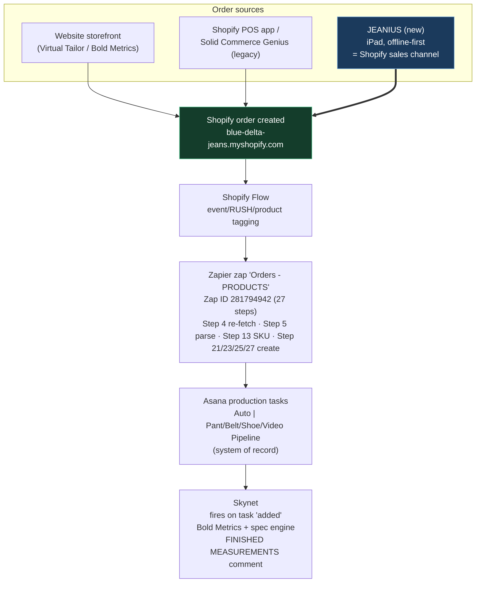
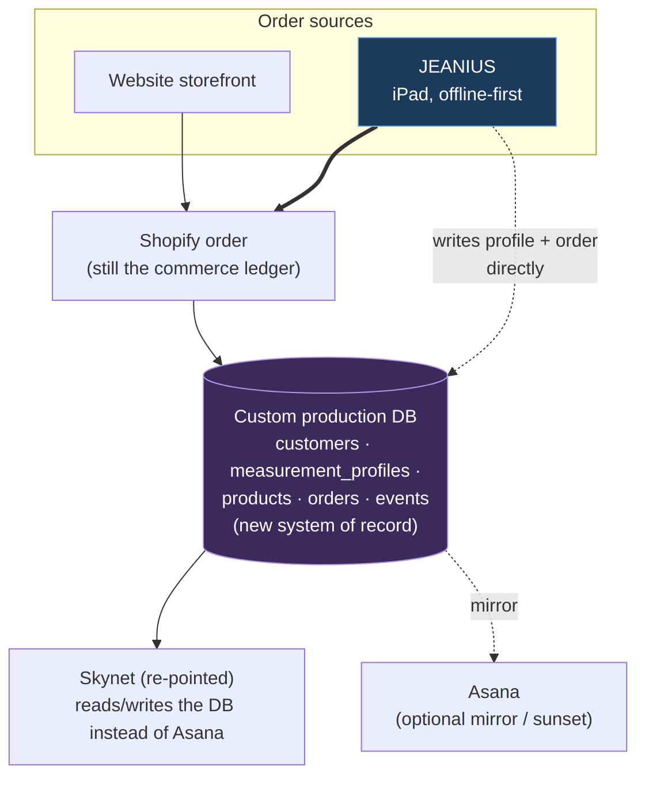
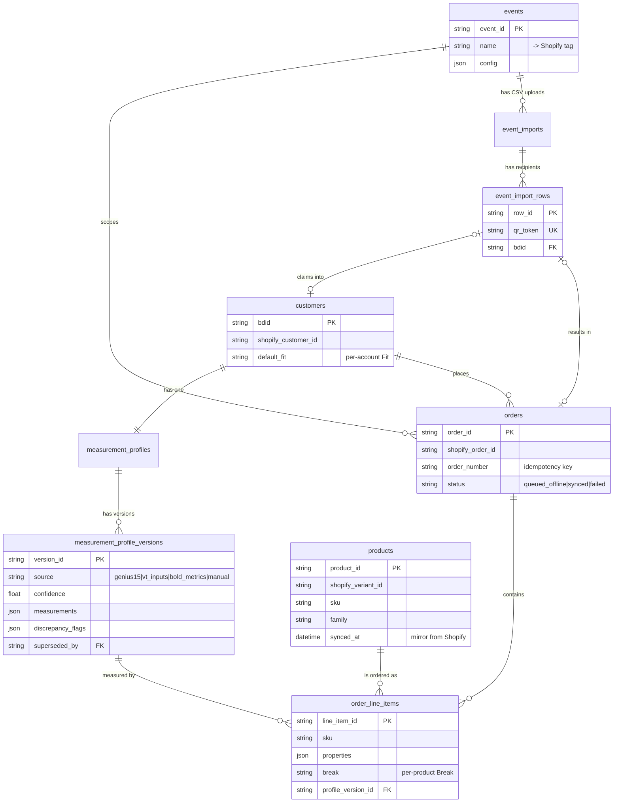
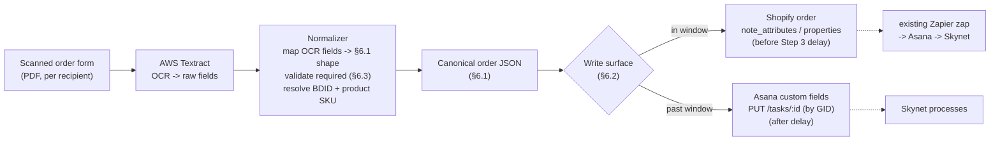

# 05 — Jeanius (Genius 2.0)

> **Status: IN PLANNING.** Jeanius has **no code yet** — there is no repository, no schema,
> no deployed surface. The **Notion design doc is the single source of truth** for the product
> vision. **The schema in this document is a DRAFT proposal only.** The Blue Delta team intends
> to design the production schema internally; treat the tables, fields, and ER diagram below as a
> straw-man to react to, not a spec to build against.
>
> Everything here is synthesized from the Jeanius design doc, the [V4 Shopify → Zapier → Asana
> pipeline docs](reference/zapier/), and the [Skynet repo + its docs](reference/skynet/).
> Where a fact must be confirmed against a live system or a team decision, it is marked **[CONFIRM]**.

**Owner:** Marketing & Tech (Caleb) · pattern-team technical lead (Hunter) · external agency (build partner)
**Last updated:** 2026-06-24
**Related docs:** [Architecture Overview](reference/zapier/Architecture%20Overview.md) ·
[Asana Field Mapping (Steps 21–27)](reference/zapier/Asana%20Field%20Mapping%20(Steps%2021%E2%80%9327).md) ·
[Online vs POS Product Architecture](reference/zapier/Online%20vs%20POS%20Product%20Architecture.md) ·
[Bold Metrics → Skynet migration context](reference/zapier/Bold%20Metrics%20Migration%20%E2%80%94%20Impact%20on%20the%20Zapier%20Pipeline.md) ·
[Skynet docs index](reference/skynet/README.md)

---

## 0. Notion source-of-truth links

These are the authoritative design pages. **If anything here disagrees with Notion, Notion wins.**

| Page | Link |
|---|---|
| Jeanius Phase 1 design doc + functional scope | [Notion source context](appendix/notion-source-context.md) |
| Jeanius Rebuild Audit (Blake/Johnson/Bud, 5/14) | [Notion source context](appendix/notion-source-context.md) |
| Jeanius Dev Planning Meeting (5/19) | [Notion source context](appendix/notion-source-context.md) |
| Esther / Tom James order-entry automation (5/22) | [Notion source context](appendix/notion-source-context.md) |
| Auto \| Pant Pipeline (Asana mapping) | [Notion source context](appendix/notion-source-context.md) |
| Auto \| Belt Pipeline | [Notion source context](appendix/notion-source-context.md) |
| Auto \| Shoe Pipeline | [Notion source context](appendix/notion-source-context.md) |
| Auto \| Video Card Pipeline | [Notion source context](appendix/notion-source-context.md) |
| BDJ Product Data | [Notion source context](appendix/notion-source-context.md) |
| Tailoring & Fit Process (Virtual Tailor) | [Notion source context](appendix/notion-source-context.md) |
| Bold Metrics → Skynet migration brief | [Notion source context](appendix/notion-source-context.md) |

> The four `Auto | … Pipeline` pages above are the **live Asana field contracts** that Jeanius
> orders must ultimately satisfy (today via Zapier → Asana, see §3 and §6).

---

## 1. What Jeanius is, and why

**Jeanius** (working name "Genius 2.0") is a planned **iPad-first, offline-first point-of-sale and
order-capture app** that becomes a **Shopify sales channel**. It is the replacement for the legacy
**Solid Commerce "Genius"** order tool.

### 1.1 The problem it solves

| Driver | Detail |
|---|---|
| **Replace Solid Commerce "Genius"** | The current event/retail order tool runs on Solid Commerce. It is the system reps use to place custom orders in person. It is being retired. |
| **~13,000 unsynced SKUs** | Blue Delta's catalog in Solid Commerce has **drifted out of sync with Shopify** — on the order of **13,000 SKUs** that do not reconcile. Shopify is becoming the catalog system of record; Genius/Solid Commerce is not. Jeanius writes orders **directly into Shopify**, so there is one catalog and one order ledger. |
| **iPad-first** | Reps work on iPads at events and in the retail showroom. The UI is designed for touch and for a salesperson standing next to a customer, not a desktop back-office screen. |
| **Offline-first** | Events happen in venues with poor or no connectivity (tents, fairgrounds, golf courses). Jeanius must let a rep capture a full order — customer, measurements, customization, payment intent — **with no network**, then sync to Shopify when connectivity returns. |
| **Becomes a Shopify sales channel** | Rather than a side database that later reconciles, Jeanius submits orders **as Shopify orders** (a registered sales channel / app). This means a Jeanius order is a first-class Shopify order the moment it syncs, and it automatically enters the **existing** Shopify → Zapier → Asana → Skynet production pipeline. |

### 1.2 Why this matters for the rest of the stack

Because a Jeanius order **is a Shopify order**, it inherits — for free — everything downstream:

- The same **Shopify Flow tagging** rules (event tags, RUSH tags, product tags).
- The same **Zapier zap** ("Orders - PRODUCTS", Zap ID `281794942`, **live at version 51**) that
  re-fetches the order, parses SKUs and note attributes, loops line items, and creates Asana
  production tasks. The earlier "V4 fixes pending as v43" framing is stale — those bug fixes plus
  later work are **deployed (v51)**, including the per-order **VT\* input field mapping** (the 5
  `VT *` fields are now populated on every order, live), with Skynet writing the 6 measurement
  fields post-creation as before.
- The same **Asana production projects** (Auto | Pant / Belt / Shoe / Video Card Pipeline).
- The same **Skynet** measurement/spec engine that fires on Asana task creation.

Jeanius does **not** need to re-implement the production pipeline. It needs to **emit a correctly
shaped Shopify order** so the existing machinery does the rest. This is the central architectural
bet and the reason §6 (the integration contract) is the most important section for anyone building
a tool that writes data into Jeanius-created orders.

---

## 2. v1 scope and the four user flows

### 2.1 v1 product scope

v1 supports the three product families that do **not** require a physical custom fitting appliance
beyond measurements, and that already have clean Shopify SKU structures:

| Family | Why in v1 | SKU shape (from [SKU Reference Guide](reference/zapier/SKU%20Reference%20Guide.md)) |
|---|---|---|
| **Pants** (men's, women's, shorts, Derby) | Core product; measurement profile drives everything | POS 4-seg, e.g. `M-PF03_DARKINDIGO-STRAIGHT-NAVY` |
| **Belts** | Simple measurement need (waist only); high event attach rate | POS 4–5-seg, e.g. `CB6-1.5-BRASS-NAVY`, `CB6-1-BRASS-NO_THREAD`, `CB6-1-BRASS-MONO-NAVY` |
| **Gift cards** (video gift cards) | No production measurements; easy to sell at events/lobby | `VID-GIFT-{Brand}-{Amount}`, e.g. `VID-GIFT-BDJ-200`, `VID-GIFT-PERSONAL-500` |

**Out of v1 (per the design doc / [CONFIRM]):** shoes (paper-form customization, no clean
self-serve path yet), shirts/jackets (no production pipeline), and alterations (separate Asana
workflow — the pipeline explicitly excludes `Alteration = true`, see
[Architecture Overview](reference/zapier/Architecture%20Overview.md) Step 16).

### 2.2 The four user flows

| # | Flow | Who | Connectivity | What happens |
|---|---|---|---|---|
| 1 | **Event rep** | Sales rep at an event | **Offline-first** | Rep measures/fits a customer in person, builds the order on the iPad, captures payment intent, queues the order locally; it syncs to Shopify when back online. The order is tagged with the event. |
| 2 | **Retail walk-in** | Showroom staff | Usually online | Same builder as event, but in the store with connectivity. Customer is measured in person or via Virtual Tailor. |
| 3 | **Corporate CSV → QR** | Corporate gifting coordinator + recipients | Online | Coordinator uploads a **CSV of recipients** (Tom James / Esther style — see §6.8). Each recipient gets a **QR code**; scanning it opens a self-serve fitting/customization flow tied to that corporate account/event. |
| 4 | **QR lobby self-serve** | Walk-up customer | Online | A QR code in the lobby / at a kiosk opens a self-serve fitting + order flow on the customer's own phone, no rep required. |

> Flows 3 and 4 are **customer-driven**; flows 1 and 2 are **rep-driven**. All four converge on the
> same outcome: **a Shopify order with a measurement profile attached** (§4) that enters the
> production pipeline (§3).

---

## 3. Where Jeanius sits in the architecture

Jeanius slots in **upstream of Shopify** and reuses the entire existing pipeline. The key change vs.
today is the **order source**: instead of (a) the website storefront or (b) the Solid Commerce
Genius tool / Shopify POS app, the order originates in **Jeanius** and is submitted **directly to
Shopify** as a sales-channel order.

### 3.1 Today's flow + Jeanius (near-term, Asana is system of record)



### 3.2 The future database-first flow (~6+ months out)

Per the [Bold Metrics → Skynet migration context](reference/zapier/Bold%20Metrics%20Migration%20%E2%80%94%20Impact%20on%20the%20Zapier%20Pipeline.md)
(§11 "Hardwire to Asana now; database later"), a **custom production database** is planned ~6+
months out. In that world, Asana stops being the system of record and the **Jeanius DB / custom DB**
becomes the canonical store. Jeanius is explicitly sequenced **after** the Bold Metrics migration
and is one of the drivers for the future DB.



> **Design implication for the integration contract (§6):** A tool that writes into Jeanius orders
> should target **a stable order shape** (§6.1), not a specific storage backend. Today that shape
> lands in **Asana custom fields**; tomorrow it lands in the **custom DB**. Build the writer against
> the field *contract*, with the write *surface* swappable.

---

## 4. The unified measurement profile

Today, body data is fragmented across three formats and two storage shapes:

| Source | What it is | Today's home |
|---|---|---|
| **Genius 15** (in-person) | ~15–16 granular tape measurements taken by a rep (waist around, seat around, thigh upper/middle/lower around+down, knee, calf, rise, outseam, leg opening) | Asana "Manual" fields (`Waist Around`, `Seat Around`, …) |
| **Virtual Tailor 5 / VT inputs** | The VT form answers (gender, age, height, weight, shoe size, preferred waist, inseam, bra size) | Asana `VT *` input fields + "BDJ User Data" note attribute |
| **Bold Metrics** | 50+ predicted dimensions returned from the VT inputs; Skynet uses **six** (`Waist Avg.`, `Hip Circum`, `Thigh Circum`, `Knee Circum`, `U Crotch`, `Jean Inseam`) | Asana "Bold Metrics" measurement fields |

**Jeanius's goal:** collapse these into **one universal customer measurement profile**, keyed by a
stable **BDID** (Blue Delta customer ID), so a customer measured once at an event, online, or via
QR has a single profile that any future order can reuse — regardless of which method captured it.

### 4.1 Profile principles (from the design doc)

1. **Keyed by BDID.** One profile per customer, identified by a Blue Delta ID. A customer's pattern
   is already "archived for all future orders" in the pattern process
   ([Tailoring & Fit Process](reference/zapier/V4%20-%20Shopify%20%E2%86%92%20Zapier%20%E2%86%92%20Asana%20Order%20Pipeline%20Documentation.md)
   / [Notion](appendix/notion-source-context.md)); BDID makes that machine-readable.
2. **Multi-source, one schema.** Genius-15, VT-5, and Bold Metrics all map into the same measurement
   slots. Skynet already normalizes these two "formats" (MANUAL vs BOLD_METRICS) today
   ([Skynet 01-overview](reference/skynet/01-overview.md)); Jeanius generalizes that.
3. **Versioned with decaying confidence.** Each profile is **versioned** (a customer re-measured a
   year later supersedes the old version). Confidence **decays over time** — an older measurement is
   trusted less; the most recent, highest-confidence version wins for a new order. **[CONFIRM the
   decay curve / half-life with the pattern team.]**
4. **Skynet-style discrepancy flagging.** When two sources disagree (e.g. in-person waist vs Bold
   Metrics waist, or this year vs last year), Jeanius flags the discrepancy the way Skynet flags
   out-of-range measurements today — a ⚠️ surfaced to the pattern team rather than a silent overwrite.
   Skynet's existing outlier detection (95%/99% intervals against ~5,300 historical patterns,
   [Skynet 05-spec-engine](reference/skynet/05-spec-engine.md)) is the model.
5. **Fit is per-account; Break is per-product.**
   - **Fit** (Tight / Tailored / Relaxed — the ease preference) is a **customer-level** attribute:
     it belongs to the profile and persists across orders.
   - **Break** (how the hem sits on the shoe — a pant-specific finishing choice) is a
     **per-product / per-order-line** attribute: it can differ between two pants in the same order
     and is captured at the line item, not the profile.

> This Fit-vs-Break split mirrors the current Asana mapping, where **Fit** falls back to a
> profile-level source (`5. Extras Jean Fit` / VT inputs) and **Break** is read from the line item
> / BDJ User Data per order ([Asana Field Mapping](reference/zapier/Asana%20Field%20Mapping%20(Steps%2021%E2%80%9327).md),
> multi-token fallback table).

### 4.2 Measurement slot crosswalk (draft)

How the three sources map onto the unified slots. The right two columns are the **live Asana
contract** (display name + GID) that the unified profile must be able to round-trip.

| Unified slot | Genius-15 (manual) | Bold Metrics dim | Asana field (today) | GID |
|---|---|---|---|---|
| waist | `Waist Around` | **average** of `waist_circum_preferred` + `waist_circum_natural` + `waist_circum_stomach` (3-way mean) | `Waist Avg.` (manual: `Waist Around`) | `1206671503499692` |
| seat / hip | `Seat Around` | `hip_circum` | `Hip Circum` | `1206671503499682` |
| thigh | `Thigh Upper Around` | `thigh_circum_proximal` | `Thigh Circum` | `1206671503499688` |
| knee | `Knee Around` | `knee_circum` | `Knee Circum` | `1206671503499686` |
| rise | `Full Rise` | `u_crotch` | `U Crotch` | `1206671503499690` |
| inseam | `Outseam` − ease *(derived)* | `jean_inseam` | `Jean Inseam` | `1206671503499684` |

> **`Waist Avg.` is an average, not a single dim.** Skynet writes it as the **mean of Bold Metrics'
> three returned waist circumferences** (`waist_circum_preferred`, `waist_circum_natural`,
> `waist_circum_stomach`) — see `Measurement-Calculator/server/boldmetrics.ts`
> (`WAIST_DIMENSION_KEYS`). Do **not** map it to `waist_circum_preferred` alone (that is the
> men's *input* `VT Waist`, a different field). The unified profile should preserve all three raw
> waist values + their average's provenance.
>
> Skynet quarter-rounds Bold Metrics values on import, derives `outseam = inseam − 0.5`, and
> derives `calf = knee − 1` for VT orders (there is no VT calf). The unified profile should record
> the **raw source value + its provenance + confidence**, and let the engine derive finished specs —
> not pre-flatten. See [migration context §9](reference/zapier/Bold%20Metrics%20Migration%20%E2%80%94%20Impact%20on%20the%20Zapier%20Pipeline.md).

---

## 5. DRAFT data model (proposal — not the production schema)

> **This is a straw-man.** The team will design the real schema internally. Purpose here: give the
> agency and the team a concrete shape to argue with. Names are illustrative. Postgres assumed
> (Skynet already uses Neon Postgres + Drizzle), but the model is engine-agnostic.

### 5.1 Entities

| Entity | Purpose | Key fields | Notes |
|---|---|---|---|
| **`customers`** | One row per person, keyed by BDID | `bdid` (PK), `first_name`, `last_name`, `email`, `phone`, `shopify_customer_id`, `default_fit` (Tight/Tailored/Relaxed), `gender`, `created_at` | `default_fit` is the per-account Fit (§4.1). `shopify_customer_id` links to Shopify's customer. |
| **`measurement_profiles`** | A customer's current best profile | `profile_id` (PK), `bdid` (FK), `current_version_id` (FK), `created_at`, `updated_at` | One per customer; points at the winning version. |
| **`measurement_profile_versions`** | Immutable, versioned snapshots | `version_id` (PK), `profile_id` (FK), `version_no`, `source` (`genius15` / `vt_inputs` / `bold_metrics` / `manual`), `captured_by` (rep / self / system), `captured_at`, `confidence` (0–1), `confidence_decayed` (computed), `measurements` (JSON: the unified slots), `vt_inputs` (JSON), `bold_metrics_raw` (JSON), `discrepancy_flags` (JSON), `superseded_by` (FK, nullable) | **Versioned + decaying confidence + discrepancy flags live here.** Never updated in place — a new version supersedes. |
| **`products`** | Catalog mirrored **from Shopify** | `product_id` (PK), `shopify_product_id`, `shopify_variant_id`, `sku`, `title`, `family` (`pant`/`belt`/`gift_card`), `price`, `options` (JSON), `active`, `synced_at` | **Shopify is the source of truth**; Jeanius mirrors for offline use. This is what closes the ~13,000-SKU drift. |
| **`orders`** | Mirrors a Shopify order | `order_id` (PK), `shopify_order_id`, `order_number` (e.g. `#114265`), `bdid` (FK), `event_id` (FK, nullable), `order_type` (`Online`/`Direct`), `status` (`draft`/`queued_offline`/`synced`/`failed`), `tags` (event/RUSH), `note`, `created_at`, `synced_at` | `order_number` is the **idempotency key** for downstream writers (§6.4). `status=queued_offline` is the offline-first state. |
| **`order_line_items`** | One per garment, mirrors Shopify line items | `line_item_id` (PK), `order_id` (FK), `shopify_line_item_id`, `product_id` (FK), `sku`, `quantity`, `properties` (JSON: thread, monogram, etc.), `break` (per-product, §4.1), `profile_version_id` (FK — which measurement snapshot was used) | **Break lives here, not on the profile.** Each line records which measurement version it shipped with. |
| **`events`** | An event or retail context | `event_id` (PK), `name` (becomes the Shopify tag), `type` (`event`/`retail`/`corporate`/`lobby`), `starts_at`, `ends_at`, `default_tags` (JSON), `config` (JSON: enabled products, pricing overrides, QR settings) | Per-event config (flow 1/3/4). `name` → Shopify `Event (tags)` field. |
| **`event_imports`** | A corporate CSV upload (flow 3) | `import_id` (PK), `event_id` (FK), `uploaded_by`, `uploaded_at`, `row_count`, `status`, `raw_csv_ref` | Parent of the recipient rows. |
| **`event_import_rows`** | One recipient from a CSV | `row_id` (PK), `import_id` (FK), `recipient_name`, `recipient_email`, `qr_token` (unique), `bdid` (FK, nullable until claimed), `claimed_at`, `order_id` (FK, nullable) | The QR token a recipient scans (flow 3). Becomes a `customers` + `orders` row on claim. |

### 5.2 Relationships (draft ER diagram)



> **Why mirror products and orders from Shopify rather than own them?** Shopify stays the commerce
> ledger and catalog system of record (this is what fixes the 13,000-SKU drift). Jeanius mirrors so
> it can work **offline** (flow 1) and so the future custom DB has a clean canonical store. Writes
> still flow **to Shopify first**, then mirror back.

---

## 6. THE INTEGRATION CONTRACT (most important section)

This section is for **any agency or tool that writes data into Jeanius-created orders** — for
example, an automation that ingests a scanned order form, extracts fields, and attaches them to the
right order/line (the **Tom James / Esther** worked example, §6.8).

### 6.1 The order-data shape a writer MUST conform to

A writer produces (or updates) an order in this canonical shape. Field names use the **live Asana
contract** because that is today's write surface (§6.2); they remain stable as the surface moves to
the custom DB.

```jsonc
{
  "order_number": "#114265",          // REQUIRED. Idempotency key. Must match the Shopify order name.
  "shopify_order_id": "7544208490787",// OPTIONAL but preferred. Stable Shopify ID.
  "customer": {
    "bdid": "BDJ-000123",             // REQUIRED if known. Links to the unified profile.
    "first_name": "Jordan",           // REQUIRED
    "last_name": "Sample",            // REQUIRED
    "email": "…",                     // OPTIONAL
    "new_customer": "No"              // OPTIONAL -> Asana "New Customer"
  },
  "order_type": "Direct",             // REQUIRED. "Online" | "Direct" (Direct = POS/Jeanius/event)
  "event_tags": "Ella,RUSH ROYAL",    // OPTIONAL -> Asana "Event (tags)" (1203340633343053)
  "note": "",                         // OPTIONAL -> Asana "Note"
  "line_items": [
    {
      "sku": "M-PF03_DARKINDIGO-STRAIGHT-NAVY", // REQUIRED. Drives product-type routing.
      "product_type": "Pant",         // REQUIRED. Pant | Belt | Shoe | Video Card
      "quantity": 1,                  // REQUIRED
      "properties": {                 // product-specific; see §6.6
        "Fabric": "PF03_DARKINDIGO",
        "Style": "STRAIGHT",
        "Thread": "Navy",
        "Monogram": "",
        "Fit": "Tailored",            // per-account, copied onto the line
        "Break": "Full"               // per-product (§4.1)
      },
      "measurement": {                // §6.5 — attach by profile version, not loose numbers
        "source": "genius15",         // genius15 | bold_metrics | vt_inputs | manual
        "profile_version_id": "…",    // preferred — points at the snapshot used
        "values": {                   // OR inline the unified slots if no profile id yet
          "Waist Avg.": "34",
          "Hip Circum": "41.83",
          "Thigh Circum": "23.1",
          "Knee Circum": "15.4",
          "U Crotch": "27.9",
          "Jean Inseam": "32"
        }
      }
    }
  ]
}
```

### 6.2 Recommended write surface (today / interim / tomorrow)

| Horizon | Write surface | How | Notes |
|---|---|---|---|
| **Today** | **Asana** | `PUT /tasks/:taskId` with a `custom_fields` map **keyed by GID** (writes need GIDs even though Skynet *reads* by display name). Find the task by order number + first/last name (the Asana task name format is `#{order} {First} {Last} {iter}/{total}{rush}`). | This is exactly how Skynet's planned `setAsanaCustomFields` works ([migration context §7A](reference/zapier/Bold%20Metrics%20Migration%20%E2%80%94%20Impact%20on%20the%20Zapier%20Pipeline.md)). The Asana PAT needs **write** scope ([CONFIRM]). |
| **Interim** | **Shopify order** | Write to the Shopify order's `note_attributes` / line item `properties` / tags **before** Zapier Step 4 re-fetches it (the pipeline has a deliberate **1.5-minute delay** at Step 3 for exactly this kind of late write). | Lets the existing zap carry your data into Asana automatically — no Asana write needed. Respect the delay window. |
| **Tomorrow** | **Custom DB** | Write to `orders` / `order_line_items` / `measurement_profile_versions` via the Jeanius API. | Same field contract (§6.1); just a different endpoint. Build the writer so the surface is a config switch. |

> **Recommendation:** target the **Shopify order (interim)** path when you can write before the
> Step 3 delay elapses (most clean, fully automatic downstream); fall back to the **Asana
> (today)** path for orders already past the delay. Never hardcode for a single surface.

### 6.3 Required vs optional fields

| Field | Required? | Why |
|---|---|---|
| `order_number` | **Required** | Idempotency key (§6.4); the only reliable join across systems. |
| `customer.first_name`, `customer.last_name` | **Required** | Part of the Asana task name; needed to locate the task. |
| `order_type` | **Required** | Drives due-date math (Online pants 14d, Direct/POS 30d) and data-source assumptions. |
| `line_items[].sku` | **Required** | SKU prefix routes the line to the right pipeline (`M-`/`W-`→Pant, `CB`→Belt, `VID-GIFT-`→Video). |
| `line_items[].product_type` | **Required** | Explicit routing; do not rely on SKU parsing alone. |
| `line_items[].quantity` | **Required** | One Asana task per unit (the qty>1 expansion is live in the zap, v51). |
| `customer.bdid` | Required *if known* | Links to the unified profile; enables reuse + discrepancy flagging. |
| `event_tags`, `note`, `properties.*`, `measurement.*` | Optional | Enrich the order; absence must not break the write. |

### 6.4 Idempotency — dedupe by order number

- **The order number is the idempotency key.** A writer must be safe to run **more than once** for
  the same order and converge to the same result (upsert, not append).
- **Before writing measurements, check whether the target fields are already populated.** Do not
  blindly overwrite. This mirrors Skynet's hard-won rule: its dedupe (`hasFinishedMeasurements`)
  **fails open** on any Asana API error, so it checks the measurement fields *directly* before
  firing a billed Bold Metrics call ([migration context §7A](reference/zapier/Bold%20Metrics%20Migration%20%E2%80%94%20Impact%20on%20the%20Zapier%20Pipeline.md);
  [Skynet 09 #15](reference/skynet/09-known-issues-and-tech-debt.md)).
- **Conflict = 409, not silent overwrite.** Skynet's Bold Metrics post returns **409 unless
  `overwrite=true`** ([Skynet 01-overview](reference/skynet/01-overview.md) §5/§6).
  A Jeanius writer should adopt the same posture: refuse to overwrite a populated field unless the
  caller explicitly asks to.

### 6.5 Measurement attachment

- Attach measurements **as a profile version reference** (`profile_version_id`) when one exists, so
  the line records *which* snapshot it used. Inline `values` are a fallback for first-touch orders
  where no profile exists yet.
- Use the **unified slots** (`Waist Avg.`, `Hip Circum`, `Thigh Circum`, `Knee Circum`, `U Crotch`,
  `Jean Inseam`) so Skynet's format detection reads the order as `BOLD_METRICS` (or `MANUAL` if you
  write the `Waist Around`/`Seat Around` set). **Do not mix** — Skynet treats `Waist Around`/`Seat
  Around` as MANUAL and `Waist Avg.`/`Hip Circum` as BOLD_METRICS, and **manual wins if both are
  present** ([migration context §9](reference/zapier/Bold%20Metrics%20Migration%20%E2%80%94%20Impact%20on%20the%20Zapier%20Pipeline.md)).
- **Belts** need only waist (the Belt pipeline gets `Waist Avg.` / `Waist Around` but **not** the
  full leg set — [Asana Field Mapping](reference/zapier/Asana%20Field%20Mapping%20(Steps%2021%E2%80%9327).md) §Belt).
- **Gift cards** carry **no measurements** at all (Video Card pipeline has 7 fields, no body data).
- Respect the **trailing period in `Waist Avg.`** — Skynet matches custom fields by exact display
  name; the period is load-bearing ([Skynet 01 invariants](reference/skynet/01-overview.md)).

### 6.6 Per-line property contract (subset)

The `properties` map per line, by product family (full mapping in
[Asana Field Mapping (Steps 21–27)](reference/zapier/Asana%20Field%20Mapping%20(Steps%2021%E2%80%9327).md)):

| Family | Key properties | Asana field / GID (project) |
|---|---|---|
| Pant | `Fabric` `Style` `Thread` `Monogram` `Monogram Thread` `Fit` `Break` `Waist Ride` `Pockets` | Pant Pipeline `1206657933205972`: `1203263757944175` (Fabric), `1206671503498614` (Style), `1206671503498616` (Thread), `1206660694454917` (Monogram), `1206706696879461` (Monogram Thread), `1206671503498618` (Fit), `1206671503498622` (Break), `1206671503499680` (Waist Ride), `1206671503498620` (Pockets) |
| Belt | `Belt - Leather` `Belt - Width` `Belt - Hardware` `Belt - Stitching` `Monogram` | Belt Pipeline `1206657932919233`: `1206660686733050` (Belt - Leather), `1206660695392880` (Belt - Width), `1206660696647112` (Belt - Hardware), `1210023972860730` (Belt - Stitching), `1206660694454917` (Monogram) |
| Shoe | `Shoe` `Size` `Laces` `Swoosh` `Back Tab \| Eyelets` `Toe Cap \| Back Heel` `Toe Box \| Mid Panel` | Shoe Pipeline `1206648505149980`: `1206649434581930` (Shoe), `1206657371264334` (Size), `1206649011400238` (Laces), `1206649336008535` (Swoosh), `1206649338146406` (Back Tab \| Eyelets), `1206649001881160` (Toe Cap \| Back Heel), `1206649000374109` (Toe Box \| Mid Panel) |
| Gift card | `Product Type` (`Video Card`) | Video Card Pipeline `1206657933205969`: `1203386148481388` (Product Type) |

> **Same-name fields can have different GIDs per project.** `Monogram` (`1206660694454917`) is
> workspace-shared and reuses one GID across Pant and Belt, but `Waist Avg.` and `White Glove` are
> **per-project duplicates** with distinct GIDs (e.g. `Waist Avg.` = `1206671503499692` on Pant vs
> `1206660342181401` on Belt; `White Glove` = `1208695148089782` on Pant vs `1210137215275442` on
> Belt). This is exactly why Skynet matches Asana custom fields by **exact display name**, not GID —
> and why a silent rename breaks the contract. A writer keying by GID (§6.2 "Today" path) must use
> the **project-specific** GID for these duplicated fields.

### 6.7 How a writer MUST NOT override in-flight orders

- **Never touch an order that has already entered production.** Skynet's pipeline **excludes**
  projects whose name contains `in production`, `alt info requests`, `alt 2.0`, or `alteration`
  ([migration context §7A](reference/zapier/Bold%20Metrics%20Migration%20%E2%80%94%20Impact%20on%20the%20Zapier%20Pipeline.md);
  [Skynet 09 #20](reference/skynet/09-known-issues-and-tech-debt.md)). A writer must
  apply the same exclusion: if the task has moved to an in-production/alteration project, **do not
  write**.
- **Never override a field a human already set.** Check-then-write (§6.4). If a rep corrected a
  measurement on the iPad after sync, that human value wins over a later automated extract.
- **Respect `action === 'added'` semantics.** Skynet only fires on **new** tasks, not edits/recuts
  ([Skynet 01](reference/skynet/01-overview.md)). A writer enriching an existing
  order must not cause a re-fire that double-posts FINISHED MEASUREMENTS.
- **Stay out of the Step 3 race for orders already past it.** If you can't write before the
  1.5-minute delay, write to **Asana** (§6.2), not to the Shopify order — re-fetching has already
  happened.
- **Do not write measurements back to Shopify.** The deliberate decision is **Asana/DB output only**;
  the raw VT inputs are kept as a fallback, and Shopify is not a measurement store
  ([migration context §11](reference/zapier/Bold%20Metrics%20Migration%20%E2%80%94%20Impact%20on%20the%20Zapier%20Pipeline.md)).

### 6.8 Worked example — Tom James / Esther automation (scanned PDF → Textract → JSON → pipeline)

A corporate partner ("Tom James", coordinated by "Esther") sends Blue Delta **scanned order forms**
(PDF) for a batch of recipients. The automation:

> **Target Asana projects for this flow.** Tom James B2B orders land in **`AUTO | TJ Order
> Pipeline`** (project GID `1210690652026343`); the broader corporate gifting / CSV→QR flow (§2.2
> flow 3) lands in **`Corporate Sales + CET Pipeline`** (project GID `1215501202787817`). A writer
> using the Asana "Today" path (§6.2) targets tasks in these projects (matching custom fields by
> exact display name, §6.6), in addition to the four standard `Auto | …` production pipelines.



**Step by step:**

1. **Scan → Textract.** Each PDF page is OCR'd by **AWS Textract** into raw key/value pairs
   (customer name, measurements, fabric/style/thread choices, monogram, event/account).
2. **Normalize → §6.1 JSON.** A normalizer maps OCR output into the canonical order shape:
   - Resolve the **BDID** (match on name/email; create a new `customers` row if unknown).
   - Resolve each **SKU** from the catalog mirror (`products`) so routing is correct.
   - Pick the **measurement source** = `genius15` (these are tape measurements off a paper form) and
     populate the **MANUAL** slots (`Waist Around`, `Seat Around`, …) — *not* the Bold Metrics slots
     — so Skynet reads format `MANUAL`.
   - Set `order_type = "Direct"` (corporate batch, not a web checkout).
   - Set `event_tags` to the corporate account/event name.
3. **Idempotency.** Key every write on `order_number`. Re-running the batch must converge (upsert).
   Check measurement fields **before** writing; on conflict, 409 unless `overwrite=true` (§6.4).
4. **Choose the write surface (§6.2).** If the Shopify order is younger than the Step 3 delay, write
   to the **Shopify order** and let the existing zap carry it. Otherwise write to **Asana** fields
   directly by GID.
5. **Guardrails.** Skip any task already in an `in production` / `alteration` project. Never
   overwrite a human-set value. Never write measurements to Shopify (§6.7).
6. **Skynet finishes the job.** On task creation, Skynet computes finished specs and posts the
   `FINISHED MEASUREMENTS` comment — no extra work from the writer.

> This is the canonical pattern for **any** "external document → Jeanius order" automation, not just
> Tom James. The corporate **CSV → QR** flow (§2.2 flow 3) is the same shape with CSV rows instead
> of scanned PDFs.

---

## 7. Open questions for the internal team

1. **Notion canonical URL.** §0 links the **Jeanius Phase 1 design doc**; confirm it is the
   authoritative/current page (vs. the Rebuild Audit / Dev Planning notes) so this doc and Notion
   stay linked to one source of truth.
2. **BDID scheme.** What is the format/source of BDID? Is it derived from the Shopify customer ID,
   minted by Jeanius, or reconciled from Solid Commerce? How are duplicate customers merged?
3. **Confidence decay curve.** What is the half-life / decay function for measurement confidence
   (§4.1.3)? When does an old profile version stop "winning" automatically?
4. **Discrepancy thresholds.** What delta between two sources triggers a ⚠️ vs an auto-pick? Should
   Jeanius reuse Skynet's 95%/99% interval logic, or define its own per-slot tolerances?
5. **Schema ownership & engine.** The team will design the production schema internally — Postgres
   (to match Skynet/Neon) or another store? Does Jeanius own the future custom DB, or is the DB a
   separate project Jeanius writes into?
6. **Offline conflict resolution.** When two iPads (or an iPad and the web) edit the same customer's
   profile offline and both sync, what is the merge/last-writer-wins/flag policy?
7. **Shopify sales-channel mechanics.** Is Jeanius a Shopify **custom app** writing orders via the
   Admin API, or a registered **sales channel**? This affects how orders are attributed and tagged
   and whether `source_name` / `cart_token` behave like web vs POS for the existing parser.
8. **Order-type detection.** Today the parser uses `cart_token` presence to decide Online vs Direct
   ([Architecture Overview](reference/zapier/Architecture%20Overview.md) §Order Type
   Detection). Will Jeanius orders have a cart token? If not, they'll parse as **Direct** (30-day
   pant due date) — confirm that's intended for event orders.
9. **Asana PAT write scope.** Confirm the PAT can write custom fields (open item from the Bold
   Metrics migration, [§14.2](reference/zapier/Bold%20Metrics%20Migration%20%E2%80%94%20Impact%20on%20the%20Zapier%20Pipeline.md)).
10. **Gift-card production tasks.** Do video gift cards still need an Asana task in the DB-first
    world, or do they short-circuit to fulfillment? (They have no measurements.)
11. **QR token lifecycle.** Expiry, single-use vs multi-use, and what happens to an unclaimed
    corporate recipient row after the event ends (§5.1 `event_import_rows`).
12. **Sequencing.** The migration context sequences Jeanius **after** the Bold Metrics work and
    **before** the custom DB. Confirm the order of build vs the agency's timeline.

---

## 8. Secrets & environment (names only — never commit values)

No Jeanius secrets exist yet. The surrounding systems use these (values live in their respective
secret stores, **not** in this repo):

| Var | System |
|---|---|
| `ASANA_ACCESS_TOKEN` | Skynet (PAT, Bearer; needs **write** scope for field write-back) |
| `BOLDMETRICS_CLIENT_ID` (`bluedelta`), `BOLDMETRICS_USER_KEY` | Bold Metrics (company-wide key) |
| `DATABASE_URL` | Neon Postgres (Skynet) |
| Shopify Admin API credentials | Zapier zap (`blue-delta-jeans.myshopify.com`) |

> **Hygiene:** the Bold Metrics `user_key` is a live secret that historically remained hardcoded in
> a legacy storefront snippet and is slated for rotation; never hardcode it. Jeanius will need its
> own Shopify app credentials and (eventually) DB credentials — store them as env vars, never in
> source.

---

*This document is a planning artifact. The Notion Jeanius design doc is authoritative; the schema in
§5 is a draft proposal the team will supersede with an internally-designed production schema.*
