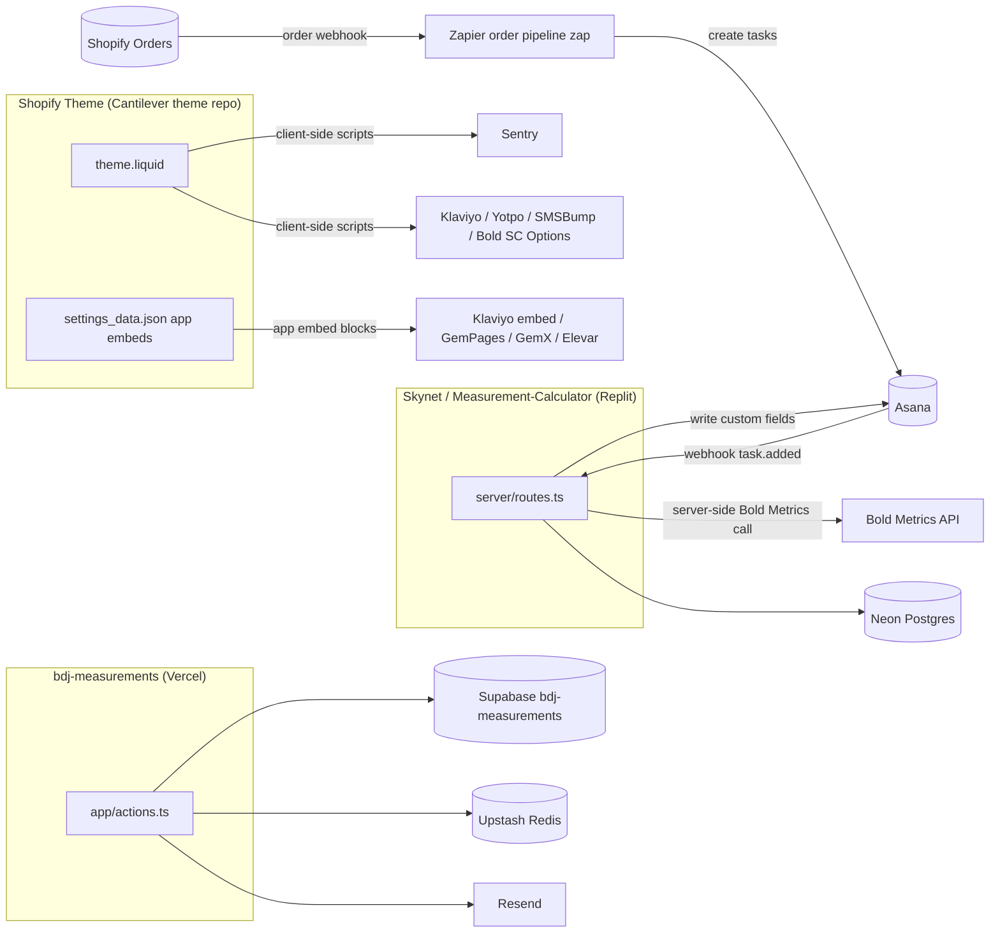

# 06 — Integrations Overview

> **Map of every third-party integration across the Blue Delta Jeans tech stack — what each one is, what it's used for, and where it's wired (system / repo / file).**
>
> This is the "what talks to what, and where in the code does it live" document. It is an *integrations overview*, not a credentials matrix: it does **not** describe where secrets are stored or how to obtain access. Environment-variable **names** appear where they aid understanding; **no secret values, tokens, or PII** appear anywhere in this file.

> **Confidential — shared for proposal evaluation.** This document is provided to prospective agencies so they can scope and estimate the work. Please treat it accordingly.

**Last verified:** 2026-06-24 · **Owner:** Marketing & Tech (Blue Delta Jeans)

---

## How to read this doc

The Blue Delta stack is four code surfaces plus a constellation of SaaS apps. Most "integrations" live in one of three places:

1. **The Shopify theme** (Cantilever theme repo) — third-party scripts injected into `layout/theme.liquid` and app embed blocks in `config/settings_data.json`. Many of these are **client-side** (the identifier is a public publishable key or a loader hash).
2. **Skynet** (the Measurement-Calculator app, hosted on Replit) — the internal measurement engine. Server-side configuration lives in environment secrets.
3. **bdj-measurements** (the standalone Virtual Tailor capture page, hosted on Vercel) — server-side configuration lives in environment variables.

Cross-system glue (Shopify → Asana) runs through a **Zapier** zap, not in any repo.

---

## ⚠️ Read first: "Bold" ≠ "Bold" disambiguation

There are **three completely unrelated vendors/products with "Bold" in the name** in this stack. They share nothing — different companies, different purposes. Conflating them is the #1 source of confusion.

| Name used here | Real vendor | What it actually is | Where it's wired |
|---|---|---|---|
| **Bold "SC Product Options"** | **Bold Commerce** (shopapps.site / "Shappify" / "Product Options") | Shopify app that moves thread/monogram/customization into **line-item properties** on the online store (works around Shopify's 100-variant cap). | `layout/theme.liquid` → renders `snippets/bold-common.liquid` + `snippets/sc-includes.liquid`; loads `https://options.shopapps.site/js/options.js`. Installed Shopify app — no env var. |
| **Bold Commerce loyalty** | **Bold Commerce** | A *loyalty* product. **NOT confirmed live in the current theme** — see note below. | Not found wired in `theme.liquid` / `settings_data.json`. |
| **Bold Metrics** | **Bold Metrics, Inc.** (San Francisco AI body-data company) | The **AI sizing engine** behind Virtual Tailor — predicts 50+ body measurements from ~9–11 questions. **Totally separate company** from Bold Commerce. | Server-side in Skynet (`server/routes.ts`, the sole live path; computes the six measurements post-order). The storefront no longer calls Bold Metrics — both the main VT path and the GemPages "quick-tailor" page have been removed from the live site (owner-confirmed). See [Bold Metrics](#bold-metrics-api). |

> **Honesty note on "loyalty":** The loyalty/rewards widget that ships in the live theme is **Yotpo Loyalty** (loaded in `theme.liquid`), *not* a Bold Commerce loyalty product. No Bold Commerce loyalty script was found wired in the current theme. If a "Bold Commerce loyalty" account exists, it is either legacy/disabled or managed entirely inside Shopify Admin with no theme footprint. **Treat "Bold loyalty" as Yotpo Loyalty unless proven otherwise.** The only confirmed *Bold Commerce* footprint in the theme is **SC Product Options**.

---

## Integrations at a glance

| Integration | Live? | Primary purpose | Where it's wired |
|---|---|---|---|
| **Shopify** (Storefront / Admin / POS / CLI) | ✅ Live | Commerce platform, source of truth for orders/products | Cantilever theme repo; Zapier Admin API calls; Shopify Admin |
| **GemPages** (Builder + GemX CRO) | ✅ Live | Landing-page builder + A/B testing | Theme snippets + `settings_data.json` app embeds |
| **Bold SC Product Options** | ✅ Live | Online customization → line-item properties | `theme.liquid` + `sc-includes.liquid` / `bold-common.liquid` |
| **Bold Commerce loyalty** | ❓ Unconfirmed | (see disambiguation) | Not found in theme |
| **Klaviyo** | ✅ Live | Email/SMS marketing + VT lead capture | Theme (public id); Klaviyo app embed; `VirtualTailor.js` |
| **Yotpo Reviews / UGC** | ✅ Live | Product reviews + photo gallery | Theme (public loader hash) |
| **Yotpo Loyalty** | ✅ Live | Rewards/points program | Theme (public loader hash) |
| **SMSBump** (Yotpo SMS) | ✅ Live | SMS marketing checkbox at checkout | Theme snippet |
| **Sentry** | ✅ Live | Front-end error tracking (storefront) | `theme.liquid` + `snippets/sentry.liquid` |
| **Bold Metrics API** | ✅ Live (Skynet only) | AI body-measurement engine | Server-side in Skynet (`server/routes.ts`) |
| **Asana** | ✅ Live | Production task management (one task per garment) | Skynet `server/asana.ts`; Zapier connection |
| **Zapier** | ✅ Live | Shopify → Asana order pipeline (27 steps) | Inside Zapier (no repo) |
| **Supabase** (`bdj-measurements`) | ✅ Live | VT capture storage + admin auth | bdj-measurements (`proxy.ts`, `app/actions.ts`) |
| **Resend** | 🟡 Phase 2 | New-submission email notifications | bdj-measurements |
| **Upstash Redis** | 🟡 Optional | IP rate-limiting (5/min) on VT capture | bdj-measurements server action |
| **Vercel** | ✅ Live | Hosting for bdj-measurements | bdj-measurements deploy target |
| **Replit** | ✅ Live | Hosting for Skynet (autoscale) | Skynet `.replit` |
| **Neon Postgres** | ✅ Live | Skynet's database | Skynet `server/db.ts` |
| **AWS (S3 / Textract)** | 🔮 Future | "Jeanius" rebuild (not yet built) | Not provisioned |
| **Optitex 15** | ✅ Live (desktop) | Pattern CAD; driven by a Python agent | Skynet job queue ↔ Windows agent |
| **Elevar** | ✅ Live | Server-side conversion tracking (dataLayer) | `settings_data.json` app embed |

Legend: ✅ Live · 🟡 Optional/Phase-2 (works degraded if absent) · 🔮 Future/planned · ❓ Unconfirmed

---

## Environment-variable names by code surface

For agencies scoping work, it helps to know which env-var **names** each repo expects. (Values, and where those values are stored, are out of scope for this document.) The Shopify theme uses **no** env file — its credentials are public client-side IDs or installed-app OAuth grants, so it does not appear in this table.

| ENV VAR | App / surface | Notes |
|---|---|---|
| `NEXT_PUBLIC_SUPABASE_URL` | bdj-measurements | Project URL; safe in browser. Used by `proxy.ts`. |
| `NEXT_PUBLIC_SUPABASE_ANON_KEY` | bdj-measurements | Anon key (RLS-bounded). Phase-2 admin auth (`proxy.ts`). |
| `SUPABASE_URL` | bdj-measurements | Server mirror of the same project URL. |
| `SUPABASE_SERVICE_ROLE_KEY` | bdj-measurements | Bypasses RLS. Server-only — **never** prefix `NEXT_PUBLIC_`. Read in `lib/supabase-server.ts`, used by `app/actions.ts`. |
| `UPSTASH_REDIS_REST_URL` | bdj-measurements | Optional. Without it the rate limiter is a no-op. |
| `UPSTASH_REDIS_REST_TOKEN` | bdj-measurements | Optional. Pairs with the URL above. |
| `RESEND_API_KEY` | bdj-measurements | Phase 2. Without it, notification emails silently skip. |
| `RESEND_FROM_ADDRESS` | bdj-measurements | Must be a verified sending domain (recommended: a subdomain of bluedeltajeans.com). |
| `NEXT_PUBLIC_SITE_URL` | bdj-measurements | Used in notification email links. |
| `DATABASE_URL` | Skynet | Neon Postgres conn string. **Required** — `server/db.ts` and `drizzle.config.ts` throw at load if unset. |
| `ASANA_ACCESS_TOKEN` | Skynet | Asana PAT, sent as `Bearer`. **Needs WRITE scope** (custom-field writes). No OAuth, no expiry (`server/asana.ts`). |
| `OPTITEX_AGENT_TOKEN` | Skynet **+** Optitex agent host | Shared bearer for the agent poll/PATCH endpoints. ⚠️ If unset on server, **any** bearer is accepted (`routes.ts`) — flagged tech-debt. |
| `BOLDMETRICS_USER_KEY` | Skynet | Bold Metrics API key (company-wide, single key). Required for the VT pipeline; server throws per-call if missing. |
| `BOLDMETRICS_CLIENT_ID` | Skynet | Optional; defaults to `bluedelta`. |
| `BOLDMETRICS_BASE_URL` | Skynet | Optional; defaults to the Bold Metrics virtualtailor endpoint. |
| `API_BASE` | Optitex agent only | The deployed Replit app URL the agent polls. |
| `REPLIT_DOMAINS` | Skynet | Replit-injected. First CSV entry builds the Asana webhook target URL (`routes.ts`). |
| `REPL_ID` | Skynet | Replit-injected. Gates the Vite cartographer plugin (Replit dev only). |
| `PORT` | Skynet | `.replit` (=5000). localPort 5000 → externalPort 80. |
| `NODE_ENV` | Skynet | dev/prod switch. |

---

# Integration deep-dives

Each section: **what it is · what it's used for · where it's wired (repo + file where helpful) · relevant IDs / env-var names.**

## Shopify

**What it is:** The commerce platform and source of truth for orders, products, customers, and inventory. The storefront theme, POS, the order→Asana pipeline, and both downstream apps all hang off Shopify.

**Store handle:** `blue-delta-jeans`. Public domain: `www.bluedeltajeans.com`.

### Storefront (theme)
- **Wired:** the entire Cantilever theme repo *is* the theme. Entry layout: `layout/theme.liquid`.
- **Dev workflow:** `local-start.sh` runs `shopify theme dev --store=blue-delta-jeans --theme=<branch>`; it refuses to run on `main` and creates an unpublished theme per branch. Requires the `shopify` CLI + `jq`.

### Admin API
- **Wired:** primarily consumed **outside the repos** — the Zapier pipeline does `Shopify API: GET Order by ID` (Step 4) against the Admin REST API to re-fetch the full order with nested line-item properties and note attributes.
- **Metafields in use (theme):** `.shopify/metafields.json` defines e.g. `custom.virtual_tailor_complete` (order metafield) and the `inventory.ShappifyHidden` / `gempages.*` namespaces referenced in `theme.liquid`.

### POS (Shopify POS)
- **What it's for:** in-store retail sales.
- **Architectural constraint (important):** **SC Product Options does NOT work in Shopify POS.** POS can only pick existing variants — it cannot prompt for custom thread/monogram fields. So Blue Delta maintains a **separate set of POS-specific products** that encode thread (and monogram for belts) **in the SKU** instead of line-item properties. See [Online vs POS Product Architecture](reference/zapier/Online%20vs%20POS%20Product%20Architecture.md) and the [SKU Reference Guide](reference/zapier/SKU%20Reference%20Guide.md). This is why the Zapier pipeline parses online vs POS items differently.

### Shopify CLI
- **What it's for:** local theme development + deploy.
- **Wired:** `local-start.sh`; `.shopify/` dir (git-ignored session + `metafields.json`).

---

## GemPages (GemPages Builder + GemX CRO A/B Testing)

**What it is:** Drag-and-drop landing-page builder (GemPages) and on-site A/B testing / CRO (GemX). Most marketing/landing templates (`gp-section-*.liquid`, `gem-*` templates) are GemPages output.

**What it's used for:** Building and testing landing/marketing pages without touching the theme repo directly.

**Where it's wired:**
- Header scripts: `layout/theme.liquid` → `snippets/gem-app-header-scripts.liquid` (loads `assets.gemcommerce.com/v6/...`).
- Footer scripts: `theme.liquid` → `snippets/gem-app-footer-scripts.liquid` (loads `gempagev2.js`), gated on GemPages v6 template detection via `shop.metafields.gempages.*`.
- App embed blocks in `config/settings_data.json`:
  - `shopify://apps/gempages-builder/blocks/embed-gp-script-head/...`
  - `shopify://apps/gemx-cro-a-b-testing/blocks/gemx-theme-helper/...`
- Page-level data: `page.metafields.gempages.featuredImage`, `shop.metafields.gempages['productV6-default']`, etc.

**IDs:** Installed Shopify app — no env var. GemPages template handles are hardcoded in the gem snippets (`index.gem-…-template`, `product.gem-…-template`, `collection.gem-…-template`). Page edits happen in the GemPages editor, not the repo.

---

## Bold "SC Product Options" (Bold Commerce)

**What it is:** A Shopify customization app from Bold Commerce. (See the [Bold≠Bold disambiguation](#️-read-first-bold--bold-disambiguation).)

**What it's used for:** Online product customization — moves thread color / monogram / personalization out of Shopify variants and into **line-item properties**, working around Shopify's hard 100-variant-per-product cap.

**Where it's wired:**
- `layout/theme.liquid` renders `` and ``.
- `snippets/bold-common.liquid` — auto-generated Bold bootstrap (`window.BOLD.*`). **Do not edit** (header warns it's regenerated).
- `snippets/sc-includes.liquid` — loads `bold-options.css` + `https://options.shopapps.site/js/options.js` (defer), with a cache param.
- Internal `_bold…` line-item properties appear on online orders and are **ignored** by the Zapier parser (they're app metadata).

**IDs:** Installed Shopify app (Bold Commerce / "shopapps.site"). No env var. The theme footprint is generated — option sets are configured in the Bold app, not by editing `sc-includes.liquid`.

---

## Bold Commerce loyalty

**Status: unconfirmed / likely not the live loyalty system.** See the disambiguation table. The live rewards program in the theme is **Yotpo Loyalty**. No Bold Commerce loyalty script is wired in `theme.liquid` or `settings_data.json`. If a Bold loyalty account exists it is managed entirely in Shopify Admin / Bold's dashboard with no theme footprint, or is legacy. **Action for handoff:** confirm whether a Bold loyalty subscription still exists before assuming it's live.

---

## Klaviyo

**What it is:** An email + SMS marketing platform.

**What it's used for:** Email/SMS marketing, and **Virtual Tailor lead capture** — every VT form submission subscribes the customer and stores their measurement answers as Klaviyo profile properties.

**Public identifiers:** `company_id` = `SkKEvJ` · VT `list_id` = `VDqK3F` (both are public client-side IDs already shipped in the theme JS).

**Where it's wired:**
- **Onsite tracking (client):** `snippets/virtual-tailor-3.liquid` and `virtual-tailor-2.liquid` load `https://static.klaviyo.com/onsite/js/klaviyo.js?company_id=SkKEvJ`.
- **App embed (settings):** `config/settings_data.json` → `shopify://apps/klaviyo-email-marketing-sms/blocks/klaviyo-onsite-embed/...` (theme app block, enabled).
- **List subscribe (client):** `assets/VirtualTailor.js` — `submitToKlaviyo()` POSTs to `https://manage.kmail-lists.com/ajax/subscriptions/subscribe` with `g: "VDqK3F"` and the VT answers (`gender`, `age`, `height`, `weight`, `shoe`, `waist`, `inseam`, `jeanfit`, `bra_band`, `bra_cup`, plus `$email`, `$phone_number`, `$consent: ["email"]`, `sms_consent: true`).
- The standalone **bdj-measurements** capture page **does NOT call Klaviyo** (by design — it only writes to Supabase; see [its README](reference/virtual-tailor-standalone/README.md)).

> A private Klaviyo API key (server-to-server) is **not** in any repo and must never be.

---

## Yotpo (Reviews / UGC + Loyalty)

**What it is:** A reviews/UGC and loyalty platform.

**What it's used for:** Product reviews & user-generated content (photo galleries), **and** the loyalty/rewards program.

**Where it's wired (`layout/theme.liquid`):**
- **Yotpo Loyalty** loader: `theme.liquid` → `https://cdn-widgetsrepository.yotpo.com/v1/loader/<loyalty-loader-hash>` (async).
- **Yotpo Reviews/UGC** loader: `theme.liquid` → `https://cdn-widgetsrepository.yotpo.com/v1/loader/<reviews-loader-hash>` (async).
- Photo gallery widget: `config/settings_data.json` custom HTML → `
`.
- Post-load DOM tweaks for Yotpo widgets in `theme.liquid` (rewards copy, scroll hint).

**IDs:** The two loader hashes are public client-side IDs (already shipped). The Yotpo App Key + secret (server/API) are **not** in any repo.

---

## SMSBump (Yotpo SMS)

**What it is:** An SMS marketing tool, now part of **Yotpo SMS & Email**.

**What it's used for:** The SMS marketing opt-in checkbox shown at checkout ("Sign up for our text club…").

**Where it's wired:** `snippets/smsbump_checkout_marketing_subscription.liquid` loads `https://dnuaqhs941n75.cloudfront.net/files/shopify/js/checkout_marketing_subscription_v2.js` and calls `smsbump_checkout_widget.init({...})`. Privacy-policy link points to `bluedeltajeans.com/pages/privacy-policy`.

**IDs:** Installed app + CloudFront-hosted widget; no repo env var. May share the Yotpo account.

---

## Sentry

**What it is:** A front-end error-tracking service.

**What it's used for:** Error tracking for the **storefront only** (scoped to `www.bluedeltajeans.com`, skips `/a/gempages` preview paths).

**Where it's wired:**
- Loader: `layout/theme.liquid` → the Sentry CDN loader (the loader hash is the public key embedded in the URL).
- Init config: `theme.liquid` → `` → `snippets/sentry.liquid`.
- **DSN:** public by design (a write-only ingest key) — safe in client code.
- **Release tag:** `blue-delta-jeans@1.0.0` · `tracesSampleRate: 0.1`.
- `sentry.liquid` carries a large `beforeSend`/`ignoreErrors`/`denyUrls` noise-filter set (iOS WebKit "load failed", browser-extension errors, ad-blocker noise, Shopify shop-js `recordCounter`, etc.).

---

## Bold Metrics API

**What it is:** The **AI body-measurement engine** behind Virtual Tailor. Given ~9 (men) / ~11 (women) questionnaire answers, it returns 50+ predicted body measurements. (Separate company from Bold Commerce — see disambiguation.)

**What it's used for:** Computing the customer's body measurements from their VT questionnaire answers, which then drive pattern generation.

**Endpoint:** `https://api.boldmetrics.io/virtualtailor/get` · **Auth:** `client_id` + `user_key` · **client_id:** `bluedelta`

**Migration status (June 2026): COMPLETE.** The Bold Metrics → Skynet migration is done. The storefront no longer calls Bold Metrics anywhere — **both** the main Virtual Tailor path **and** the GemPages "quick-tailor" page have been removed from the live site (owner-confirmed). Skynet is now the **sole live caller**, computing the six measurements server-side post-order.

**Where it's wired — server-side (Skynet) is the only live path:**

1. **Skynet (server-side — the sole live path):**
   - `server/routes.ts` calls Bold Metrics from the backend using `BOLDMETRICS_USER_KEY` (never hardcoded; server throws if missing).
   - `BOLDMETRICS_CLIENT_ID` (default `bluedelta`) and `BOLDMETRICS_BASE_URL` (default the endpoint above) are optional.
   - **The main storefront Virtual Tailor path no longer calls Bold Metrics.** The client-side call was removed and merged to the live theme (PR #83, merged 2026-06-19); `grep api.boldmetrics.io` now returns 0 across `assets/`. The cart (`sections/cart-new-template.liquid` → `assets/bdj_vtailor2_boldmetrics-postAPI.js`) now writes **VT inputs only** to the order `note_attributes`. Skynet then computes the six measurements **server-side post-order** (on the Asana `task.added` webhook — so the call fires **once per real order**, not on every cart load/edit) and writes them back into Asana custom fields (`writeBoldMetricsMeasurements`, by GID).

2. **GemPages "quick-tailor" page — live = removed; committed snippet exports are stale:**
   - Per the owner, the GemPages quick-tailor page on the **live site no longer fires Bold Metrics**. The page is managed inside the **GemPages app**, so the committed `.liquid` exports in the theme repo **lag** what is actually live and have not all been purged yet.

3. **bdj-measurements** intentionally **does NOT call Bold Metrics** — it only stores the shaped `bold_metrics_payload` jsonb in Supabase; the pattern team re-attaches *their own* key when they replay it (`bdj-measurements/lib/bold-metrics.ts`).

**Credential model:** One **company-wide `user_key`** (a single key shared org-wide). See the [Bold Metrics → Skynet migration impact doc](reference/zapier/Bold%20Metrics%20Migration%20—%20Impact%20on%20the%20Zapier%20Pipeline.md) and the [Bold Metrics vendor context](reference/domain/domain-context.md).

> **Known cleanup item (internal, not agency work):** the Bold Metrics `user_key` rotation is still pending. It is an internal owner task and is tracked as tech-debt; agencies do not need to act on it.

---

## Asana

**What it is:** A project/task-management platform.

**What it's used for:** Production task management — the Zapier pipeline creates **one Asana task per garment** in the correct production project; Skynet reads VT inputs from the task and writes finished measurements back.

**Where it's wired:**
- **Skynet:** `server/asana.ts` — raw REST against `https://app.asana.com/api/1.0`, `Authorization: Bearer ${ASANA_ACCESS_TOKEN}`. The `asana` npm package is **dead** (unused; `asana.d.ts` is a leftover shim from the abandoned Replit OAuth connector).
- **Zapier:** the load phase (Steps 15–27) creates tasks and maps custom fields via the Asana connection.

**IDs / env vars:** `ASANA_ACCESS_TOKEN` — a Personal Access Token with **WRITE scope** (needed for custom-field writes: `setAsanaCustomFields`, `writeBoldMetricsMeasurements`). No OAuth, no expiry. Custom fields are matched by **exact display name, never GID**, except the six Bold Metrics outputs which use `BOLD_METRICS_FIELD_GIDS`. See [Asana integration](reference/skynet/04-asana-integration.md) and the [Asana Field Mapping (Steps 21–27)](reference/zapier/Asana%20Field%20Mapping%20(Steps%2021–27).md).

> The current PAT is a personal token — flagged as tech-debt; a dedicated service/automation account would be cleaner.

---

## Zapier

**What it is:** A no-code automation platform.

**What it's used for:** The **Shopify → Asana order pipeline** — a 27-step zap that turns each incoming Shopify order into individual Asana production tasks (3-phase ETL: Extract 1–6, Transform 7–14, Load 15–27).

**Version: 51 (live)** · Zap name: *"Orders - PRODUCTS: Shopify > Code > Looping > Code > Paths > Asana"*

**Where it's wired:** Entirely **inside Zapier** (not in any repo). Documented in [reference/zapier/](reference/zapier/) — see [Architecture Overview](reference/zapier/Architecture%20Overview.md), [V4 Shopify → Zapier → Asana Order Pipeline Documentation](reference/zapier/V4%20-%20Shopify%20→%20Zapier%20→%20Asana%20Order%20Pipeline%20Documentation.md), [SKU Reference Guide](reference/zapier/SKU%20Reference%20Guide.md), and the per-step field-mapping docs. Key steps: Step 1 Shopify trigger; Step 3 a deliberate 1.5-min delay (lets AfterSell add note attributes + staff add tags like "RUSH ROYAL"); Step 4 Shopify Admin API GET full order; [Steps 5](reference/zapier/Step%205%20—%20Order%20Parser.md)/[13](reference/zapier/Step%2013%20—%20Line%20Item%20Processor.md) JavaScript code steps; Steps 15–27 Paths → Asana.

> **Current state (June 2026): migration field work is DONE / live at v51.** The new **VT\* input-field mapping is complete and live** — each order now populates the 5 VT\* Asana input fields (VT Height, VT Shoe Size, VT Waist, VT Inseam, VT Bra Size). Skynet still writes the 6 measurement fields post-creation (unchanged), and the exact-display-name field-matching invariant still holds (renaming an Asana field silently breaks it).

**IDs:** Zapier app **connections** to Shopify and Asana. No repo env var.

---

## Supabase (project: `bdj-measurements`)

**What it is:** A hosted Postgres + auth platform.

**What it's used for:** Storage + auth for the standalone **Virtual Tailor capture page** (`bdj-measurements`). Customers who skip in-checkout VT fill the form post-purchase; the pattern team reads rows from Supabase.

**Where it's wired:**
- Browser/admin client: `bdj-measurements/proxy.ts` (`@supabase/ssr`, uses `NEXT_PUBLIC_*` keys).
- Server writes: `bdj-measurements/app/actions.ts` (the *only* path into the DB; uses the service-role key; browser never sees it).
- Schema: `bdj-measurements/supabase/migrations/0001…0006` (table `public.virtual_tailor_submissions`, `user_profiles`, RLS policies, SECURITY DEFINER RPCs, realtime).

**Env vars / IDs:** `NEXT_PUBLIC_SUPABASE_URL`, `NEXT_PUBLIC_SUPABASE_ANON_KEY`, `SUPABASE_URL`, `SUPABASE_SERVICE_ROLE_KEY` (see table above). Project ref appears in the URL (`https://<ref>.supabase.co`).

**Auth model (Phase 2):** Google OAuth (primary) + magic-link fallback, via Supabase Auth → Providers. Allow-list enforced at **two layers**: `proxy.ts` checks `user_profiles` and bounces unknown emails; RLS + SECURITY DEFINER RPCs enforce the same at the DB layer. `/admin` is restricted to the `admin` role.

---

## Resend

**What it is:** A transactional-email API.

**What it's used for:** Phase-2 "new VT submission" notifications to pattern-team members who opted in (`notify_on_new_submission = true`).

**Where it's wired:** `bdj-measurements` (Phase 2). Sends from `RESEND_FROM_ADDRESS`. Failure is logged but never fails the customer's submit.

**Env vars:** `RESEND_API_KEY` (server-only; without it notifications silently skip), `RESEND_FROM_ADDRESS` (must be a **verified domain** — recommended a *subdomain* of bluedeltajeans.com so the main domain's email reputation is untouched).

---

## Upstash (Redis)

**What it is:** A serverless Redis service.

**What it's used for:** **IP rate-limiting** on the VT capture form — sliding window, 5 submissions / minute. Optional anti-abuse layer alongside the honeypot (`company_website`) and min-time-on-form checks.

**Where it's wired:** `bdj-measurements` server action. **No-op if unset** (allows everything).

**Env vars:** `UPSTASH_REDIS_REST_URL`, `UPSTASH_REDIS_REST_TOKEN`. The next abuse-escalation noted in the repo is Cloudflare Turnstile.

---

## Vercel

**What it is:** A hosting/deployment platform.

**What it's used for:** Hosting **bdj-measurements** (Next.js 16 App Router). Default deployed URL: `https://bdj-measurements.vercel.app`.

**Where it's wired:** `bdj-measurements` deploys via `vercel --prod`. All bdj-measurements env vars (above) are set in the Vercel project for **Production + Preview**.

---

## Replit

**What it is:** A cloud development + hosting platform.

**What it's used for:** Hosting **Skynet** (Measurement-Calculator) — autoscale deployment, single process serves API + SPA on port 5000 → external :80.

**Where it's wired:** `Measurement-Calculator/.replit` (modules `nodejs-20`, `web`, `postgresql-16`; build `npm run build`; run `npm run start`). Replit injects `REPLIT_DOMAINS`, `REPL_ID`.

> Note: `.replit`'s `[agent]` block still lists `asana:1.0.0` — an **inert leftover** from the abandoned Replit OAuth connector (replaced by PAT in April 2026). Clicking **Publish** auto-commits `Published your App` to git (deploy markers).

---

## Neon (Postgres)

**What it is:** A serverless Postgres provider.

**What it's used for:** Skynet's database (serverless Postgres, WebSocket transport, Drizzle ORM, `drizzle-kit push` — **no migration files**).

**Where it's wired:** `Measurement-Calculator/server/db.ts` (Neon Pool + Drizzle; throws if `DATABASE_URL` unset) and `drizzle.config.ts`. Schema is `shared/schema.ts` (single source of truth).

**Env var:** `DATABASE_URL` — the Neon connection string. **Required** — both `server/db.ts` and `drizzle.config.ts` throw at load if it's missing.

---

## AWS (S3 / Textract) — "Jeanius" future

**Status: 🔮 future / not provisioned.** Referenced only as a downstream goal in the Bold Metrics → Skynet migration context (the migration is explicitly *"the first step before the Jeanius rebuild, the Tom James automation, and the future custom database"*). See [Jeanius](05-jeanius.md).

**Intended purpose (planned):** S3 for document/image storage and **Textract** for OCR/extraction in the future "Jeanius" system. **Nothing is wired today** — no AWS SDK, no IAM keys, no env vars in any repo.

---

## Optitex (15)

**What it is:** Pattern-CAD desktop software, driven by an automation agent.

**What it's used for:** Generating patterns. A Windows **Python agent** (`Measurement-Calculator/optitex_agent.py`, PyAutoGUI) polls Skynet's job queue and drives Optitex 15 on the pattern-maker's machine.

**Where it's wired:**
- Agent ↔ Skynet auth: shared bearer **`OPTITEX_AGENT_TOKEN`** — set server-side **and** in the agent's host `.env` (must match). ⚠️ If unset on the server, **any** bearer value is accepted (`routes.ts`) — a real auth hole; flagged tech-debt.
- Agent → Skynet base URL: `API_BASE` in the agent's host `.env` (the deployed Replit app URL).
- Operator guide: `Measurement-Calculator/OPTITEX_AGENT_SETUP.md`; deeper docs in [Optitex agent](reference/skynet/08-optitex-agent.md).

**Credential:** Optitex itself is desktop-licensed software (license on the pattern-maker's PC). The *integration* credential is the shared bearer token only.

---

## Elevar

**What it is:** A server-side conversion / data-layer tracking app (GA4 / ads).

**What it's used for:** Server-side conversion tracking; present as a Shopify app embed.

**Where it's wired:** `config/settings_data.json` → `shopify://apps/elevar-conversion-tracking/blocks/dataLayerEmbed/...` (enabled). Sentry's `denyUrls` deliberately drops `gtag/js` and `doubleclick.net` noise so it doesn't pollute error reports.

**IDs:** Installed Shopify app; configured in Elevar's dashboard. No repo env var.

---

## Known integration tech-debt (for scoping)

These are the integration-layer rough edges an agency should be aware of:

1. 🔴 **Bold Metrics `user_key` rotation is pending** (internal owner cleanup, not agency work). The storefront no longer fires Bold Metrics — both the main VT path (PR #83, merged 2026-06-19) and the GemPages quick-tailor page have been removed from the **live** site, and Skynet now runs the call server-side. Some app-managed GemPages snippet exports in the theme repo lag the live page and have not all been purged. Rotation and cleanup are tracked internally.
2. 🔴 **`OPTITEX_AGENT_TOKEN` fails open** — if unset on the Skynet server, any bearer is accepted. The server-side token must always be set.
3. 🟠 **Asana uses a personal PAT**, not a service account — moving to a dedicated automation account makes revocation clean.
4. 🟠 **bdj-measurements service-role key** must **never** get a `NEXT_PUBLIC_` prefix (it bypasses RLS).

For deeper tech-debt context, see [Skynet known issues & tech-debt](reference/skynet/09-known-issues-and-tech-debt.md) and the [Zapier Bug Tracker & Fix Plan](reference/zapier/Bug%20Tracker%20&%20Fix%20Plan.md).

---

## Related docs & deeper context

- **Skynet internals:** [architecture & stack](reference/skynet/02-architecture-and-stack.md), [backend API](reference/skynet/03-backend-api.md), [Asana integration](reference/skynet/04-asana-integration.md), [Optitex agent](reference/skynet/08-optitex-agent.md), [known issues & tech-debt](reference/skynet/09-known-issues-and-tech-debt.md).
- **Bold Metrics → Skynet migration:** [Bold Metrics Migration — Impact on the Zapier Pipeline](reference/zapier/Bold%20Metrics%20Migration%20—%20Impact%20on%20the%20Zapier%20Pipeline.md).
- **VT capture page:** [bdj-measurements README](reference/virtual-tailor-standalone/README.md).
- **Zapier order pipeline:** [Architecture Overview](reference/zapier/Architecture%20Overview.md), [V4 Order Pipeline Documentation](reference/zapier/V4%20-%20Shopify%20→%20Zapier%20→%20Asana%20Order%20Pipeline%20Documentation.md), [SKU Reference Guide](reference/zapier/SKU%20Reference%20Guide.md).
- **Online vs POS products (why SC Product Options + two product sets):** [Online vs POS Product Architecture](reference/zapier/Online%20vs%20POS%20Product%20Architecture.md).
- **Bold Metrics (vendor/account context):** [domain context](reference/domain/domain-context.md) (account/terms in the [vendor Notion source](appendix/notion-source-context.md)).
- **Theme integration source of truth:** `layout/theme.liquid`, `snippets/sentry.liquid`, `snippets/sc-includes.liquid`, `snippets/bold-common.liquid`, `snippets/gem-app-header-scripts.liquid` / `gem-app-footer-scripts.liquid`, `assets/VirtualTailor.js`, `config/settings_data.json` (app embed blocks).
- **Theme docs in this bundle:** [Theme documentation](reference/shopify-theme/THEME_DOCUMENTATION.md), [Virtual Tailor / Bold Metrics theme notes](reference/shopify-theme/VIRTUAL_TAILOR_BOLDMETRICS.md).
