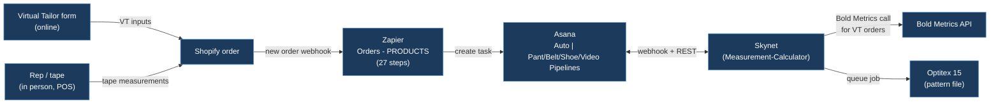
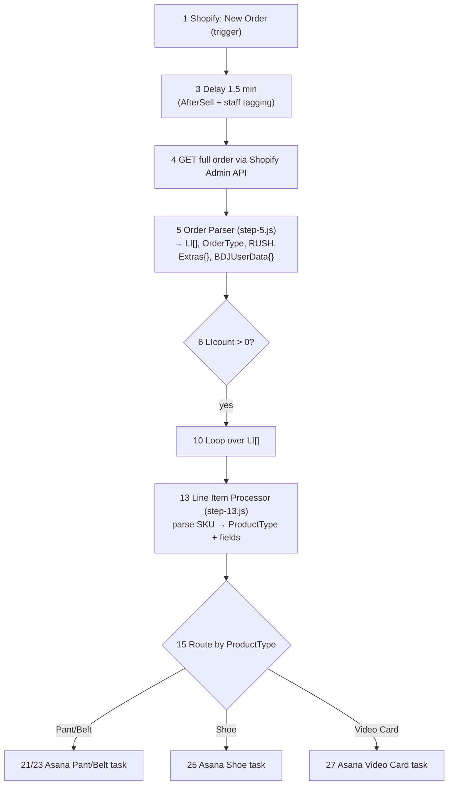
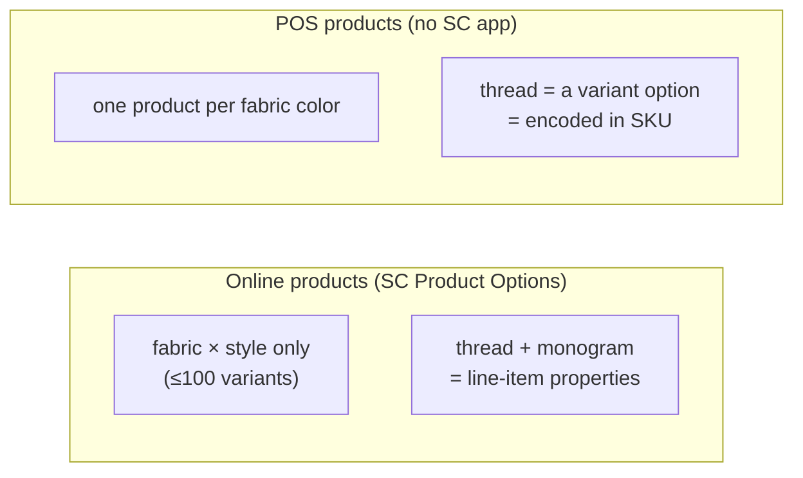

# 07 — Glossary & Naming Disambiguation

> **Audience:** an agency (or any new engineer) picking up the Blue Delta Jeans (BDJ) tech stack cold.
> **Purpose:** define every term, system, and field name you will hit, and — critically — pull apart
> the pairs that *sound* the same but are not (Genius vs Jeanius, Skynet vs Bold Metrics,
> Bold Metrics vs Bold/SC Product Options vs Bold Commerce, `note_attributes` vs line-item
> properties, `Extras{}` vs `BDJUserData{}`).
>
> **How to read this:** entries are grouped (Systems & Apps → Order Pipeline → Data Structures →
> Products & Channels → Measurement Fields → Operational Terms → Versions & Themes), then there's an
> **alphabetical index** at the bottom. Each entry is 1–3 sentences and, where relevant, calls out the
> **common confusion** explicitly. "What's live vs pending" is flagged inline.
>
> **Conventions used below**
> - `live` = running in production today · `pending` = built/decided but not deployed · `future` = planned, not built.
> - GIDs and field names are quoted verbatim from the ground-truth docs — they are matched **by exact
>   display name** in Skynet, so the trailing period in `Waist Avg.` is load-bearing.
> - **No secrets here.** Where a credential exists, only the env-var name and its location are named.

---

## 0. The one-paragraph mental model

A customer is measured one of two ways — online via the **Virtual Tailor** form (which feeds the
**Bold Metrics** AI) or in person by a rep (tape). The order lands in **Shopify**. A 27-step
**Zapier** pipeline re-fetches the order, parses it, and creates a work-order **task in Asana** (the
production system of record). **Skynet** (the Measurement-Calculator app) watches Asana, converts
body measurements into finished-garment specs, and posts them back; it also now fires Bold Metrics
itself for online orders. Production runs off the Asana task; **Optitex** turns specs into a pattern
file. Everything Shopify-side is built on the **Retina / "Web Rescue Fall 2024"** theme with
**GemPages** landing pages. The whole stack is mid-migration toward an in-house database and a
rebuilt order-entry portal (**Jeanius / Genius 2.0**).

---

## 1. Systems, apps & vendors

### Skynet  ·  *(= Measurement-Calculator)*
The internal web app that turns **body** measurements into **finished-garment** measurements, posts
them back to Asana, and (as of June 2026) fires the Bold Metrics call for Virtual Tailor orders.
Repo: `BlueDeltaJeans/Measurement-Calculator`; hosted on Replit at `bdjskynet.replit.app`. Stack: React 18 + Vite
front-end, Express backend, Drizzle ORM over Neon Postgres.
**Confusion:** "Skynet" and "Measurement-Calculator" are the **same thing** — Skynet is the nickname,
Measurement-Calculator is the repo/product name. It is *not* the Virtual Tailor form and *not* Bold Metrics
(it now *calls* Bold Metrics, but is a separate system). `live`

### Bold Metrics  ·  *(the measurement API — moved into Skynet)*
A San Francisco AI body-data vendor (Mark Cuban–backed) that predicts 50+ body measurements from a
short questionnaire (9 questions men / 11 women). It is the engine behind the **Virtual Tailor**.
Endpoint `GET https://api.boldmetrics.io/virtualtailor/get`; auth `client_id=bluedelta` + a single
company-wide `user_key` (env vars `BOLDMETRICS_CLIENT_ID`, `BOLDMETRICS_USER_KEY`; optional `BOLDMETRICS_BASE_URL`).
**Where it fired:** historically on the **Shopify cart** (every cart load — expensive). The
**Bold Metrics → Skynet migration is COMPLETE** (owner-confirmed): the storefront **no longer calls Bold
Metrics on the live site** — neither the main Virtual Tailor → cart path (removed and merged via PR #83,
merged 2026-06-19) nor the GemPages **"quick-tailor"** page (the live page is app-managed in GemPages and
no longer fires; the hardcoded key was removed from the live site). The cart now writes **VT inputs
only**, and **Skynet computes the 6 measurements server-side post-order** (live, June 2026).
**Repo nuance (honest):** a few **committed GemPages quick-tailor snippet exports** in the theme repo
still embed a **legacy hard-coded Bold Metrics key**. GemPages sections are app-managed, so these
committed exports **lag** the live page — LIVE = removed; the committed copies are **stale**. Do not
read this as the live site still firing, and do not claim the repo is fully key-free.
**Pending owner tasks (Caleb handles personally):** rotate the Bold Metrics `user_key` on the vendor
side (**not yet rotated**), deactivate the now-unused quick-tailor page, and purge the stale committed
key copies.
`live (Skynet server-side; storefront no longer fires) / committed quick-tailor exports stale + key rotation pending`
**Confusion — the three "Bold" things below are unrelated to this Bold Metrics:**

| "Bold" name | What it actually is | Vendor | Surface |
|---|---|---|---|
| **Bold Metrics** | AI **measurement** API (this entry) | Bold Metrics, Inc. | Virtual Tailor → Skynet |
| **Bold / SC Product Options** | Shopify **product-options** app (thread color, monogram as line-item properties) | Shop Circle (formerly "Bold Product Options") | online product pages |
| **Bold Commerce loyalty** | the **loyalty/rewards** widget (`bold-loyalties-widget.liquid`) | Bold Commerce | storefront widget |

These share only the word "Bold." `snippets/bold-common.liquid`, `bold-loyalties-widget.liquid`, and
`assets/bold-options.css` belong to the Shopify apps — **not** to Bold Metrics. Do not touch them when
working on measurements.

### SC Product Options  ·  *(formerly "Bold Product Options")*
The Shopify app that moves high-cardinality customization (thread color, monogram add-on, waist
height, front pockets) **out of the variant matrix and into line-item properties**, so an online
product stays under Shopify's hard **100-variant** limit. It writes both customer-facing properties
(`Thread Color`, `Lettering`, `Color`) and internal `_bold*` metadata onto each line item.
**Confusion:** "SC Product Options" = "Bold Product Options" = "Bold options" — same app, renamed when
Shop Circle acquired it. It does **not** work in the Shopify **POS** app, which is the root cause of the
entire Online-vs-POS product split (see §4). `live`

### Virtual Tailor (VT)
Blue Delta's online self-measurement experience: a multi-step, gender-branched form that collects
inputs (gender, age, height, weight, shoe size, plus men: waist/inseam, women: bra size, plus jean fit),
which Bold Metrics turns into body measurements. "Virtual Tailor" is also written as the order note
attribute `Virtual Tailor = "Yes"`.
**Confusion — "Virtual Tailor" appears in three guises:**

| Variant | What it is | Where | Status |
|---|---|---|---|
| **In-theme VT** | The production form inside the Shopify theme | `snippets/virtual-tailor-3.liquid` + `assets/VirtualTailor.js` | `live` |
| **Standalone VT** | A separate Next.js page (`bdj-measurements` repo) for customers who *skipped* the in-checkout form; writes to Supabase for the pattern team, **no** Bold Metrics call, **no** Klaviyo | Vercel-hosted, `bdj-measurements/` | `live (stop-gap)` |
| **Quick Tailor** | A public storefront page staff used to manually fire Bold Metrics; the **live page no longer fires Bold Metrics** (migration complete) and is slated to be deactivated/rebuilt as a tab inside Skynet. Note: the 3 committed snippet exports still contain the key string and need purging. | storefront → Skynet `/bold-metrics` | `live page no longer fires; page deactivation + committed-export purge pending` |

The Bold Metrics **vendor** powers the VT; "Virtual Tailor" is BDJ's brand name for the feature.

### Asana
The production system of record. Each qualifying line item becomes one **task** in a per-product
pipeline project (see §5). Skynet reads/writes Asana custom fields **by exact display name** and posts
results as a `FINISHED MEASUREMENTS` comment. Auth: Personal Access Token (`ASANA_ACCESS_TOKEN`, Bearer). `live`

### Zapier
The integration platform running the 27-step **"Orders - PRODUCTS"** zap (Zap ID `281794942`) that
moves Shopify orders into Asana tasks. See §2 for the pipeline and §6 for versions. `live`

### Optitex
CAD pattern-making software (Optitex 15) driven on a Windows machine by a local Python agent
(`optitex_agent.py`, PyAutoGUI) that polls Skynet's job queue and saves a `.dxf` pattern file.
Auth: `OPTITEX_AGENT_TOKEN`.
**Confusion / honesty:** the shipped agent is **scaffolding that reports false success** — the actual
Optitex UI-automation steps are commented-out TODOs, so it currently marks jobs "completed" without
producing a file. Treat Optitex integration as `future`, not production. `scaffold only`

### AfterSell
A Shopify post-purchase upsell app. It writes note attributes/metadata to the order *after* creation —
which is why Zapier **Step 3 waits 1.5 minutes** before re-fetching the order, and why Step 5 blanks the
`__aftersell_tamper_proof` note attribute (a noisy hash). `live`

### Klaviyo
Email/SMS marketing platform. The Virtual Tailor form POSTs a copy of inputs to Klaviyo (list `VDqK3F`,
company `SkKEvJ`) independently of Bold Metrics. The standalone VT (`bdj-measurements`) does **not**
write to Klaviyo. `live`

### Genius  ·  *(current event/POS order-entry — vendor system)*
The **existing, third-party Solid Commerce** order-entry / product-customizer system reps use to take
orders at events (and the system that pushes event orders into Shopify). It costs a monthly vendor fee
and is built around measurement-based products; its catalog has drifted ~13,000 SKUs out of sync with
Shopify, a key reason for the rebuild.
**Confusion — Genius ≠ Jeanius:** Genius is the **current vendor** system; Jeanius is the **in-house
rebuild** of it. They are pronounced almost identically; in meetings "Genius 2.0" and "Jeanius" both
refer to the rebuild, while plain "Genius" usually means the legacy vendor tool. `live (legacy)`

### Jeanius  ·  *(= Genius 2.0, the in-house rebuild)*
The planned in-house replacement for Genius: a unified ordering **portal** serving both event
order-taking and in-house POS (replacing paper forms), backed by the future custom database, with
role-specific features (in-house: customer lookup / measurements / order history; events: QR
pre-registration). Sometimes called "Genius 2.0."
**Confusion:** "Jeanius" is the rebuild **project/codename**; "Genius 2.0" is the same thing described
as a version. The Bold Metrics→Skynet migration is explicitly the **first step before** the Jeanius
rebuild. `future`

### BDID  ·  *("Blue Delta ID" — custom client identifier)*
A unique, persistent **customer ID** to be implemented in the new Genius/Jeanius build so a customer's
record (and measurements) follows them across every event, retail visit, and B2B order — independent of
Shopify's customer record.
**Confusion / honesty:** the name was still being bikeshedded in planning ("BG8, BDJID or BDID? — BDID").
It is a **future** concept tied to Jeanius; it does **not** exist in any current repo, Shopify field, or
Asana field today. `future`

---

## 2. The order pipeline (Zapier "Orders - PRODUCTS")

> Full detail: `zapier-documentation/Architecture Overview.md` and the V4 pipeline doc. Zap ID `281794942`.

A 27-step **ETL**: Extract (1–6) → Transform (7–14, looped per line item) → Load (15–27, routed to Asana
by product type).

### Step 5 — Order Parser (`step-5.js`)
The first JS code step. Parses the raw order into the structured outputs every downstream step needs:
`LI[]` (filtered line items as strings), `OrderType`, `RUSH`, `Extras{}`, `BDJUserData{}`, `Note`. `live`

### Step 13 — Line Item Processor (`step-13.js`)
Runs once per line item. Splits the SKU, flattens line-item properties into a `Properties{}` object,
routes by SKU prefix into product-specific parsers, and computes the due date. This is where all the
Online-vs-POS SKU logic lives. `live`

### OrderType  ·  *(Online / Direct / POS)*
Set in Step 5 from `Order.cart_token`: **present → `"Online"`** (website checkout); **absent →
`"Direct"`** (POS app at events, draft orders, or API-created). The pipeline literally only emits two
string values: `Online` and `Direct`.
**Confusion:** people say "POS order" colloquially, but the field value for a POS order is **`Direct`**,
not `POS`. "POS" describes the *channel/product set*; "Direct" is the *parsed OrderType value*.
`cart_token` is the detection key — it is censored in Zapier logs but still truthy. `live`

### RUSH
A tag-driven priority. Step 5 uppercases the order tags and emits a suffix for the Asana task name:
`" | RUSH ROYAL"` (highest priority) or `" | RUSH COBALT"` (standard rush), else empty. Staff add the
tag in Shopify during the Step 3 delay window.
**Confusion:** RUSH is **two named tiers** (ROYAL > COBALT), not a single flag. `live`

### Asana pipeline projects  ·  *("the Auto | … Pipelines")*
The four destination projects, one per product type. Each maps a different field count:

| Project | GID | Created by step | Field count |
|---|---|---|---|
| **Auto \| Pant Pipeline** | `1206657933205972` | Step 21 | up to 49 |
| **Auto \| Belt Pipeline** | (see V4 doc) | Step 23 | 17 |
| **Auto \| Shoe Pipeline** | (see V4 doc) | Step 25 | 15 |
| **Auto \| Video Card Pipeline** | (see V4 doc) | Step 27 | 7 |

Only the **Pant Pipeline** carries the full Virtual Tailor / Bold Metrics measurement set. `live`

---

## 3. Data structures & field-name disambiguation

### `note_attributes` vs line-item properties
The two completely different places custom data rides on a Shopify order — the single most common
mix-up in this stack.

| | `note_attributes` | line-item `properties` |
|---|---|---|
| **Scope** | **Order-level** (one set per order) | **Per line item** (one set per item) |
| **Holds** | `Virtual Tailor`, `BDJ User Data`, `Jean Fit`, `Shoe Type`, `Pattern on File`, `White Glove`, AfterSell hash | `Thread Color`, `Lettering`, `Color`, `Waist Height`, `Front Pockets`, `_bold*` metadata, shoe customization |
| **Written by** | the cart's hidden `attributes[…]` `<textarea>`s | **SC Product Options** (online) / manual POS entry |
| **Parsed in** | Step 5 → `Extras{}` + `BDJUserData{}` | Step 13 → `Properties{}` |

**Confusion:** "the order note" (`cart.note`, free text) is **a third thing**, distinct from
`note_attributes`. And neither trigger payload includes the full nested data — that's why Step 4
re-fetches the whole order. `live`

### `Extras{}` vs `BDJUserData{}`
Both are produced by Step 5 from order-level `note_attributes`, but they hold opposite kinds of data:

| | `Extras{}` | `BDJUserData{}` |
|---|---|---|
| **Source note attribute** | the flattened `note_attributes` array (minus the AfterSell hash) | the single `"BDJ User Data"` newline-delimited block |
| **Contains** | the **outputs** — Bold Metrics measurements (`Hip Circum`, `Jean Inseam`, …) + flags (`Pattern On File`, `White Glove`, `Virtual Tailor`) | the **inputs** — `Gender, Age, Height, Weight, Shoe Size, Bra Size, Inseam, Jean Fit, Common Shoe, Style` |
| **Maps to Asana** | measurement fields + flags | Age/Weight/Gender/Fit/Break/Waist Ride + the new `VT *` input fields |

**Confusion (critical):** `Extras{}` = computed **measurements**; `BDJUserData{}` = raw **form inputs**.
After the Bold Metrics migration, the 6 measurement keys in `Extras{}` are **EMPTY for new online
orders** (Skynet computes them post-order); `BDJUserData{}` is "the whole point" and must keep flowing.
`live (with migration caveat)`

### "BDJ User Data"
The exact name of the order **note attribute** that carries the Virtual Tailor form inputs as a
newline-delimited `key: value` block (e.g. `Gender: Female\nAge: 51\n…`). Step 5 parses it into
`BDJUserData{}`.
**Confusion:** the note attribute is `"BDJ User Data"` (with spaces); the parsed JS object is
`BDJUserData` (no spaces). Same data, two spellings depending on layer. Historically had `\r` residue
from Windows line endings (BUG-06, fixed in V4 code). `live`

---

## 4. Products & channels

### Online vs POS products
BDJ maintains **two parallel product sets** in Shopify because SC Product Options (which keeps online
products under the 100-variant limit) **doesn't work in the Shopify POS app**. POS therefore needs every
option encoded as a variant, so products are split (e.g. one product per fabric color) to free variant
slots for thread color.
**Confusion:** these are two different Shopify product catalogs for the *same physical product*, detected
downstream by **SKU segment count** (3 segments = online, 4–5 = POS), *not* by the OrderType field.
~5,555 SKUs total. `live`

### Optitex base pattern
Within Optitex, the agent selects a base pattern (e.g. `MensBase_41`) and enters measurements. (Listed
here so "base pattern" isn't confused with a product or SKU.) `scaffold`

---

## 5. Measurement & garment fields (Asana)

> All `text` except `Gender` (`enum`). Matched by **display name**, never GID, on reads. Full GID list in
> `Measurement-Calculator/bold-metrics-skynet-migration-context.md` §10.

### Fit  ·  vs  ·  Break
Two **separate** Asana fields from the customer's preferences, often confused because they're adjacent
denim-fit jargon:

| Field | Asana GID | Meaning | Values |
|---|---|---|---|
| **Fit** | `1206671503498618` | the silhouette / ease level | Regular / Trim / Easy (Skynet normalizes; Skinny forces Trim) |
| **Break** | `1206671503498622` | how the hem sits on the shoe (the "break") | customer preference text |

**Confusion:** "Fit" is the leg ease; "Break" is the hem length at the ankle. Both come from the VT form
(`BDJUserData`) with a manual fallback. The 2025 style migration maps "Modern/Tapered" marketing names
onto the existing Trim/Regular/Easy fit math. `live`

### Bold Metrics measurement outputs (the 6 write-back fields)
The six body/garment measurements Skynet computes via Bold Metrics and writes to the Pant Pipeline:
`Waist Avg.` (`1206671503499692`, **trailing period required**), `Hip Circum` (`1206671503499682`),
`Thigh Circum` (`1206671503499688`), `Knee Circum` (`1206671503499686`), `U Crotch` (`1206671503499690`),
`Jean Inseam` (`1206671503499684`).
**Confusion (input vs output):** the **`VT *`** fields (`VT Height`, `VT Shoe Size`, `VT Waist`,
`VT Inseam`, `VT Bra Size`) are the Bold Metrics **inputs**; `Waist Avg.`/`Jean Inseam`/etc. are the
**outputs**. `VT Waist` ≠ `Waist Avg.`; `VT Inseam` ≠ `Jean Inseam`. Also note `Waist Avg.` is the
**3-way mean** of Bold Metrics' three waist circumferences (natural + preferred + stomach), *not*
`waist_circum_preferred`. `live (Skynet write-back, staging→prod)`

### Manual (in-person) measurement fields
The tape-measured set used for POS/in-person orders: `Waist Around`, `Seat Around` (`1206889231694800`),
`Thigh Upper Around`, `Knee Around`, `Calf Around`, `Full Rise`, `Outseam`, `Front Rise`, `Leg Opening`,
`Measured By`. Presence of `Waist Around`/`Seat Around` makes Skynet read the task as **MANUAL** format
(vs **BOLD_METRICS** when `Waist Avg.`/`Hip Circum` are present). `live`

### Pattern Readiness  ·  *("Pattern Guidance")*
A Skynet spec-engine verdict (`shared/spec-engine/patternReadiness.ts`) emitted with every calculation:
`status` ∈ `ready_for_pattern` | `needs_review` | `blocked`, plus `summary`, `reasons[]`,
`reviewPoints[]`, `adjustmentsApplied[]`. Rendered as a "Pattern Guidance" card and persisted in
`optitex_jobs.pattern_readiness`.
**Confusion:** "Pattern Readiness" is the verdict object; "Pattern Guidance" is the UI card name for the
same thing. Both are unrelated to **Pattern on File** below. `live (staging)`

### Pattern on File (POF)  ·  vs  ·  White Glove
Two order flags (in `Extras{}`, set from PDP options on the storefront):

| Flag | Asana GID | Meaning |
|---|---|---|
| **Pattern on File (POF)** | `1206660699367056` | a finished pattern already exists for this customer — skip re-measuring / re-drafting |
| **White Glove** | `1208695148089782` | premium handling flag for the order |

**Confusion:** "Pattern on File" (a customer-state flag) is **not** "Pattern Readiness" (an
engine verdict) and **not** the Optitex pattern file. In the Pant Pipeline mapping, the POF token is
listed twice (a config duplication, not an intentional fallback). `live`

---

## 6. Versions, themes & infra

### v51 (Zapier zap version)
**v51** is the zap version **currently live** in Zapier (Zap ID `281794942`). The V4-documentation set
of code fixes (`step-5-v4.js`, `step-13-v4.js` — 11 bug fixes incl. qty>1 expansion, POS belt monogram
detection, shoe SKU re-parse) plus the new **VT\*** input-field mapping are **deployed and live** —
each order now populates the 5 VT\* Asana input fields, and Skynet writes the 6 measurement fields
post-creation (unchanged). The older "v42 live / V4 fixes pending as v43" framing is **stale**.
**Confusion:** "V4" is the **documentation/code-audit** generation describing what changed; the live
zap is now at **version 51**. `v51 live (V4 fixes + VT* mapping deployed)`

### Retina theme  ·  *("Web Rescue | Fall 2024")*
The production Shopify theme (repo `blue-delta-jeans`). Its in-repo name is "Web Rescue | Fall 2024";
it is a Retina-family theme. Standard Shopify structure (assets/, sections/, snippets/, templates/).
**Confusion:** "Retina theme," "Web Rescue Fall 2024," and "the live theme" all mean the same current
storefront. The headless **Hydrogen sandbox** (repo `blue-delta-sandbox`) is a *separate, throwaway*
greenfield experiment — **not** this theme and not connected to production. `live`

### GemPages
A drag-and-drop page builder layered on the Shopify theme; many landing-page templates and sections are
GemPages-built (`gp-section-*`, `product.gem-*-template.liquid`). The Virtual Tailor modal renders on
GemPages layouts too.
**Confusion:** GemPages PDPs use a *different* flag path (`pdp2024_sizing.js` →
`patternOnFile`/`whiteGlove`/`tailor2Complete`) than the standard cart; don't assume one code path covers
both. `live`

### Skynet hosting / branches
`main` = production (Replit autoscale; never push directly); develop on `staging`/feature branches.
Webhook URL is derived from `REPLIT_DOMAINS[0]`. Type-checking is **not** part of the build, so type
errors don't block deploys. `live`

### `bdj-measurements` (standalone VT) infra
Next.js 16 + Supabase (Postgres + RLS) + Vercel. Env vars (names only): `NEXT_PUBLIC_SUPABASE_URL`,
`NEXT_PUBLIC_SUPABASE_ANON_KEY`, `SUPABASE_URL`, `SUPABASE_SERVICE_ROLE_KEY` (server-only),
`UPSTASH_REDIS_REST_URL`/`_TOKEN` (optional), `RESEND_API_KEY` (Phase 2). `live (stop-gap)`

---

## 7. Quick disambiguation cheat-sheet

| If you hear… | It means… | Don't confuse with… |
|---|---|---|
| **Genius** | current event/POS order-entry **vendor** tool | **Jeanius** (the rebuild) |
| **Jeanius / Genius 2.0** | the in-house rebuild (future) | **Genius** (legacy vendor) |
| **Skynet** | the Measurement-Calculator app | Virtual Tailor / Bold Metrics |
| **Bold Metrics** | the **measurement** API (→ Skynet) | **SC/Bold Product Options** (Shopify options app) and **Bold Commerce loyalty** |
| **SC Product Options** | thread/monogram → line-item **properties** | Bold Metrics; POS products |
| **Virtual Tailor** | the online measurement **form/feature** | the Bold Metrics **vendor** behind it; the standalone VT page; Quick Tailor |
| **`note_attributes`** | **order-level** custom data | line-item **properties**; the free-text `cart.note` |
| **`Extras{}`** | computed **measurements** + flags | **`BDJUserData{}`** (raw inputs) |
| **OrderType = Direct** | a POS / non-web order | the word "POS" as a field value |
| **Fit** | leg ease (Regular/Trim/Easy) | **Break** (hem at the shoe) |
| **Pattern on File** | customer-has-a-pattern flag | **Pattern Readiness** verdict; the Optitex pattern **file** |
| **VT Waist / VT Inseam** | Bold Metrics **inputs** | **Waist Avg. / Jean Inseam** (outputs) |
| **v51** | the **live** zap (V4 fixes + VT* mapping deployed) | the stale "v42 live / v43 pending" framing |
| **Retina / Web Rescue Fall 2024** | the live theme | the Hydrogen **sandbox** |

---

## 8. Alphabetical index

- **AfterSell** → §1 (post-purchase app; cause of the 1.5-min Zapier delay)
- **Asana** → §1 (production system of record)
- **Asana pipeline projects (Auto | …)** → §2
- **BDID (Blue Delta ID)** → §1 (future client ID, Jeanius)
- **BDJ User Data** → §3 (order note attribute → `BDJUserData{}`)
- **`BDJUserData{}`** → §3 (parsed VT inputs)
- **Bold / SC Product Options** → §1 (Shopify options app)
- **Bold Commerce loyalty** → §1 (loyalty widget)
- **Bold Metrics** → §1 (measurement API → Skynet)
- **Break** → §5 (hem-at-shoe field)
- **`cart.note`** → §3 (free-text order note, ≠ note_attributes)
- **`Extras{}`** → §3 (computed measurements + flags)
- **Fit** → §5 (Regular/Trim/Easy)
- **GemPages** → §6 (page builder)
- **Genius** → §1 (legacy vendor order-entry)
- **Jeanius / Genius 2.0** → §1 (in-house rebuild)
- **Klaviyo** → §1 (marketing platform)
- **line-item properties** → §3
- **Manual measurement fields** → §5
- **`note_attributes`** → §3
- **Online vs POS products** → §4
- **Optitex** → §1 (pattern CAD; scaffold)
- **OrderType (Online / Direct / POS)** → §2
- **Pattern on File (POF)** → §5
- **Pattern Readiness / Pattern Guidance** → §5
- **Quick Tailor** → §1 (live page no longer fires Bold Metrics; deactivation + committed-export purge pending)
- **Retina theme / Web Rescue Fall 2024** → §6
- **RUSH (ROYAL / COBALT)** → §2
- **SC Product Options** → §1
- **Skynet (= Measurement-Calculator)** → §1
- **Step 5 — Order Parser** → §2
- **Step 13 — Line Item Processor** → §2
- **v51 (Zapier zap version)** → §6
- **Virtual Tailor (in-theme / standalone / Quick Tailor)** → §1
- **`VT *` input fields** → §5
- **Waist Avg.** → §5 (3-way mean; trailing period)
- **White Glove** → §5
- **Zapier ("Orders - PRODUCTS", Zap 281794942)** → §1, §2

---

## 9. Source map (where each fact came from)

| Topic | Authoritative source |
|---|---|
| Zapier pipeline, OrderType, RUSH, Extras/BDJUserData, AfterSell | `zapier-documentation/Architecture Overview.md`, `V4 - … Order Pipeline Documentation.md`, `Step 5 — Order Parser.md` |
| Online vs POS, SC Product Options, SKU segments | `zapier-documentation/Online vs POS Product Architecture.md` |
| Bold Metrics migration, VT input/output fields, GIDs, Pattern Readiness | `Measurement-Calculator/bold-metrics-skynet-migration-context.md`, `Measurement-Calculator/replit.md`, `Measurement-Calculator/docs/01-overview.md` |
| In-theme VT, cart note attributes, Bold (3 vendors) | `blue-delta-jeans/VIRTUAL_TAILOR_BOLDMETRICS.md`, `blue-delta-jeans/README.md` |
| Standalone VT | `bdj-measurements/README.md` |
| Optitex | `Measurement-Calculator/docs/08-optitex-agent.md`, `09-known-issues-and-tech-debt.md` |
| Bold Metrics vendor facts | `BlueDelta-Brain/wiki/Suppliers & Vendors/Bold Metrics.md` |
| Pattern on File / White Glove GIDs | `zapier-documentation/Asana Field Mapping (Steps 21–27).md` |
| Hydrogen sandbox, Retina/GemPages note | `blue-delta-sandbox/CLAUDE.md` |
| Genius vs Jeanius, BDID, sequencing | Notion: *Decision Record — Jeanius / Database Sequencing & Tech Stack*; *Jeanius Rebuild*; *Pattern Team Tech Request Meeting* (5/18/26); *Jeanius Development Planning Meeting* (5/19/26) |

*Glossary compiled 2026-06-24. Field GIDs and zap step numbers verified against the V4 pipeline docs
and the Skynet migration context as of April–June 2026. The Bold Metrics → Skynet migration is COMPLETE
(storefront no longer fires; Skynet server-side live) and the Zapier zap is live at v51 with the VT*
mapping deployed; remaining owner tasks are the Bold Metrics key rotation, quick-tailor page deactivation,
and purging the stale committed key copies. The Jeanius rebuild remains future — re-verify before relying
on any "future" item.*
