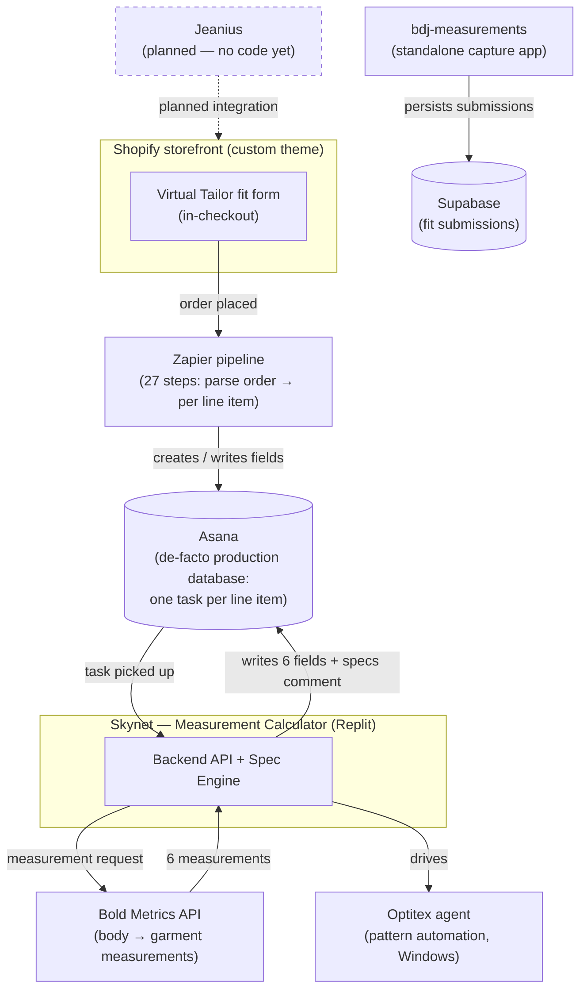

# Blue Delta Jeans — Tech Stack Documentation Bundle

> 🔒 **Confidential — shared for proposal evaluation.** This bundle is a **point-in-time
> snapshot (June 2026)** of Blue Delta Jeans' (BDJ) production technology stack, provided to
> prospective agencies so they can scope work and write proposals. It does **not** require
> Notion access, repository access, or any external system to read — everything is inlined here.
> **Full repository access is provided once an engagement is signed.** Customer PII has been
> scrubbed; only synthetic examples (e.g. "Erin Test") appear. Private repositories are named in
> plain text and shared once engaged.

---

## What Blue Delta's tech stack is

Blue Delta sells deeply customizable, made-to-measure jeans. There is **no custom application
backend and no real order database** — the stack is a chain of off-the-shelf platforms wired
together with glue code. A customer configures a garment and submits fit inputs through a
**"Virtual Tailor"** form on the **Shopify** storefront (a heavily customized theme). When the
order is placed, a **27-step Zapier** automation parses each line item and creates one **Asana**
task per production-qualifying item — **Asana is the de-facto production database.** An internal
measurement service nicknamed **"Skynet"** (the Measurement Calculator, deployed on Replit) calls
**Bold Metrics** to turn body measurements into the six finished-garment measurements, runs a
**spec engine** against historical pattern data, writes results back to the Asana task, and
(separately) drives an **Optitex** pattern-automation agent. A standalone **bdj-measurements**
app captures fit inputs from customers who skipped the storefront form, persisting to
**Supabase**. A next-generation customer product, **Jeanius**, is in planning (no code yet) and is
intended to fold these flows back into Shopify. The two biggest themes an agency should expect:
heavy reliance on glue code (Zapier + Asana as a database) that the company wants to retire, and a
recently completed migration that moved Bold Metrics off the storefront and into Skynet.

---

## System map

---

## How this bundle is organized

The bundle has three layers:

1. **Root orientation docs (`00`–`07`)** — written for this handoff. Start here. They explain each
   system at a "why and how it fits together" altitude and link down into the authoritative source
   docs for detail. The end-to-end map lives in **`01-system-architecture.md`** — if you read only
   one file, read that one.
2. **`reference/`** — the **authoritative, inlined source docs**, copied verbatim from the
   originating repositories and engineering notes. These are the ground truth the orientation docs
   are built on. Subfolders: `skynet/` (the Measurement Calculator), `shopify-theme/` (the custom
   storefront), `virtual-tailor-standalone/` (the bdj-measurements capture app), `zapier/` (the
   order pipeline), and `domain/` (business-domain context).
3. **`appendix/`** — Notion-sourced context that backs links which originally pointed at internal
   Notion pages.

> **Note on completeness:** a few root and reference docs are still being finalized for this
> snapshot — `00-orientation.md`, `06-integrations.md`, `reference/domain/domain-context.md`, and
> `appendix/notion-source-context.md` are planned but not yet included in this build. Every link in
> the index below resolves to a file present in this bundle.

---

## Document index

### Root — orientation

| Doc | Purpose |
| --- | --- |
| [`01-system-architecture.md`](01-system-architecture.md) | End-to-end map: Virtual Tailor → Zapier → Asana → Skynet → Bold Metrics. The single most important doc. |
| [`02-asana-production-database.md`](02-asana-production-database.md) | How Asana is used as the production database — the task/field "schema," who writes what, and why it's tech debt. |
| [`03-virtual-tailor.md`](03-virtual-tailor.md) | What the Virtual Tailor is, its two implementations, and the exact Bold Metrics payload contract both honor. |
| [`04-website-vs-pos-products.md`](04-website-vs-pos-products.md) | The dual-product-set architecture: why two SKU formats exist (web vs POS) and how Shopify's 100-variant limit forces it. |
| [`05-jeanius.md`](05-jeanius.md) | The planned next-gen "Jeanius" product (no code yet) — vision and a draft straw-man schema for discussion. |
| [`07-glossary.md`](07-glossary.md) | Every term, system, and field name defined — plus the lookalike pairs pulled apart (Genius vs Jeanius, Skynet vs Bold Metrics, etc.). |

### reference/skynet — Measurement Calculator ("Skynet")

| Doc | Purpose |
| --- | --- |
| [`reference/skynet/README.md`](reference/skynet/README.md) | What Skynet is, where it's deployed (Replit), and how the docs are organized. |
| [`reference/skynet/01-overview.md`](reference/skynet/01-overview.md) | Overview and end-to-end measurement flows. |
| [`reference/skynet/02-architecture-and-stack.md`](reference/skynet/02-architecture-and-stack.md) | Architecture, tech stack, and deployment. |
| [`reference/skynet/03-backend-api.md`](reference/skynet/03-backend-api.md) | Backend server and API reference. |
| [`reference/skynet/04-asana-integration.md`](reference/skynet/04-asana-integration.md) | How Skynet reads from and writes back to Asana tasks. |
| [`reference/skynet/05-spec-engine.md`](reference/skynet/05-spec-engine.md) | The spec engine (`shared/spec-engine/`) — garment-spec computation and range validation. |
| [`reference/skynet/06-database-and-data.md`](reference/skynet/06-database-and-data.md) | Database and reference data. |
| [`reference/skynet/07-frontend.md`](reference/skynet/07-frontend.md) | The React frontend (`client/`). |
| [`reference/skynet/08-optitex-agent.md`](reference/skynet/08-optitex-agent.md) | The Optitex Python pattern-automation agent (Windows). |
| [`reference/skynet/09-known-issues-and-tech-debt.md`](reference/skynet/09-known-issues-and-tech-debt.md) | Known issues, security gaps, and tech debt. |

### reference/shopify-theme — custom storefront

| Doc | Purpose |
| --- | --- |
| [`reference/shopify-theme/README-theme.md`](reference/shopify-theme/README-theme.md) | Theme overview, project structure, and where to start. |
| [`reference/shopify-theme/THEME_DOCUMENTATION.md`](reference/shopify-theme/THEME_DOCUMENTATION.md) | Full engineering reference: the three code generations, CSS build pipeline, git↔Shopify sync, active-vs-dead file map, and before-you-edit checklist. |
| [`reference/shopify-theme/SHADOW_DOM_COMPONENTS.md`](reference/shopify-theme/SHADOW_DOM_COMPONENTS.md) | The custom Vite/Tailwind/Shadow DOM component layer in the theme. |
| [`reference/shopify-theme/VIRTUAL_TAILOR_BOLDMETRICS.md`](reference/shopify-theme/VIRTUAL_TAILOR_BOLDMETRICS.md) | The storefront Virtual Tailor + Bold Metrics integration detail. |

### reference/virtual-tailor-standalone — bdj-measurements app

| Doc | Purpose |
| --- | --- |
| [`reference/virtual-tailor-standalone/README.md`](reference/virtual-tailor-standalone/README.md) | The standalone post-purchase fit-capture app, its stack, and its Supabase persistence. |

### reference/zapier — order pipeline

| Doc | Purpose |
| --- | --- |
| [`reference/zapier/Architecture Overview.md`](reference/zapier/Architecture%20Overview.md) | Complete architecture of the 27-step Shopify → Asana order pipeline. |
| [`reference/zapier/V4 - Shopify → Zapier → Asana Order Pipeline Documentation.md`](reference/zapier/V4%20-%20Shopify%20%E2%86%92%20Zapier%20%E2%86%92%20Asana%20Order%20Pipeline%20Documentation.md) | V4 audit-level documentation of the live order pipeline zap. |
| [`reference/zapier/Step 5 — Order Parser.md`](reference/zapier/Step%205%20%E2%80%94%20Order%20Parser.md) | Step 5: parsing raw Shopify order JSON into structured components. |
| [`reference/zapier/Step 13 — Line Item Processor.md`](reference/zapier/Step%2013%20%E2%80%94%20Line%20Item%20Processor.md) | Step 13: per-line-item, SKU-driven field extraction (the most complex step). |
| [`reference/zapier/Asana Field Mapping (Steps 21–27).md`](reference/zapier/Asana%20Field%20Mapping%20(Steps%2021%E2%80%9327).md) | Steps 21–27: how parsed fields map onto Asana task fields (post-migration). |
| [`reference/zapier/Online vs POS Product Architecture.md`](reference/zapier/Online%20vs%20POS%20Product%20Architecture.md) | Why two product sets exist in Shopify and how it shapes Step 13. |
| [`reference/zapier/SKU Reference Guide.md`](reference/zapier/SKU%20Reference%20Guide.md) | Complete SKU-format reference across all product categories (V4 audit). |
| [`reference/zapier/Bold Metrics Migration — Impact on the Zapier Pipeline.md`](reference/zapier/Bold%20Metrics%20Migration%20%E2%80%94%20Impact%20on%20the%20Zapier%20Pipeline.md) | Bridge doc: what the Bold Metrics → Skynet migration changed in the pipeline (now complete). |
| [`reference/zapier/Bug Tracker & Fix Plan.md`](reference/zapier/Bug%20Tracker%20%26%20Fix%20Plan.md) | Bugs found in the V4 code audit, their fixes, and the deployment plan. |
| [`reference/zapier/step-5 js.md`](reference/zapier/step-5%20js.md) | Source of the Step 5 JavaScript code step. |
| [`reference/zapier/step-13 js.md`](reference/zapier/step-13%20js.md) | Source of the Step 13 JavaScript code step. |
| [`reference/zapier/zap-export json.md`](reference/zapier/zap-export%20json.md) | The exported zap definition (ground-truth for the pipeline). |

---

## Which agency reads what

This bundle serves two kinds of engagement. Both should read the root orientation docs
(`01`–`07`), then specialize:

- **Automation / database / backend agency** (the order pipeline, Asana-as-database replacement,
  Skynet, integrations) → focus on **`01-system-architecture.md`**,
  **`02-asana-production-database.md`**, all of **`reference/zapier/`**, all of
  **`reference/skynet/`**, and **`reference/virtual-tailor-standalone/`** (Supabase capture). The
  Jeanius doc (**`05-jeanius.md`**) frames the intended future state.
- **Web / Shopify / front-end agency** (storefront theme, Virtual Tailor UI, product/SKU model) →
  focus on **`03-virtual-tailor.md`**, **`04-website-vs-pos-products.md`**, all of
  **`reference/shopify-theme/`**, and the SKU + product-architecture docs in
  **`reference/zapier/`** (`SKU Reference Guide.md`, `Online vs POS Product Architecture.md`).

The **`07-glossary.md`** is required reading for everyone — the naming overlaps in this stack
(Genius vs Jeanius, Skynet vs Bold Metrics) trip up newcomers immediately.

---

## Self-contained

This bundle is **fully self-contained**. Every link in it resolves to another file inside this
folder — no Notion login, no repository checkout, and no external URL is required to read any part
of it. Where the original engineering notes pointed at private repositories or internal Notion
pages, those references have been inlined into `reference/` and `appendix/` or rendered as plain
text. Anything that still depends on a live system or an internal team decision is flagged inline
in the relevant doc (look for **[CONFIRM]** and status legends).
