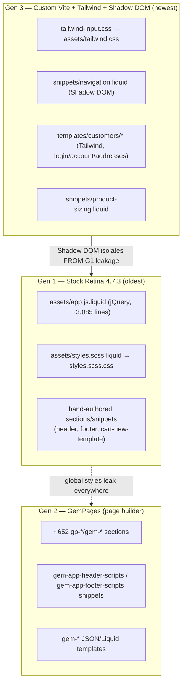
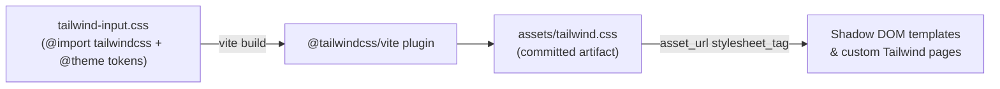
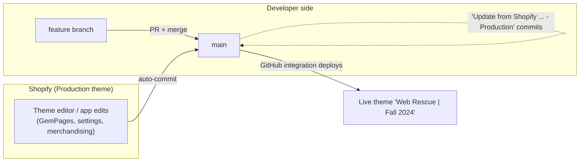
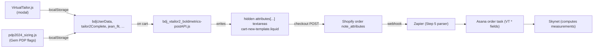

# Blue Delta Jeans — Shopify Theme Reference

> **What this is:** the steady-state engineering reference for working safely in the Blue Delta
> Jeans Shopify theme. Read this **before** you touch a file. It explains what the theme is, how it
> is built and deployed, the three overlapping generations of code living in the same repo, which
> files are alive vs. abandoned, and the order-note contract that downstream automation depends on.
>
> **Companion docs:**
> - [SHADOW_DOM_COMPONENTS.md](SHADOW_DOM_COMPONENTS.md) — how to build new UI with Tailwind + Shadow DOM.
> - [VIRTUAL_TAILOR_BOLDMETRICS.md](VIRTUAL_TAILOR_BOLDMETRICS.md) — the Virtual Tailor → cart → order-note chain and the active-vs-dead file forensics (its **§5** is the canonical dead-file map; this doc summarizes it).
> - [README.md](README-theme.md) — quick-start.
>
> **Audience:** agency / contract developers who do not have the original build context. When in
> doubt, prefer the grep anchors (function names, attribute strings, snippet names) over line
> numbers — line numbers drift, names don't.

---

## 1. Theme identity

| Field | Value |
|---|---|
| Theme name (in Shopify admin) | **Web Rescue \| Fall 2024** |
| Base theme | **Retina** by Out of the Sandbox |
| Base version | **4.7.3** |
| Vendor docs | https://help.outofthesandbox.com/ |
| Repo | `blue-delta-jeans` (private repo — provided once engaged) |
| Production storefront | https://www.bluedeltajeans.com |
| Store handle (CLI) | `blue-delta-jeans` |
| License | ISC |

Source of truth for the **base theme / version** fields: [`config/settings_schema.json`](config/settings_schema.json)
(`theme_info` block — `theme_name: "Retina"`, `theme_author: "Out of the Sandbox"`, `theme_version: "4.7.3"`).
The **admin theme name** "Web Rescue | Fall 2024" is the *live theme label in the Shopify admin* (it is not
in `theme_info`); you can see it echoed in the git-sync commit pattern `Update from Shopify ... - Production`
(§6). See also [`README.md`](README-theme.md).

This is a **heavily modified** Retina install. The stock theme is still underneath everything
(its SCSS, its `app.js`, its section/snippet conventions), but two later waves of code — GemPages
and a custom Vite/Tailwind/Shadow-DOM layer — have been layered on top. Understanding which wave a
given file belongs to is the single most important skill for not breaking this theme (see §3).

---

## 2. Repository & directory structure

Standard Shopify theme layout. The headline number is the section count — this theme is enormous
because GemPages writes one Liquid section per page block.

```
blue-delta-jeans/
├── assets/        133 files   CSS, JS, fonts, images. Mix of stock Retina, custom, and committed build output.
├── config/          2 files   settings_schema.json (theme settings def) + settings_data.json (~115 KB of saved values)
├── layout/          8 files   theme.liquid (main) + alternates (e.g. password, gem layouts)
├── locales/         7 files   en (default), es, fr, de, pt-BR, pt-PT, zh
├── sections/      710 files   ~652 are GemPages-generated (gp-*/gem-*). Only a handful are hand-authored.
├── snippets/      222 files   reusable Liquid partials (incl. integration includes + Virtual Tailor)
├── templates/     170 files   116 .liquid + 53 .json templates; templates/customers/ has the new Tailwind account pages
├── .shopify/                  metafields.json (custom-data definitions snapshot) — git-ignored, see §11
├── tailwind-input.css         Tailwind v4 entry / theme tokens (source)
├── vite.config.js             CSS-only Vite build config (see §4)
├── local-start.sh             per-branch local dev launcher (see §5)
├── package.json               npm scripts (local:start, build:css, watch:css)
├── README.md
├── SHADOW_DOM_COMPONENTS.md
├── VIRTUAL_TAILOR_BOLDMETRICS.md
└── THEME_DOCUMENTATION.md      ← this file
```

> **Why 710 sections?** GemPages (the page builder) compiles each landing/PDP it manages into its
> own `gp-*` / `gem-*` Liquid section file. ~652 of 710 section files are GemPages output. Treat
> them as generated artifacts, not hand-editable source — see §3 and §8.

`.gitignore` excludes `node_modules`, `.env*`, `.DS_Store`, and **`.shopify`** (so the local
Shopify CLI state / `metafields.json` is not committed).

---

## 3. The three generations of code

The same repo contains three distinct, coexisting styles of code. They do not share conventions,
and most "why is this so weird" questions resolve once you identify which generation a file is from.



### Gen 1 — Stock Retina 4.7.3
The foundation. jQuery-driven, global SCSS, Out-of-the-Sandbox section/snippet patterns.

- **JS:** `assets/app.js.liquid` (the vendored jQuery theme bundle, ~3,085 lines — handles cart
  ajax via `ajaxSubmitCart()`, quick shop, slideshows, etc.), plus `assets/bdj-modal.js`,
  `assets/bdj-global.js`.
- **CSS:** `assets/styles.scss.liquid` → compiled `styles.scss.css`, loaded globally in
  `layout/theme.liquid` (except on account/login/addresses pages — see §7). Also
  `bdj-2024-consolodated-styles.css` and `bdj-working-styles.css`.
- **Theme settings:** everything in `config/settings_schema.json` (Colors, Typography, Product
  grid, Cart, etc.) is Retina's. These power the global look only — Gen 2/3 ignore most of them.

### Gen 2 — GemPages
A third-party drag-and-drop page builder app. It owns most marketing pages, many PDPs, the home
page, and collection pages.

- Renders via `` (in `<head>`) and
  `` (conditionally, for v6 templates) in `layout/theme.liquid`.
- The header detects GemPages-default templates through `shop.metafields.gempages` and the
  `gem-…-template` suffix convention.
- **Its sections/snippets/templates are app-managed.** Editing them in the repo is usually a waste
  of time — the app overwrites them on its next publish (see §8).

### Gen 3 — Custom Vite + Tailwind + Shadow DOM (the "new UI" layer)
The modern layer added for net-new components. Tailwind v4 utility classes, compiled by Vite into
a single `assets/tailwind.css`, attached either inside a Shadow DOM (for components dropped into
GemPages/legacy pages, to avoid style bleed) or directly on full custom templates.

- **Build:** `tailwind-input.css` → `assets/tailwind.css` (see §4).
- **Shadow DOM components:** `snippets/navigation.liquid`, `snippets/product-sizing.liquid`.
- **Template-level Tailwind (no Shadow DOM needed):** `templates/customers/login.liquid`,
  `templates/customers/account.liquid`, `templates/customers/addresses.liquid`.
- Full authoring guide: [SHADOW_DOM_COMPONENTS.md](SHADOW_DOM_COMPONENTS.md).

| | Gen 1 Retina | Gen 2 GemPages | Gen 3 Vite/Tailwind |
|---|---|---|---|
| Styling | global SCSS | app inline + Gem CSS | Tailwind utilities |
| JS | jQuery (`app.js.liquid`) | app runtime | vanilla Custom Elements |
| Isolation | none (leaks) | none | Shadow DOM (isolated) |
| Edit in repo? | ✅ yes | ⚠️ usually no (overwritten) | ✅ yes |
| Source files | `.liquid` / `.scss.liquid` | generated | `.liquid` + `tailwind-input.css` |

---

## 4. Build pipeline (CSS-only)

There is **exactly one** build step in this repo, and it builds **CSS only**. Vite is *not* used to
bundle JavaScript. All JS in the theme is plain files in `assets/` loaded directly by Liquid.



### What it does
- **Input:** [`tailwind-input.css`](tailwind-input.css) — `@import "tailwindcss";` plus a `@theme`
  block defining the brand palette (e.g. `--color-navy: #103E53`, `--color-red-700: #af1f31`),
  containers (`--container-container: 1352px`), and fonts (`--font-inter`, `--font-albiona`).
- **Output:** [`assets/tailwind.css`](assets/tailwind.css) — **committed to the repo** and shipped
  to Shopify like any other asset. Templates pull it via
  `{{ 'tailwind.css' | asset_url | stylesheet_tag }}`.
- **Config:** [`vite.config.js`](vite.config.js).

### npm scripts ([`package.json`](package.json))

| Script | Command | Use |
|---|---|---|
| `npm run build:css` | `vite build` | one-shot compile of `tailwind.css` |
| `npm run watch:css` | `vite build --watch` | rebuild on every change to Tailwind source — **run this during local dev** (see §5) |
| `npm run local:start` | `./local-start.sh` | start the Shopify theme dev server (does **not** build CSS) |

### Two protections that keep the build from eating the theme
Because Vite normally "owns" its `outDir`, two settings in `vite.config.js` are load-bearing —
**do not remove them:**

1. **`emptyOutDir: false`** — the build writes into `assets/`, which is full of hand-authored JS,
   images, and fonts. Without this, Vite would wipe the entire `assets/` folder on every build.
2. **`build.watch.exclude: ["assets/**"]`** — in `--watch` mode, Vite writes `tailwind.css` *into*
   `assets/`; without excluding `assets/`, that write would re-trigger the watcher and create an
   infinite rebuild loop.

```js
build: {
  watch: { exclude: ["assets/**"] },   // prevents rebuild loops
  rollupOptions: {
    input:  { tailwind: path.resolve(__dirname, "tailwind-input.css") },
    output: { entryFileNames: "[name].js", assetFileNames: "[name][extname]" }, // CSS → tailwind.css
  },
  outDir: "assets",     // emit directly into the theme assets
  emptyOutDir: false,   // NEVER true — would delete every other asset
}
```

> **No JS bundling.** Vite's `rollupOptions.input` is `tailwind-input.css` and nothing else. The
> `entryFileNames: "[name].js"` line exists only to satisfy Rollup's output config; no meaningful JS
> is produced. If you need new client JS, add a plain file to `assets/` and load it from Liquid —
> do not try to route it through Vite.

> **Committed artifact.** `assets/tailwind.css` is generated but **must be committed**. After
> editing `tailwind-input.css` or any Tailwind classes, run `npm run build:css` and commit the
> regenerated `tailwind.css` alongside your template changes, or production will be stale.

---

## 5. Local development

```bash
npm run local:start    # Terminal 1 — Shopify theme dev server (per-branch theme)
npm run watch:css      # Terminal 2 — Tailwind rebuilds (SEE CAVEAT BELOW)
```

### How `local:start` works ([`local-start.sh`](local-start.sh))
1. Requires the **Shopify CLI** and **`jq`** on `PATH`.
2. Computes a theme name from the current git branch:
   `blue-delta-jeans/{current-branch-name}` (store `blue-delta-jeans`).
3. **Refuses to run on `main`** — development on the production branch is blocked by design.
4. If no remote theme with that name exists, it `shopify theme push --unpublished` to create one
   (a private, unpublished theme on the live store, scoped to your branch).
5. Runs `shopify theme dev` against that theme (changes sync live to your unpublished theme).
6. A background watcher polls `git rev-parse --abbrev-ref HEAD` every 2s and kills the dev server
   if you switch branches (so you never push branch A's edits to branch B's theme).

### ⚠️ LOUD CAVEAT — `local:start` does NOT start the CSS watcher
`local-start.sh` starts **only** `shopify theme dev`. It **does not** run `vite build --watch`.

**Consequence:** if you change a Tailwind class or `tailwind-input.css` and only have
`local:start` running, `assets/tailwind.css` will **not** rebuild, and your Tailwind/Shadow-DOM
changes will silently not appear. This is the #1 "my styles aren't updating" trap.

**Always run `npm run watch:css` in a second terminal** whenever you are working on any Gen 3
(Tailwind / Shadow DOM) UI. Leave it running for the whole session.

> The per-branch theme is **unpublished but lives on the production store**. It is not customer-
> facing unless someone publishes it, but it does count against the store's theme limit — clean up
> stale branch themes in the Shopify admin when a branch is merged/abandoned.

---

## 6. Deploy & the git ↔ Shopify bidirectional sync model

This theme uses Shopify's GitHub integration, so the repo and the live theme stay in sync **in both
directions**. This is the part most likely to surprise a new contributor.



- **`main` = production.** The live theme deploys from `main` via Shopify's GitHub integration.
  `local-start.sh` blocks dev on `main` for exactly this reason.
- **Code → Shopify (your direction):** create a feature branch off `main`, develop with
  `local:start`, open a PR, and merge to `main`. The merge deploys to the live theme.
  (See real merges in history, e.g. `Merge pull request #83 from bold-metrics-api-removal`.)
- **Shopify → git (the reverse direction):** changes made **in the Shopify admin** — theme editor
  tweaks, `settings_data.json` changes, and especially **GemPages app publishes** — are committed
  back to `main` automatically as commits titled:

  > `Update from Shopify for theme Blue Delta Jeans - Production`

  These appear frequently in `git log` interleaved with real PR merges. **They are not yours and
  you usually should not revert them** — they represent merchant/app state that is now live.

### What this means for you
- **Always branch from a fresh `main`** and rebase/merge before opening a PR — `main` moves on its
  own (those auto-commits) even when no developer is working.
- **Expect merge conflicts in `config/settings_data.json`, `templates/*.json`, and `gp-*` sections**
  — these are the files Shopify/GemPages rewrite. Prefer the Shopify (production) side for
  app-managed/merchandising files unless you specifically intend to override them.
- **Never hand-edit a file that the app round-trips** (see §8) and expect it to stick.

---

## 7. The two styling systems

| | New UI (Gen 3) | Legacy (Gen 1) |
|---|---|---|
| Tech | Tailwind v4 + Shadow DOM | global SCSS + jQuery |
| Source | `tailwind-input.css` → `assets/tailwind.css` | `assets/styles.scss.liquid` (+ `bdj-2024-consolodated-styles.css`, `bdj-working-styles.css`) |
| Behavior | vanilla Custom Elements | `assets/app.js.liquid` (+ `bdj-modal.js`, `bdj-global.js`) |
| Isolation | **isolated** (Shadow DOM blocks style leak in/out) | **global** (cascades over the whole site) |
| Where | `snippets/navigation.liquid`, `snippets/product-sizing.liquid`, `templates/customers/*` | everything else |

**Rule of thumb:** build **new** UI in Gen 3 (Tailwind + Shadow DOM) so it is immune to the
legacy global cascade and to GemPages CSS. Only edit the legacy SCSS/jQuery when you must change
existing legacy components.

The global SCSS is loaded in [`layout/theme.liquid`](layout/theme.liquid) and is deliberately
**skipped on account/login/addresses templates** (those run on the Gen 3 Tailwind pages):

```liquid

  {{ 'styles.scss.css' | asset_url | stylesheet_tag }}

```

`layout/theme.liquid` also contains a large jQuery `$(document).ready(...)` block near the bottom
that rewires nav links into modal triggers (Virtual Tailor, brand videos, gift card) and auto-opens
the Virtual Tailor modal from URL params (`?vtailor=true`, `utm_campaign=VidCard`). That is Gen 1
behavior — touch with care.

---

## 8. ⚠️ GemPages vs. native files — the overwrite warning

**Most `sections/`, many `snippets/`, and many JSON `templates/` are GemPages-managed
(`gp-*` / `gem-*`).** ~652 of 710 section files are GemPages output.

**If you edit a GemPages-managed file directly in the repo, your change will be overwritten** the
next time someone edits that page in the GemPages app and it publishes (which round-trips back to
`main` as an "Update from Shopify" commit — see §6). You will lose your work and not understand why.

How to tell what is GemPages-managed:
- Section/snippet filenames starting with `gp-` or `gem-`.
- Templates with a `gem-…-template` suffix, or pages that are GemPages defaults via
  `shop.metafields.gempages` (the `layout/theme.liquid` footer logic that sets `isV6GpTemplate`).
- The GemPages runtime includes: `snippets/gem-app-header-scripts.liquid`,
  `snippets/gem-app-footer-scripts.liquid`.

**Do this instead:** make layout/content changes for those pages **inside the GemPages app**, or
introduce a new Gen 3 Shadow-DOM component and have the page render it — components you own are safe
from the app's round-trip. Reserve repo edits for the hand-authored Gen 1 files (header, footer,
`cart-new-template`, Virtual Tailor, the custom `templates/customers/*`) and Gen 3 source.

---

## 9. Active-vs-dead file inventory

> **Canonical source:** [VIRTUAL_TAILOR_BOLDMETRICS.md §5](VIRTUAL_TAILOR_BOLDMETRICS.md#5-active-vs-old-map-your-predecessor-left-many-backups--these-are-traps)
> ("Active-vs-OLD map"). It lists every Virtual-Tailor-adjacent file with status and proof. **Read
> it before editing anything in the cart / Virtual Tailor area.** This section is a summary +
> the highest-risk traps.

A previous developer left many dated backups and superseded versions in place. Several look exactly
like the live file. The cart, in particular, **exists in three versions, and only one is active.**

### The cart — 3 versions, 1 live
| File | Status | Proof |
|---|---|---|
| `sections/cart-new-template.liquid` | ✅ **ACTIVE** | rendered by `templates/cart.liquid` |
| `sections/cart-template.liquid` | 🟡 DEAD (most dangerous trap) | unreferenced, but **mirrors the active cart including the poster enqueue** — easy to "fix" by mistake |
| `sections/cart-template-backup-apr-2024.liquid` | 🟡 DEAD | unreferenced dated backup; enqueues the old `boldmetrics-post.js` |

`templates/cart.liquid` is a one-liner that renders the active section:
```liquid

```

### Key live files (edit these)
| File | Role |
|---|---|
| `sections/cart-new-template.liquid` | active cart (hidden note-attribute fields — see §10) |
| `snippets/virtual-tailor-3.liquid` | active Virtual Tailor modal (rendered site-wide from `layout/theme.liquid`) |
| `assets/VirtualTailor.js` | active VT engine (form → localStorage → Klaviyo) |
| `assets/bdj_vtailor2_boldmetrics-postAPI.js` | active cart "poster" (copies localStorage → hidden cart fields) |
| `assets/pdp2024_sizing.js` | active Gem-PDP fit-flag setter |
| `assets/virtual-tailor-styles.css` | active VT modal CSS |
| `templates/customers/{login,account,addresses}.liquid` | active Gen 3 Tailwind pages |
| `snippets/navigation.liquid`, `snippets/product-sizing.liquid` | active Gen 3 Shadow-DOM components |

### Dead traps — do NOT edit (deleting is a separate cleanup PR)
- `sections/cart-template.liquid`, `sections/cart-template-backup-apr-2024.liquid` (dead carts).
- `snippets/virtual-tailor-2.liquid` (old modal) + `assets/bdj_vtailor2.js` + `assets/bdj_vtailor2_styles.css`.
- `assets/boldmetrics-post.js`, `assets/v-tailor-setandsend-prodpage.js` (old posters/orphans).
- `assets/v-tailor-store.js`, `assets/v-tailor-store-klaviyo.js`, `assets/v-tailor-store-archived-ga-tracking..js`, `assets/vtailor-clean.js` (old store-page engines).
- `assets/gcf-sizr-app.js`, `assets/backend-app.js` (sizr / staff backend utility pages).
- `assets/quick-tailor.js`, `assets/quick-tailor-steel-tmp.js` (niche Learfield co-brand PDP tailor — separate flow, out of scope).

> **Naming collision, NOT dead, NOT Bold Metrics:** `snippets/bold-common.liquid`,
> `snippets/bold-loyalties-widget.liquid`, `assets/bold-options.css` belong to **Bold Commerce**
> (the product-options/loyalty vendor) — a *different* "Bold" from Bold **Metrics**. Leave them
> alone.

> 🔴 **Security note (already flagged):** a hard-coded Bold Metrics `user_key` was duplicated across
> the (old) VT engine and several dead engines. Bold Metrics has now been **fully removed from the
> live storefront**: the **main** VT path call was removed via **PR #83** (merged 2026-06-19) and the
> key is **gone from `assets/VirtualTailor.js`**, and per the owner the GemPages **quick-tailor page
> also no longer fires** Bold Metrics on the live site (the hard-coded key was removed from the live
> page). **Honest repo nuance:** a legacy GemPages quick-tailor snippet export committed on `main`
> still holds the old `user_key` and Bold Metrics endpoint. GemPages sections are app-managed, so
> these committed exports **lag** the live page — LIVE = removed, committed exports = stale. They
> remain a **cleanup/rotation target**. The key is **not yet rotated**. See the remaining owner tasks
> below and VIRTUAL_TAILOR_BOLDMETRICS.md §5/§9.

> 🟡 **GemPages quick-tailor surface (live = removed; committed exports stale):** the **separate
> GemPages "quick-tailor" product flow** no longer fires Bold Metrics on the live site (owner-
> confirmed; key removed from the live page). However, a legacy GemPages quick-tailor snippet export
> committed on `main` still holds the old Bold Metrics endpoint and the hard-coded `user_key`, because
> GemPages app-managed exports lag the live page. The Learfield/steel co-brand quick-tailor pages
> (`assets/quick-tailor.js`) are the same kind of separate flow. Do **not** claim the repo is fully
> key-free, and do **not** claim the live site still fires — purge these committed copies as part of
> the rotation cleanup.

> **Remaining owner tasks (handled by the BDJ owner directly):**
> 1. **Rotate** the Bold Metrics `user_key` vendor-side (not yet done).
> 2. **Deactivate** the now-unused GemPages quick-tailor page.
> 3. **Purge** the stale committed key copies in the legacy GemPages quick-tailor snippet exports.

---

## 10. Order note-attributes contract

The active cart [`sections/cart-new-template.liquid`](sections/cart-new-template.liquid) contains a
block of **hidden `<textarea name="attributes[X]">` fields** inside the cart `<form method="post">`.
On checkout, Shopify serializes each `attributes[X]` into the order's **`note_attributes`** under
the key `X`. Those order note attributes are then consumed by the **Zapier → Asana** pipeline (and
ultimately the Skynet measurement backend). **This is a cross-team contract: changing a field name,
or removing a field, silently breaks downstream automation.**

### The live fields (post Bold-Metrics-removal — PR #83)

| `note_attributes` key | Hidden field id | Written by (theme) | Source value | Consumed by | If changed/removed |
|---|---|---|---|---|---|
| `Virtual Tailor` | `#tailor2_complete` | poster `bdj_vtailor2_boldmetrics-postAPI.js` | `localStorage.tailor2Complete` (`"Yes"`) | Zapier (flag that VT was completed) | pipeline can't tell VT orders apart |
| `BDJ User Data` | `#bdj_user_data` | poster | `localStorage.bdjUserData` (newline block of all VT inputs) | **Zapier Step 5 parser → Asana `VT *` fields → Skynet** | **the whole VT flow breaks** — measurements can't be computed |
| `Jean Fit` | `#jean_fit` | poster | VT input | Asana Pant pipeline | fit lost |
| `Shoe Type` | `#shoe_type` | poster | VT input | Asana | shoe type lost |
| `Pattern on File` | (Pattern on File field) | poster | `localStorage.patternOnFile` (PDP flag) | Asana / ops | pattern-reuse routing breaks |
| `White Glove` | (White Glove field) | poster | `localStorage.whiteGlove` (PDP flag) | ops | white-glove service flag lost |
| `Pocket Initials` | `#pocket_initials` | poster | PDP initials UI | Asana Monogram path | initials lost |

> **Verify field names by grep, not memory:**
> ```
> grep -n 'attributes\[' sections/cart-new-template.liquid
> ```

### What flows where


### Important migration fact (already landed)
As of PR #83 the **main cart path** (`VirtualTailor.js` → `bdj_vtailor2_boldmetrics-postAPI.js` →
`cart-new-template.liquid`) **no longer calls the Bold Metrics API**, and the **6 computed
measurement fields** (`Hip Circum`, `Jean Inseam`, `Knee Circum`, `Thigh Circum`, `U Crotch`,
`Waist Average`) have been **removed** from the cart. Measurements are now computed **post-order by
the backend** ("Skynet") from the raw inputs in `BDJ User Data`. **Do not re-add those 6 fields** —
full rationale and the exact edits in [VIRTUAL_TAILOR_BOLDMETRICS.md](VIRTUAL_TAILOR_BOLDMETRICS.md)
(its §1 contract table and §4 edit list). The downstream Zapier/Asana mapping lives in the
Zapier documentation set ([Step 5 — Order Parser](../zapier/Step%205%20—%20Order%20Parser.md),
[Asana Field Mapping](../zapier/Asana%20Field%20Mapping%20%28Steps%2021–27%29.md)).

> ⚠️ **Scope caveat:** Bold Metrics is now fully removed from the **live** storefront. PR #83 covered
> the **main** VT cart path; per the owner the **separate GemPages "quick-tailor" product flow**
> (a legacy GemPages product template) **also no longer fires** Bold Metrics on the live site. The
> **committed** snippet exports on `main` still hold the old Bold Metrics endpoint and the hard-coded
> `user_key` (GemPages app-managed exports lag the live page), so they remain a cleanup/rotation
> target (see §9). Do not claim the live site still fires; do not claim the repo is key-free.

> The poster's filename still says `boldmetrics-postAPI` for historical reasons even though it no
> longer calls Bold Metrics — renaming it requires updating the enqueue in
> `cart-new-template.liquid`, so it has been left as-is.

---

## 11. Custom metafields

A snapshot of the store's custom-data **definitions** lives in
[`.shopify/metafields.json`](.shopify/metafields.json). Note `.shopify` is **git-ignored**, so this
file is a local artifact (pulled via the Shopify CLI), not a committed source of truth — re-pull it
if you need the current schema.

Highlights the theme/pipeline depends on:

| Owner | Namespace.key | Name | Type | Notes |
|---|---|---|---|---|
| order | `custom.virtual_tailor_complete` | Virtual Tailor Complete | text | mirror of the `Virtual Tailor` note attribute |
| order | `custom.hip_circum` | Hip Circum | text | legacy measurement metafield (output now computed by Skynet) |
| product | `custom.denim_wash`, `custom.thread_color` | Denim Wash / Thread Color | list.text | merchandising / option data |
| product | `custom.discontinued`, `custom.modern_product_type` | Discontinued / Modern Product | bool / product_ref | guides customers to replacement products |
| product | `inventory.ShappifyHidden` (+ `product.type contains _HIDDEN_`) | — | — | drives `noindex` in `layout/theme.liquid` (hidden products) |
| product | `shopify.color-pattern`, `shopify.material` | Color / Material | metaobject_ref | Shopify standard taxonomy |
| variant | `mm-google-shopping.*` | Google Shopping fields | text/bool | Google Merchant feed (custom labels, GTIN/MPN, gender, etc.) |
| variant | `custom.variant_media`, `custom.style_media`, `custom.thread_colors` | media references | list.file_ref | swatch/variant imagery |
| shop | `custom.team_last_assignee` | team.last_assignee | text | rotating sales-rep assignment |

For modeling/managing metafields & metaobjects, use the Shopify custom-data tooling — do not invent
new namespaces ad hoc; coordinate with the pipeline owners since several keys are consumed downstream.

---

## 12. Third-party integrations wired in `layout/theme.liquid`

Everything below is wired in [`layout/theme.liquid`](layout/theme.liquid). Env vars / secrets are
**not** in the theme; the IDs below are public client-side embeds. For deeper context (esp. how
order data flows to Asana/Skynet) see the order-pipeline / integrations references in the
[domain context](../domain/domain-context.md) and the [Zapier documentation set](../zapier/Architecture%20Overview.md).

| Integration | Where wired | Notes |
|---|---|---|
| **Sentry** (error tracking) | `<head>` CDN loader + `` | client-side error filtering lives in `snippets/sentry.liquid` |
| **GemPages** | `` / `gem-app-footer-scripts` | page builder runtime (see §3, §8) |
| **Bold Commerce** product options/loyalty | `` | NOT Bold Metrics; provides on-page options |
| **SC Product Options** (Shop Circle) | `` | line-item custom options; **keeps online products under the 100-variant cap** (see README "Online vs POS") |
| **Yotpo** Loyalty + Reviews/UGC | two CDN loader scripts in `<head>` | loyalty widget + reviews |
| **Klaviyo** (email/SMS) | loaded from `snippets/virtual-tailor-3.liquid` (`company_id=SkKEvJ`) | VT form posts a profile to Klaviyo list `VDqK3F` |
| **Facebook** domain verification | `<meta facebook-domain-verification>` ×2 | ad/pixel ownership |
| **jQuery Modal** | CDN CSS in `<head>` | powers the Virtual Tailor / video modals |
| **DISQUS** (optional) | conditional on `settings.disqus_enabled` | comments on blog/article/index |
| **Currency converter** | conditional on `settings.show_shipping_calculator` + multi-currency | `currencies.js` |
| **Virtual Tailor modal** | `` (bottom of body) | site-wide fit form (see §10 / VIRTUAL_TAILOR_BOLDMETRICS.md) |

> The theme also renders `` to expose Shopify routes, theme settings,
> locale, and translation strings to the legacy jQuery layer (`snippets/js-variables.liquid`).

---

## 13. Before-you-edit checklist

Run through this before changing anything:

- [ ] **Branch off fresh `main`.** Never develop on `main` (`local-start.sh` enforces this). Pull
      `main` first — it moves on its own via "Update from Shopify" auto-commits (§6).
- [ ] **Identify the generation** (§3). Is this stock Retina, GemPages, or Gen 3 Tailwind/Shadow-DOM?
      The right way to edit differs for each.
- [ ] **Is it GemPages-managed?** (`gp-*`/`gem-*`, §8) If so, edit in the app — repo edits get
      overwritten.
- [ ] **Is it the live file?** Confirm against [VIRTUAL_TAILOR_BOLDMETRICS.md §5](VIRTUAL_TAILOR_BOLDMETRICS.md)
      and §9 here. The cart and Virtual Tailor each have dead look-alikes
      (`sections/cart-template.liquid` is the worst trap). Verify with a `render`/`section`/`asset_url`
      grep that something actually references the file.
- [ ] **Touching the cart or VT JS?** Do not break the order note-attributes contract (§10). Don't
      rename/remove `attributes[...]` fields or re-add the 6 removed Bold Metrics measurement fields.
- [ ] **Touching Tailwind / Shadow DOM?** Run `npm run watch:css` **in addition to** `npm run
      local:start` (§5), and **commit the regenerated `assets/tailwind.css`** (§4).
- [ ] **No secrets in the theme.** Public embed IDs are fine; never commit API keys (the old
      hard-coded Bold Metrics `user_key` is exactly the antipattern to avoid — §9).
- [ ] **Online vs POS:** the theme renders **website products only**. If your change affects
      products/variants, read the "Online vs POS Product Architecture" doc (§ README addendum) —
      POS products are a separate product set and SC Product Options is what keeps online products
      under Shopify's 100-variant cap.
- [ ] **PR, don't push to `main`.** Open a PR; merging deploys to production.

---

*Source-verified against the working tree on `main` (`config/settings_schema.json`,
`vite.config.js`, `package.json`, `local-start.sh`, `layout/theme.liquid`,
`sections/cart-new-template.liquid`, `templates/cart.liquid`, `.shopify/metafields.json`) and the
git history's "Update from Shopify ... - Production" / PR-merge commit pattern, 2026-06-24. For the
Virtual Tailor / cart forensics see VIRTUAL_TAILOR_BOLDMETRICS.md; for the order pipeline see the
Zapier documentation set (reference/zapier/) and the domain context (reference/domain/).*
