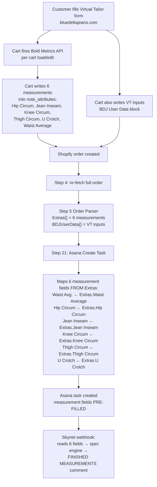
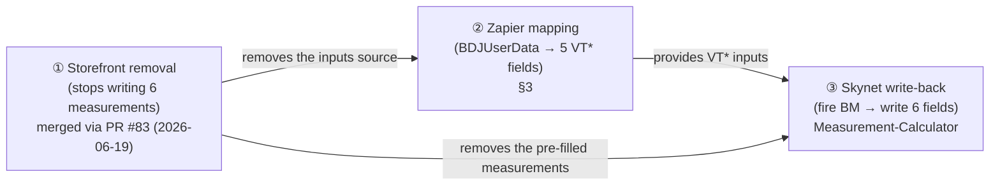

# Bold Metrics Migration — Impact on the Zapier Pipeline

> **What this page is.** A *bridge* document. The existing Zapier pipeline docs ([Architecture Overview](./Architecture%20Overview.md), [Step 5 — Order Parser](./Step%205%20%E2%80%94%20Order%20Parser.md), [Asana Field Mapping (Steps 21–27)](./Asana%20Field%20Mapping%20(Steps%2021%E2%80%9327).md)) describe the pipeline **as it ran for over a year** — where Bold Metrics fired at the storefront cart and the 6 computed measurements arrived in Asana pre-filled. **That migration is now COMPLETE.** This page explains what the Bold Metrics → Skynet migration changed about the pipeline; it is all live as of June 2026. The OLD-vs-NEW comparison below is kept as history — NEW is the current state.
>
> **Read this alongside, not instead of, the other docs.** Where this page and an older page disagree, this page is newer on the migration topic — but the older pages remain the source of truth for everything the migration does *not* touch.
>
> **Authoritative sources for this page:**
> - `blue-delta-jeans/VIRTUAL_TAILOR_BOLDMETRICS.md` — the storefront removal (branch `bold-metrics-api-removal`), incl. §8 cross-team findings.
> - `Measurement-Calculator/bold-metrics-skynet-migration-context.md` — the Skynet (backend) side and the new Asana field GIDs.
> - [V4 — Order Pipeline Documentation](./V4%20-%20Shopify%20%E2%86%92%20Zapier%20%E2%86%92%20Asana%20Order%20Pipeline%20Documentation.md) — zap version history and bug fixes (V4 fixes are deployed; zap is now live at v51).

---

## 1. Status Banner — as of June 2026

| Thing | State | Detail |
|---|---|---|
| **Live zap version** | **v51 (LIVE)** | "Orders - PRODUCTS", Zap ID `281794942`. The V4 bug fixes plus the VT* input mapping and later work are all deployed; the zap is now at **version 51**. The 6 Bold Metrics measurement fields are no longer pre-filled by the cart (see below); the 5 VT* input fields are now mapped on every order. |
| **V4 code fixes** (`step-5-v4.js`, `step-13-v4.js`) | **DEPLOYED (in v51)** | The 11 bug fixes (BUG-01 critical qty>1, BUG-02/03 belt monogram/thread, NEW-01 shoe SKU, BUG-05 CustomerNew, BUG-06 `\r` residue, etc.) are **deployed and live** as part of the current v51 zap. The old "pending as v43" framing is historical. |
| **Bold Metrics @ storefront cart** | **REMOVED (LIVE)** | The main Virtual Tailor cart path no longer calls `api.boldmetrics.io` and no longer writes the 6 measurements into `note_attributes`. Merged to the live theme via **PR #83** (Cantilever theme repo, private — provided once engaged; merged 2026-06-19). The GemPages "quick-tailor" page **also no longer fires Bold Metrics on the live site** and the hardcoded key was removed from the live site. *Honest repo note: a hard-coded Bold Metrics key still remains in a legacy GemPages quick-tailor snippet export committed to the theme repo. GemPages sections are app-managed, so those committed exports LAG the live page — LIVE = removed; the committed copies are stale. Key rotation / purge of those stale committed copies is pending known tech-debt, so do not treat the repo as fully key-free.* |
| **Skynet computes measurements post-order** | **LIVE** | Skynet (`Measurement-Calculator` repo) fires Bold Metrics from its webhook pipeline after the Asana task is created, then writes the 6 measurements back into Asana. Implemented and live: `server/boldmetrics.ts` (`callBoldMetrics`), `server/asana.ts` (`writeBoldMetricsMeasurements` / `setAsanaCustomFields`), wired into the webhook pipeline in `server/routes.ts`. |
| **The 5 new Asana `VT *` input fields** | **MAPPED + LIVE** | `VT Height`, `VT Shoe Size`, `VT Waist`, `VT Inseam`, `VT Bra Size` exist in the Pant Pipeline project, and the Zapier mapping that populates them is **deployed and live in v51** — each new VT order now fills these 5 fields. GIDs are final (see §3, VT Bra Size corrected). |

### State at a glance — all LIVE (v51)

```
LIVE TODAY (v51 — migration COMPLETE):
  ✅ V4 bug fixes deployed (BUG-01 qty>1, belt monogram/thread, shoe SKU, etc.)
  ✅ Storefront no longer writes the 6 measurements (main path PR #83, merged 2026-06-19)
  ✅ GemPages quick-tailor no longer fires Bold Metrics on the live site
       (committed snippet exports are stale — see honest repo note above)
  ✅ Step 5 parses BDJUserData{} (VT inputs); Extras{} no longer carries 6 measurements
  ✅ THE ZAP CHANGE: BDJUserData → the 5 VT* Asana fields is MAPPED + LIVE  ← §3
  ✅ Skynet fires Bold Metrics post-order + writes the 6 measurements back  ← §4

REMAINING OWNER TASKS (Caleb handles personally — NOT agency work):
  ☐ Rotate the Bold Metrics user_key on the vendor side (NOT yet rotated)
  ☐ Deactivate the now-unused quick-tailor page
  ☐ Purge the stale committed quick-tailor key copies from the theme repo
```

> **One-line summary of the migration (now COMPLETE):** measurements moved from *"computed at the cart, arrive pre-filled in Asana via Zapier"* to *"VT inputs arrive in Asana via Zapier; Skynet computes the measurements after the order exists and writes them back into the same 6 Asana fields."* This is the live behavior as of June 2026.

---

## 2. OLD flow vs NEW flow

> **NEW = current state (live, v51).** OLD is kept for historical context — it describes how the pipeline ran before the migration completed.

### The shift in one table

| Concern | OLD (pre-migration, historical) | NEW (live today, v51) |
|---|---|---|
| Where Bold Metrics fires | Storefront **cart**, on every cart load/edit (pre-purchase) | **Skynet backend**, once per real order (post-purchase) |
| What's in `note_attributes` | VT inputs (`BDJ User Data`) **+ the 6 measurements** | VT inputs (`BDJ User Data`) **only** — 6 measurements removed |
| What Step 5 produces | `Extras{}` carries the 6 measurements; `BDJUserData{}` carries the inputs | `Extras{}` no longer carries the 6 measurements; `BDJUserData{}` carries the inputs (unchanged parser) |
| What the zap maps to Asana | 6 measurement fields (from `Extras`) | **5 new `VT *` input fields** (from `BDJUserData`) |
| State of measurement fields at task creation | **Populated** by Zapier | **Empty** at creation; **Skynet writes them** afterward |
| Who owns the cost of the API call | Cart (3,000–4,000 calls/mo, billed for non-buyers) | Skynet (~1,000 calls/mo, one per order, guarded/idempotent) |
| Failure behavior | If BM ajax failed at cart, raw inputs were dropped too (data loss) | Raw inputs always persist in Asana; Skynet retries/flags |

### OLD flow (pre-migration — historical)



### NEW flow (live today, v51)

```mermaid
flowchart TD
    A[Customer fills Virtual Tailor form] --> B[NO Bold Metrics call at cart<br/>only VT INPUTS submitted]
    B --> C["note_attributes:<br/>Virtual Tailor=Yes, BDJ User Data,<br/>Jean Fit, Shoe Type, flags<br/>(NO measurements)"]
    C --> D[Shopify order created]
    D --> E[Step 4: re-fetch full order]
    E --> F["Step 5 Order Parser (unchanged parser)<br/>BDJUserData{} = VT inputs<br/>Extras{} no longer has 6 measurements"]
    F --> G[Step 21: Asana Create Task]
    G --> H["★ NEW: maps 5 VT input fields FROM BDJUserData:<br/>VT Height ← BDJ User Data.Height<br/>VT Shoe Size ← BDJ User Data.Shoe Size<br/>VT Waist ← BDJ User Data.Waist (men)<br/>VT Inseam ← BDJ User Data.Inseam (men)<br/>VT Bra Size ← BDJ User Data.Bra Size (women)"]
    H --> I[Asana task created<br/>6 measurement fields EMPTY<br/>VT input fields POPULATED]
    I --> J[Skynet webhook fires on task added]
    J --> K[Detect: VT order, inputs present,<br/>measurements empty]
    K --> L[Build Bold Metrics request from<br/>Gender, Age, Weight + VT* fields]
    L --> M[Call Bold Metrics, AWAIT response]
    M --> N["★ Skynet WRITES the 6 measurements back<br/>into the SAME Asana fields<br/>(Waist Avg., Hip Circum, Thigh Circum,<br/>Knee Circum, U Crotch, Jean Inseam)"]
    N --> O[Spec engine → FINISHED MEASUREMENTS comment]
```



**The key structural change for the Zapier side:** the zap stops being the thing that fills the 6 measurement fields and instead becomes the thing that delivers the **5 VT inputs** that Skynet needs to compute them. Skynet becomes the writer of the 6 measurement fields.

---

## 3. THE ZAP CHANGE — now DEPLOYED (live in v51)

This was the **one change Zapier owned** in this migration (everything else is storefront or Skynet). It is **done and live in v51.** It was made in the **Asana create-task steps** that map the Pant Pipeline — practically **Step 21 (Pant)**; the gendered split below determines which of the five fields receive a value per order. The spec is retained here as the as-built reference.

> **Scope note:** Only the **Pant Pipeline** uses the full VT/Bold Metrics measurement set, so these five input fields only need to be wired in **Step 21**. The Belt Pipeline (Step 23) already pulls waist measurements but does not need the VT inputs; Shoe (Step 25) and Video (Step 27) are out of scope.

### The 5 VT input field mappings in Step 21 (as built)

Source = `Step 5 → BDJUserData → <key>`. The `BDJUserData` object is **already parsed today** by Step 5 (see [Step 5 — Order Parser §7](./Step%205%20%E2%80%94%20Order%20Parser.md)); no Step 5 code change is required for this — only new mappings on the Asana create-task step.

| New Asana field | Asana GID | Source token | Bold Metrics param it feeds | Gender |
|---|---|---|---|---|
| **VT Height** | `1215612213755174` | `5. BDJ User Data Height` | `height` (total inches) | all |
| **VT Shoe Size** | `1215612213755176` | `5. BDJ User Data Shoe Size` | `shoe_size_us` (numeric) | all |
| **VT Waist** | `1215612213755178` | `5. BDJ User Data Waist` | `waist_circum_preferred` | **men only** |
| **VT Inseam** | `1215612213755180` | `5. BDJ User Data Inseam` | `jean_inseam` | **men only** |
| **VT Bra Size** | `1215851864495064` | `5. BDJ User Data Bra Size` | `bra_size` | **women only** |

> Gender/Age/Weight already flow to Asana today (`Gender` `1112754700909040` via Step 14 enum lookup, `Age` `1206671503499694`, `Weight` `1206671503499698`) — no change needed for those three. The five fields above are the gap.

### Gendered handling — the part that's easy to get wrong

The storefront VT form is **gender-branched**, and `VirtualTailor.formatUserData()` enforces the split when it builds the `BDJ User Data` block (per `VIRTUAL_TAILOR_BOLDMETRICS.md §8`):

- **Men** emit `Waist` and `Inseam`; **men never emit `Bra Size`.**
- **Women** emit `Bra Size`; **women's block omits `Waist`, `Inseam`, and `Common Shoe`.** (The storefront VT Rebuild also removes the women's inseam question entirely — Bold Metrics mishandles inseam for women, so it is *not* sent in the women's branch.)

Because the source keys are simply **absent** for the off-gender, the Zapier mappings can be wired unconditionally and self-select:

| Order gender | `BDJ User Data` contains | Result in Asana |
|---|---|---|
| Male | `Height`, `Shoe Size`, `Waist`, `Inseam` (no `Bra Size`) | `VT Height`, `VT Shoe Size`, `VT Waist`, `VT Inseam` filled; `VT Bra Size` empty |
| Female | `Height`, `Shoe Size`, `Bra Size` (no `Waist`/`Inseam`) | `VT Height`, `VT Shoe Size`, `VT Bra Size` filled; `VT Waist`/`VT Inseam` empty |

You do **not** need a Path branch or conditional mapping for this — map all five tokens, and the missing source keys produce empty Asana fields naturally. Skynet's request builder then sends `waist_circum_preferred`/`jean_inseam` for men and `bra_size` for women based on the order's `Gender`.

### Step 21 mapping — as built (all complete in v51)

```
[x] Step 21 (Asana: Create Task → Auto | Pant Pipeline, GID 1206657933205972)
[x] Custom-field mapping: VT Height     (1215612213755174) ← 5. BDJ User Data Height
[x] Custom-field mapping: VT Shoe Size  (1215612213755176) ← 5. BDJ User Data Shoe Size
[x] Custom-field mapping: VT Waist      (1215612213755178) ← 5. BDJ User Data Waist
[x] Custom-field mapping: VT Inseam     (1215612213755180) ← 5. BDJ User Data Inseam
[x] Custom-field mapping: VT Bra Size   (1215851864495064) ← 5. BDJ User Data Bra Size
[x] Men's VT order  → VT Waist + VT Inseam populated, VT Bra Size empty
[x] Women's VT order → VT Bra Size populated, VT Waist/VT Inseam empty
[x] Gender / Age / Weight still map (no regression)
```

> ⚠️ **Do not confuse inputs with outputs.** `VT Waist` (input → `waist_circum_preferred`) is **NOT** `Waist Avg.` (output). `VT Inseam` (input → `jean_inseam`) is **NOT** `Jean Inseam` (output). The `VT *` fields are what the zap fills; the un-prefixed measurement fields are what Skynet fills. They are different Asana fields with different GIDs.

---

## 4. The Asana "DO-NOT-BREAK" list

Skynet now **writes** the 6 measurement fields. That moves the contract from "Zapier owns these fields" to "Skynet owns these fields" — and Skynet's coupling to Asana is fragile in a specific way.

### 4a. The 6 measurement fields are now WRITTEN BY SKYNET

After migration, these fields are **empty at task creation** and **populated by Skynet** once it gets the Bold Metrics response:

| Asana field (display name) | Asana GID | Bold Metrics `dimensions` source |
|---|---|---|
| **Waist Avg.** *(trailing period!)* | `1206671503499692` | **3-way mean** — see §4c |
| **Hip Circum** | `1206671503499682` | `hip_circum` |
| **Thigh Circum** | `1206671503499688` | `thigh_circum_proximal` |
| **Knee Circum** | `1206671503499686` | `knee_circum` |
| **U Crotch** | `1206671503499690` | `u_crotch` |
| **Jean Inseam** | `1206671503499684` | `jean_inseam` |

### 4b. Skynet matches by EXACT DISPLAY NAME — renaming silently breaks it

This is the single most dangerous fact for anyone administering the Asana project:

> **Skynet's `parseAsanaMeasurements()` matches custom fields by their exact display name, never by GID.** Renaming a field in Asana **silently breaks** parsing for every new order — no error, just missing data.

The trap everyone hits: **`Waist Avg.` has a trailing period.** It is literally `Waist Avg.` (W-a-i-s-t-space-A-v-g-period). Not `Waist Avg`, not `Waist Average`, not `Waist Avg .`. If anyone "cleans up" that field name and removes the period, Skynet stops reading waist and Bold-Metrics format detection fails.

**Do-not-break rules:**

- **Do not rename** any of the 6 measurement fields above. Keep `Waist Avg.` exactly, period included.
- **Do not rename** the 5 input fields (`VT Height`, `VT Shoe Size`, `VT Waist`, `VT Inseam`, `VT Bra Size`) — Skynet's request builder reads those by name too.
- **Do not rename** `Gender`, `Age`, `Weight` (also read by Skynet).
- GIDs are stable and used for **writes** (Skynet writes by GID), but **reads match on name** — so a rename breaks reads even though the GID is unchanged.
- Format detection keys on `Waist Avg.` **or** `Hip Circum` being present → treats the order as **BOLD_METRICS**; `Waist Around` **or** `Seat Around` present → **MANUAL** (manual wins if both). This is why writing the 6 fields makes the task correctly parse as BOLD_METRICS on any reprocess.

### 4c. `Waist Avg.` is a 3-way mean — NOT `waist_circum_preferred`

Cross-team finding from the storefront cart code (`VIRTUAL_TAILOR_BOLDMETRICS.md §8`; the averaging itself lives in the product-form snippets, e.g. `snippets/product-form-mustache.liquid:211`) — this **corrects** an open question in the Skynet doc:

```js
// What the cart historically wrote to "Waist Average":
waist_average = round( (waist_circum_natural + waist_circum_preferred + waist_circum_stomach) / 3 , 2 )
```

Skynet replicates this exact 3-way mean when it recomputes, so historical orders and new orders carry the same waist value. This is already implemented in `Measurement-Calculator/server/boldmetrics.ts` (`WAIST_DIMENSION_KEYS` = `waist_circum_preferred` + `waist_circum_natural` + `waist_circum_stomach`, averaged → `Waist Avg.`). The Skynet migration-context doc §9 left this as an open question (its mapping table showed `waist_circum_preferred` *(see note)* pending confirmation) — the answer is the **3-way mean**, not `waist_circum_preferred` alone. (`Thigh Circum` = `thigh_circum_proximal`, also confirmed in `boldmetrics.ts`; the other four — `hip_circum`, `knee_circum`, `u_crotch`, `jean_inseam` — are direct passthroughs.)

This is a Skynet concern, not a Zapier one — but it lives here so the two docs don't contradict each other.

### 4d. Should Step 21/23 STOP mapping the 6 measurement fields?

The migration is complete and the storefront no longer writes the 6 measurements, so the existing Step 21 `Extras` mappings now resolve to **empty** on their own (Option B behavior) and Skynet fills the fields. The three options below are retained as background; Option B was the cutover choice and Option A (removing the now-dead mappings) remains an optional follow-up cleanup.

| Option | What Step 21 does with the 6 measurement fields | Pros | Cons |
|---|---|---|---|
| **A. Stop mapping** (remove from Step 21) | Don't map them at all; Skynet is the sole writer | Cleanest contract; no risk of Zapier overwriting Skynet | If Skynet fails/lags, the task has *no* measurements until Skynet recovers |
| **B. Keep mapping (recommended interim)** | Keep the existing `5. Extras …` mappings as-is | Zero-risk: after storefront removal, `Extras` simply won't have the 6 keys → fields land **empty** → Skynet fills them. Acts as a passthrough/fallback for any in-flight order still carrying measurements. | Slightly stale config; a stray order that still has measurements in `Extras` would pre-fill (harmless — Skynet's idempotency guard skips already-populated fields) |
| **C. Map to explicit empty** | Force the 6 fields to blank | Guarantees empties | Pointless work; same outcome as B once storefront removal is live |

**As built: Option B was used for the cutover; Option A (removing the now-dead mappings) remains optional cleanup.**

Rationale: once the storefront stops writing the 6 measurements, `Step 5 Extras{}` no longer contains those keys, so the existing Step 21 mappings resolve to **empty** on their own — exactly the state Skynet expects ("inputs present, measurements empty"). Leaving the mappings in place during cutover means **no Zapier edit is strictly required to remove them**, which de-risks the deploy. They become dead-but-harmless. Schedule their removal (Option A) as a follow-up once Skynet write-back is proven in production.

> ⚠️ **Critical ordering dependency for Option B:** Skynet's idempotency guard **must check the measurement fields directly before firing Bold Metrics** (it does — per the Skynet doc, the existing `hasFinishedMeasurements` dedupe *fails open* on Asana API errors and cannot be relied on alone). If both Zapier (pre-filling) and Skynet (computing) could write, Skynet's "skip if already populated" guard prevents a duplicate billed call. As long as Zapier resolves these to empty post-removal, there is no conflict.

**Belt Pipeline (Step 23) note:** Step 23 maps `Waist Avg.` and `Waist Around` from `Extras`. Belts do **not** go through the VT/Bold Metrics measurement flow (a belt only needs waist size, and the full VT set is pants-only). The migration **does not change** Step 23. After storefront removal, `Extras["Waist Average"]` will be empty for online belt orders — which is acceptable, since belt sizing for VT customers will resolve once the pant task's waist is computed. **If belt waist accuracy matters for VT-only belt buyers, [CONFIRM with Caleb/Hunter]** whether belts need any Skynet involvement; current scope says no.

---

## 5. Deployment sequencing — how it was rolled out (historical)

> **Status: completed.** All three pieces below are deployed and live (zap at v51; storefront removal via PR #83; Skynet write-back live). This section is retained to document the rollout order and the interdependency that governed it.

The V4 code fixes and the **Bold Metrics migration** were *different* changes that landed in the same window. They are **interdependent in one direction**, and getting the order wrong could have **stranded orders without measurements** — which is why the sequence below was followed.

### The three moving pieces and their dependency



**The danger:** if the storefront stops writing measurements (①) **before** Skynet can compute them (③), then for the gap window **every VT online order has no measurements at all** — the cart didn't compute them and Skynet isn't writing them yet. Those orders are stranded and need manual recovery.

### Recommended safe sequence

| Order | Step | Why this order |
|---|---|---|
| **1** | Deploy **Zapier VT* mapping (§3)** *first* | Harmless on its own — it just starts filling 5 currently-empty Asana fields from data already in `BDJUserData`. No order depends on it yet. Lets you verify the inputs land correctly while the cart is still computing measurements (belt-and-suspenders). |
| **2** | Deploy **Skynet write-back (③)** with idempotency guard | Now Skynet *can* compute measurements from the VT* fields, but the cart is still pre-filling them — so Skynet's "skip if populated" guard means it mostly no-ops. Safe to soak. |
| **3** | Deploy **storefront removal (①)** last — done via **PR #83** (merged 2026-06-19) | Only after Skynet was proven to fill empties. Now the cart stops pre-filling; tasks arrive with empty measurements; Skynet fills them. No gap window. |
| **4** | (Optional) Remove the now-dead 6 measurement mappings from Step 21 — **Option A** in §4d | Cleanup once steady-state is confirmed. |

### How the V4 fixes and the VT* mapping landed

The **V4 code fixes** (`step-5-v4.js` / `step-13-v4.js`) are **independent of the migration** — none of their 11 bug fixes touch the Bold Metrics measurement mapping. The §3 VT* mapping change was a Step-21 config edit and the V4 fixes were Step-5/Step-13 code edits. Both are now deployed in the live **v51** zap. Notes that still apply in steady state:

- The §3 VT* mapping is a **Step-21 config** mapping (distinct from the Step-5/Step-13 code); both are live in v51.
- **BUG-01 (qty>1 expansion) interaction:** a qty-2 VT pant order creates **2 Asana tasks**, so Skynet fires Bold Metrics **twice** (once per task). That's correct (two physical garments) and the idempotency guard is **per-task**, so it doesn't suppress the legitimate second call. Be aware the API-call count tracks task count, not order count.

> **Stranded-order recovery path:** if any VT order does land with empty measurements *and* Skynet doesn't fill them (incomplete inputs, BM error, deploy gap), the recovery is the **Bold Metrics tab on the Skynet dashboard** (rebuilt from the old public "Quick Tailor" page): staff enter the VT inputs, fire Bold Metrics on demand, and post the result to the Asana task. Skynet marks such orders `failed` with a clear message rather than posting garbage.

---

## 6. SC Product Options vs Bold Metrics — disambiguation

These are **two completely different systems** that both touch the order, and confusing them is the easiest way to mis-scope this migration. **The Bold Metrics migration does NOT touch SC Product Options.**

| | **SC Product Options** | **Bold Metrics (Virtual Tailor)** |
|---|---|---|
| What it is | A Shopify app for **product customization add-ons** | An AI **body-measurement** vendor (San Francisco; Mark Cuban–backed) |
| What it produces | **Line item properties** — thread color, monogram/lettering, monogram thread, front pockets, waist height, etc. | **Body measurements** — the 6 pant measurements (Hip Circum, Jean Inseam, Knee Circum, Thigh Circum, U Crotch, Waist Avg.) |
| Where it lands in the order | `order.line_items[].properties` | `order.note_attributes` (today) / computed by Skynet (after migration) |
| Parsed by | **Step 13** (Line Item Processor) → `Properties{}` | **Step 5** (Order Parser) → `Extras{}` (measurements) + `BDJUserData{}` (inputs) |
| Maps to Asana via | Step 21 garment-spec fields (Thread, Monogram, Pockets, Waist Ride, …) | Step 21 measurement fields (the 6) + VT input fields |
| Affected by this migration? | **NO** — unchanged | **YES** — this is the whole migration |
| Online vs POS | Online only (SC Product Options doesn't work in Shopify POS, so POS encodes the same data in the **SKU**) | Online only (in-person/POS orders use **Manual/tape** measurements, not Bold Metrics) |

**Two more "Bold"-named traps that are NOT Bold Metrics** (from `VIRTUAL_TAILOR_BOLDMETRICS.md §5`):

- **Bold Commerce** — a *different* vendor entirely. `snippets/bold-common.liquid`, `snippets/bold-loyalties-widget.liquid`, `assets/bold-options.css` are Bold Commerce product-options/loyalty app files. Leave them alone.
- **"Bold" in CSS** — `font-weight: bold` in `virtual-tailor-styles.css` is cosmetic, not a vendor reference.

> **Why this matters for the zap:** the fallback chains in Step 21 (e.g. Thread → Thread Color, Monogram → Lettering, Waist Ride → Waist → Waist Height) are **SC Product Options** mechanics described in [Asana Field Mapping §Multi-Token Fallback Chains](./Asana%20Field%20Mapping%20(Steps%2021%E2%80%9327).md). None of those fallbacks change in this migration. If SC Product Options were ever removed/replaced, **that** would break Step 13's property parsing — a separate dependency, unrelated to Bold Metrics. (See [Architecture Overview §Key System Dependencies](./Architecture%20Overview.md).)

---

## 7. Quick reference — every GID this migration touches

### VT input fields (Zapier WRITES these — §3)

| Field | GID | Source | Gender |
|---|---|---|---|
| VT Height | `1215612213755174` | `5. BDJ User Data Height` | all |
| VT Shoe Size | `1215612213755176` | `5. BDJ User Data Shoe Size` | all |
| VT Waist | `1215612213755178` | `5. BDJ User Data Waist` | men |
| VT Inseam | `1215612213755180` | `5. BDJ User Data Inseam` | men |
| VT Bra Size | `1215851864495064` | `5. BDJ User Data Bra Size` | women |

### Measurement output fields (Skynet WRITES these — §4)

| Field | GID | BM dimensions source |
|---|---|---|
| Waist Avg. *(trailing period)* | `1206671503499692` | 3-way mean (natural + preferred + stomach) ÷ 3 |
| Hip Circum | `1206671503499682` | `hip_circum` |
| Thigh Circum | `1206671503499688` | `thigh_circum_proximal` |
| Knee Circum | `1206671503499686` | `knee_circum` |
| U Crotch | `1206671503499690` | `u_crotch` |
| Jean Inseam | `1206671503499684` | `jean_inseam` |

### Unchanged-but-relevant fields

| Field | GID | Notes |
|---|---|---|
| Gender (enum) | `1112754700909040` | M `1112754700909041`, W `1112754700909042`, Youth `1209345887831124`. Via Step 14 lookup. Skynet reads this to pick gendered BM params. |
| Age | `1206671503499694` | Already mapped from `BDJUserData`. |
| Weight | `1206671503499698` | Already mapped from `BDJUserData`. |
| Pant Pipeline project | `1206657933205972` | Auto \| Pant Pipeline (where all VT/BM fields live). |

### Related pipeline project GIDs (now captured)

| Project | GID | Notes |
|---|---|---|
| Auto \| Pant Pipeline | `1206657933205972` | All VT/BM fields live here (Step 21). |
| Auto \| Belt Pipeline | `1206657932919233` | Step 23. (Was "not captured" in earlier drafts.) |
| Auto \| Shoe Pipeline | `1206648505149980` | Step 25. (Was "not captured" in earlier drafts.) |
| Auto \| Video Card Pipeline | `1206657933205969` | Step 27. (Earlier drafts mistakenly showed a workspace id here.) |

> Team "PRODUCTION ORDER PIPELINE" = `5333978630773`; workspace = `2357765184667`. Skynet **excludes** these projects from automation by NAME: ORDER PIPELINE (`5333978630781`), ALTERATION (`52059426160001`), Alt 2.0 (`1209872583838617`), plus "alt info requests".

### System IDs

- **Zap:** "Orders - PRODUCTS", Zap ID `281794942` · live at **v51** (V4 fixes + VT* mapping deployed).
- **Skynet repo:** `BlueDeltaJeans/Measurement-Calculator` · Replit app `bdjskynet.replit.app` · webhook pipeline `processWebhookEvent` in `server/routes.ts`.
- **Bold Metrics:** `GET https://api.boldmetrics.io/virtualtailor/get` · `client_id = bluedelta` · one company-wide `user_key`. **Secrets:** `BOLDMETRICS_CLIENT_ID`, `BOLDMETRICS_USER_KEY` (Skynet env vars — never hardcode). The live site no longer fires Bold Metrics from the main VT path or the GemPages quick-tailor page, and the hardcoded key was removed from the live site. **Remaining owner tasks:** rotate the `user_key` on the vendor side (NOT yet rotated), deactivate the now-unused quick-tailor page, and purge the stale hard-coded key copies that still exist in a legacy committed GemPages quick-tailor snippet export.
- **Skynet Asana write auth:** `ASANA_ACCESS_TOKEN` (PAT with **write** scope for custom-field write-back — confirmed working now that Skynet write-back is live).

---

## 8. Cross-references

**Sibling repo docs:**
- `Measurement-Calculator/bold-metrics-skynet-migration-context.md` — full Skynet build spec, BM request/response contract, env vars, write-back logic.
- `blue-delta-jeans/VIRTUAL_TAILOR_BOLDMETRICS.md` — storefront removal map (branch `bold-metrics-api-removal`); §8 is the source of the 3-way-mean waist finding and the gendered-input proof.

**These Zapier pipeline pages (this doc updates them on the migration topic):**
- [Architecture Overview](./Architecture%20Overview.md)
- [Step 5 — Order Parser](./Step%205%20%E2%80%94%20Order%20Parser.md)
- [Asana Field Mapping (Steps 21–27)](./Asana%20Field%20Mapping%20(Steps%2021%E2%80%9327).md)
- [V4 — Order Pipeline Documentation](./V4%20-%20Shopify%20%E2%86%92%20Zapier%20%E2%86%92%20Asana%20Order%20Pipeline%20Documentation.md) (zap version history; V4 fixes deployed, now live at v51)

**BlueDelta-Brain wiki:**
- `BlueDelta-Brain/wiki/Suppliers & Vendors/Bold Metrics.md` — vendor background (what Bold Metrics is, ~7% return-rate impact, Mark Cuban backing).
- `BlueDelta-Brain/wiki/Ordering & Fitting/Tailoring & Fit Process.md` — how the Virtual Tailor is used in the fit flow.

**Notion (depth, where reachable):**
- [Auto \| Pant Pipeline](../../appendix/notion-source-context.md)
- [Bold Metrics vendor page](../../appendix/notion-source-context.md)
- Bold Metrics API docs (attach as MCP): `https://docs.boldmetrics.io/~gitbook/mcp`

---

## 9. Status & remaining items

**Resolved (migration complete):**

| # | Item | Status |
|---|---|---|
| 1 | **Storefront removal live?** — main VT path merged via **PR #83** (2026-06-19); GemPages quick-tailor no longer fires on the live site. | ✅ Done (LIVE) |
| 2 | **Skynet write-back live?** — `setAsanaCustomFields()` deployed; write-back is live. | ✅ Done (LIVE) |
| 3 | **Step 21 / Option B vs A** — Option B used for cutover (mappings resolve to empty post-removal); Option A removal is optional cleanup. | ✅ Decided |
| 4 | **VT* mapping deployed** — the 5 VT* mappings shipped and are live in **v51**. | ✅ Done (LIVE) |
| 6 | **`Waist Avg.` 3-way mean** — implemented in `server/boldmetrics.ts` as `(preferred+natural+stomach)/3`. | ✅ Confirmed |

**Remaining owner tasks (Caleb handles personally — not agency work):**

| # | Item | Owner |
|---|---|---|
| A | **Rotate the Bold Metrics `user_key`** on the vendor side. **Not yet rotated.** | Caleb |
| B | **Deactivate the now-unused quick-tailor page.** | Caleb |
| C | **Purge the stale hard-coded `user_key` copies** still committed in a legacy GemPages quick-tailor snippet export. | Caleb |
| 5 | **Belt VT waist** — do VT-only belt buyers need Skynet involvement, or is empty `Waist Avg.` on belt tasks acceptable? Current scope: no change to Step 23. | Caleb / Hunter |

---

*Bridge document created 2026-06-24. Reflects the COMPLETED migration: zap live at **v51**, storefront removal merged via **PR #83** (2026-06-19), Skynet write-back live. Grounded in: `VIRTUAL_TAILOR_BOLDMETRICS.md`, `bold-metrics-skynet-migration-context.md`, the live Asana API schema (June 2026), and git. Field names and GIDs are final per those sources (VT Bra Size GID corrected to `1215851864495064`). Honest repo note: a legacy committed GemPages quick-tailor snippet export still contains a hard-coded Bold Metrics key and is slated for rotation/purge. No secrets or keys are reproduced here — only env-var names.*
